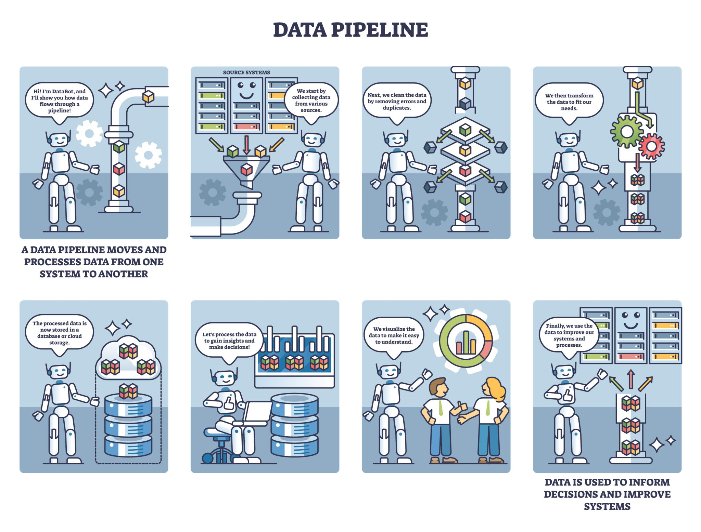

# ETL Extract Transform Load

- ETL (Extract, Transform, Load) is a fundamental process in data integration.
- It's used to collect raw data from various sources, clean and restructure it
- Then load it into a central repository for analysis and reporting.
- Basically, standardize and centralize disparate data so it can be used for business intelligence (BI) and analytics.
  
- Three-Step Process:

1. ### Extract
    - Pull data from one or more source systems
    - Sources can be databases, flat files, APIs, or SaaS applications.
    - Extraction Process needs to be efficient and handle various data formats and structures
2. ### Transform
    - Data is cleaned, enriched, and restructured to fit the target schema.
    - Tasks included:
        - data cleansing (removing duplicates, handling missing values)
        - data validation
        - data type conversions
        - data aggregation or summarization.
    - Ensures the data is high-quality and ready for analysis.
3. ### Load
    - The final step involves writing the transformed data into a target data warehouse or data lake.
    - Can be a full load (replacing all data) or an incremental load (adding new or changed data)

## ELT (Extract, Load, Transform)

- ETL has been the traditional approach
- ELT (Extract, Load, Transform) has gained prominence with the advent of modern cloud-based data warehouses.
- **ETL:** The transformation occurs before the data is loaded into the target system. This approach is more suited for
  on-premises data warehouses with limited processing power.
- **ELT**: The data is loaded into the target system first, and then the transformation happens within the data
  warehouse itself. This is possible due to the massive scalability and computational power of modern cloud data
  warehouses like Snowflake, BigQuery, and Redshift.
    - Cause for ELT:
        - Cloud Computing: Cloud-based data warehouses make it cost-effective to store raw data and perform
          transformations at scale.
        - Massive Data Volumes: impractical to transform all data on a staging server. ELT allows you to quickly load
          all raw data, so you can decide which subsets to transform later.
        - Data Lake Popularity: The rise of data lakes, which are designed to store raw, unstructured data, made ELT a
          natural fit.

## Data Ecosystem:

1. ### Data Warehouse:
    - Central repository for structured, clean data.
    - Populated by ETL
        - Amazon Redshift
        - Google BigQuery
        - Snowflake
2. ### Data Lake:
    - Data lake is a repository for raw, unstructured data.
    - ELT is often used here, as you can load data in its original format and transform it later as needed.
    - Platforms/Services:
        - AWS S3 + AWS Lake Formation
        - Azure Data Lake
        - Good Cloud Storage
        - Apache Hadoop (HDFS)
3. ### Data Mart:
    - A data mart is a smaller, subject-oriented data warehouse
    - Often serving a specific department (e.g., marketing, finance
    -

# Extract Phase

## Data Sources

- In modern data environments, data comes from a wide variety of places. Common source systems include:
    - DBs: SQL-MySql,PostgreSQL or NoSQL DB like Mongo
    - APIs: SaaS applications provide APIs to access data
    - Flat Files: Like CSV, xml, json
    - Streaming Data: Real time continuous from web clicks, finance transactions

## Extraction Methods:

1. ### Full Extraction:
    - Copies the entire dataset from the source every time the ETL process runs.
    - Simple
    - Inefficient and resource intensive, especially for large datasets
2. ### Incremental Extraction:
    - Extracts data that has changed or been added since the last extraction
    - much more efficient and less resource-intensive
    - requires tracking changes in the source system using timestamps and changelog
3. ### Change Data Capture (CDC):
    - Set of techniques for identifying and capturing changes made to data in DB
    - CDC uses the database's transaction logs to identify exactly which records were changed
    - Highly efficient form of **incremental Extraction**
4. ### Batch vs Realtime Streaming Extraction
    1. ### Batch Extraction:
        - Traditional Approach
        - Data is extracted in scheduled batches 📌e.g., once a day, every hour
        - Suitable where latency isn't critical concern
    2. ### Real-Time/Streaming Extraction:
        - Continuously extracting data as soon as it's created or changed
        - Used where immediate insights needed 📌e.g. fraud detection
        - Uses tools like Apache Kafka or Amazon Kinesis

# Transform Phase

- Most crucial phase

## Data Staging Area

- Temporary storage location where data is held after extraction and before transformation
- Often a database or a file system
- Provides a safe sandbox for data manipulation separating from source system
    - Prevents any performance impact or data corruption at source
    - Best Practices: A good staging area should be transient (data is typically deleted after a successful load)

## Core Transformations

1. ### Data Cleansing:
    - This involves fixing or removing incorrect data.
        - handling missing values (e.g., replacing nulls with a default value or removing the record)
        - standardizing formats (e.g., converting all dates to YYYY-MM-DD)
        - correcting errors (e.g., fixing misspellings in a city name).
2. ### Data Deduplication:
    - identifies and removes duplicate records
3. ### Data Validation:
    - This step ensures data integrity by applying business rules to the data.
4. ### Data Aggregation and Summarization:
    - This involves reducing the data volume by summarizing it.
    - 📌For example, instead of loading every sales transaction, you might aggregate them to get the total daily sales
      for each product.
5. ### Data Enrichment:
    - This involves combining data from multiple sources to add value.
    - 📌For example, you might combine customer data with demographic data to create a richer customer profile.
6. ### Data Type Conversions and Field Mapping:
    - This ensures that the data types in the source system (e.g., VARCHAR) are correctly mapped to the data types in
      the target system (e.g., STRING)
    - This also involves renaming fields to match the target schema.

## Advanced Transformations:

1. Slowly Changing Dimensions:
    - In a data warehouse, a dimension table (e.g., a list of customers) contains attributes that change slowly over
      time (e.g., a customer's address). SCDs are a way to manage these changes.
        1. SCD Type 1: Overwrites the old value with the new one. The history is lost.
        2. SCD Type 2: Creates a new record for the new value, keeping the old record as a historical entry. Most common
           and powerful.

# Load Phase:

- Final Step of ETL Process
- Data loaded into a target system, such as a data warehouse, where it becomes available for analysis.

## Loading Strategies:

1. ### Full Load:
    - Clears existing data in the target table, reloads entire dataset from source
    - Simple and straightforward
    - Can be very slow and resource-intensive, especially with large datasets.
2. ### Incremental Load:
    - Much more efficient strategy
    - Only loads new or changed data
    - Requires a mechanism to track changes, such as timestamps on records or a change data capture (CDC) process.
    - Incremental loads are essential for large, continuously updated datasets because they minimize the load window and
      system resource usage.
3. ### Bulk Loading:
    - Loading large chunks of data in a single operation
    - Standard in modern ETL, highly optimized by data warehouses
    - Bulk loading tools bypass some of the database's standard transactional overhead, resulting in much faster
      performance
    - Best for high volume data
4. ### Row by Row Loading
    - Much slower and less efficient process
    - only for small one off loads
5. ### Managing Data Integrity During the Load:
    - Done through techniques like:
        - primary key checks to prevent duplicate records
        - Constraint validation to ensure conformity to schema and rules
        - Most ETL tools and data warehouses handle these checks automatically during the loading process.

## Target Systems

- Type of target system dictates the loading method and the final data structure.

# Data Modelling and Design

## Relational Databases

- ### Schema:
    - schema is the overall logical structure of a database
- ### Tables/Relations:
    - Where the data is stored, organized into rows and columns.
- ### Relationships:
    - Relationships are the connections between tables, established using keys
- ### Normalization and Denormalization
    - ### Normalization:
        - process of organizing data to reduce redundancy and improve data integrity
        - Best for systems like OLTP (Online Transaction Processing) with frequent updates
    - ### Denormalization:
        - Process of adding redundant data back into tables to improve query performance.
        - Reduces the number of joins needed to retrieve data, making it faster for analytics
        - Best for OLAP systems which are read heavy

## Dimensional Modelling

- data design technique for data warehouses.
- ### Tables:
    - ### Fact Table:
        - The table contains the numerical, measurable data
        - Very large because they hold every single transaction
        - it's like a receipt of each transaction
        - Store measurable, numeric, additive values — things you want to aggregate
        - Each row = an event or measurement at a certain grain.
        - They link to dimensions via foreign keys.
    - ### Dimension Table:
        - Provide descriptive context for numbers in fact table
        - describes a “who, what, when, where, how” about the fact
        - generally smaller and less frequently updated than the fact table
        - Can contain numeric data but it has to be descriptive
    - facts are immutable history, dimensions are context that can evolve.
    - 📌 Example:
        - ### Tiny Dimensional Modeling Example

## Fact Table: FactSales

Each row represents one sale.

| DateKey    | ProductKey | CustomerKey | Quantity | SalesAmount |
|------------|------------|-------------|----------|-------------|
| 2025-09-21 | 101        | 201         | 2        | 1500        |

## Dimension Table: DimProduct

Descriptive info about products.

| ProductKey | Name     | Category | ListPrice |
|------------|----------|----------|-----------|
| 101        | Widget A | Gadget   | 800       |

## Dimension Table: DimCustomer

Descriptive info about customers.

| CustomerKey | Name  | AgeGroup | City  |
|-------------|-------|----------|-------|
| 201         | Alice | 25–34    | Delhi |

## Notes

- **FactSales**: measurable outcomes (Quantity, SalesAmount).
- **DimProduct**: descriptive attributes of product (ListPrice, Name, Category).
- **DimCustomer**: descriptive attributes of customer (AgeGroup, City).
- Fact table links to dimensions via keys to provide context for analysis.

- ### Schemas:
  
    1. ### Star Schema (most common):
        - Fact table in the center
        - Dimension tables surround the fact table, connected to it by keys.
        - Simple and Efficient
    2. ### Snowflake Schema
        - Snowflake Schema is a more complex version of a star schema
        - Broken down into sub-dimensions to reduce data redundancy
        - Saves storage, but queries are slower and complex
    3. ### Galaxy Schema / Fact Constellation:
        - Multiple fact tables sharing dimension tables.
        - Useful for complex warehouses.

## Data Warehouse Design

1. Designing schemas for analytics and reporting:
    - easy to understand and navigate for non-technical users.
    - star schema are ideal for this
2. The role of primary keys and foreign keys in ETL
    - Primary keys (PK) uniquely identify each row in a table
        - PK is essential for the Load phase, as it ensures that each record is unique and can be correctly identified.
    - Foreign keys (FK) are columns in one table that refer to the primary key in another table, creating a link between
      them.
        - In the Transform phase, you use foreign keys to join data from various sources and link fact tables to their
          corresponding dimension tables.

## ETL Tools

### Open Source Tools:

1. Apache NiFi
2. Apache Airflow

### Cloud Native Services:

1. AWS Glue
2. Azure Data Factory
3. Google Cloud Dataflow

## ETL Practices

## ETL Job Orchestration and Scheduling

- Orchestration is the automated management of a series of ETL jobs (or data pipelines).
- Instead of manually running each step, an orchestrator ensures the jobs run in the correct order and on a set
  schedule.

  ## Data Pipeline
    - Data pipeline is a sequence of steps that moves data from a source to a destination.
    - **An orchestrator** defines this sequence, manages the resources, and tracks the status of each job
    - Apache Airflow or cloud-native services like AWS Step Functions are used for this
  ## Handling dependencies between jobs
    - In a complex ETL workflow, some jobs can't start until others are complete.
    - Orchestration tools automatically manage these dependencies

## Monitoring and Error Handling

1. Log:
    - Record every action taken by an ETL job, including start and end times
    - the number of rows processed, and any errors encountered.
    - This log is a critical tool for debugging.
2. Alerting:
    - Notifies the data team immediately when a job fails or a data quality issue is detected.
3. Failure recovery:
    - Involves having a plan to restart a failed job.
    - This could mean automatically retrying the job,
    - resuming it from the point of failure
    - manually rerunning the entire process after fixing the underlying issue.

## Ensuring data lineage and traceability:

- Data lineage is the lifecycle of data, including its origin, transformations, and final destination.
- Maintaining a record of data lineage is essential for auditing, debugging, and understanding the impact of changes.

## Performance Optimization

Optimizing ETL jobs for speed and efficiency is key to handling large datasets and meeting business needs.

- ### Tuning ETL jobs for speed and efficiency:
    - This involves fine-tuning the code and processes.
    - 📌For example, using a bulk loading strategy instead of row-by-row loading can drastically reduce load times.
- ### Partitioning and indexing strategies:
    - Partitioning divides a large table into smaller, more manageable parts. Queries that only need to access data from
      a specific partition (e.g., a specific date range) will run much faster because they don't have to scan the entire
      table.

## Data Governance and Quality
### Implementing data quality checks and rules:
- Data quality checks should be a standard part of the Transform phase.

## Auditing and compliance for regulatory standards (e.g., GDPR, HIPAA)