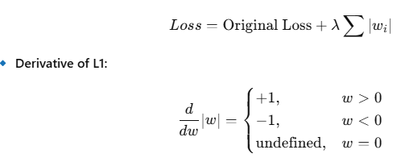

# Machine Learning Topics

Index of notations to complete/learn more:
`⚠️[Requires Investigation]`
`❌[Incomplete]`

## Deep Learning

1. **Perceptron**
   A Perceptron is the simplest type of artificial neural network. It is a type of linear classifier that makes
   predictions based on a weighted sum of input features followed by an activation function.
   Composed of: A perceptron consists of the following components:
    1. **Inputs** (x1,x2,...,xnx_1, x_2, ..., x_nx1,x2,...,xn): Features of the data.
    2. **Weights** (w1,w2,...,wnw_1, w_2, ..., w_nw1,w2,...,wn): Adjustable parameters that determine the importance of
       each feature.
    3. **Bias** (b): A constant term that allows shifting the decision boundary.
    4. **Summation Function:** Computes the weighted sum of inputs
       $$z = \sum_{i=1}^{n} w_i x_i + b$$
    5. **Activation Function**: Applies a step function (threshold function) to determine the output:
       $$y = \begin{cases} 1, & \text{if } z \geq 0 \\ 0, & \text{otherwise} \end{cases}$$
2. **Feed Forward Neural Networks**
3. **Hidden Layers**<br>
   Layers between the input and output layers
4. **Width of Model**
5. **Weights and Biases**  
   (Mentioned above)
   Weights: Defined for each connection. Variable input is multiplied with.  
   Biases: Defined for each node. Variable input shifted by.
6. **Universal Approximation Theorem**
   The Universal Approximation Theorem is a pivotal result in neural network theory, proving that feedforward neural
   networks can approximate any continuous function under certain conditions.  
   The theorem only states that such a mapping exists but provides no way to find it and does no assertion that
   backpropagation
   can or will find it.
7. **Activation Function**
    1. **Need**  
       Activation functions are crucial in neural networks because they introduce non-linearity into the model, enabling
       it to learn complex patterns and relationships in data. Without activation functions, a neural network would
       essentially be a linear model, limiting its ability to handle complex tasks.
       If we had no activation function, the output of a layer would be simply a weighted sum of the inputs z=w<sub>
       1</sub>x<sub>1</sub>+w<sub>2</sub>x<sub>2</sub>+...+w<sub>n</sub>x<sub>n</sub>+bz = w_1x_1 + w_2x_2 + ... +
       w_nx_n + bz=w1x1+w2x2+...+wnxn+b

    2. Common ones:
        1. **ReLU**
           Rectified Linear Unit – f(x)=max(0,x)
           $$f(x) = \begin{cases} x & \text{if } x > 0 \\ 0 & \text{if } x \leq 0 \end{cases} $$
           

            - Pros:
                - Only negatively saturates
                - Better Sparsity so less computation
            - Cons:
                - Dying RELU (Can get stuck at 0)
                - Not differentiable at 0 (solved using f′(0)=0)

        2. **Leaky ReLU**
           $$f(x) = \begin{cases} x, & \text{if } x \geq 0 \\ \alpha x, & \text{if } x < 0 \end{cases}$$
           Where α: a small positive constant (usually something like 0.01).  
           Designed to fix a problem known as the "**dying ReLU**" problem  
           Leaky ReLU doesn’t just cut off all negative values — instead, it lets a small negative slope through.
           So even when x<0, the function still outputs a small (negative) value and, more importantly, has a non-zero
           gradient.  
           Alpha << 1

            - The neuron still gets to learn (because there's still a gradient to flow back during backpropagation).
            - It reduces the risk of neurons getting “stuck” outputting 0 forever.

        3. **Parametric ReLU**
           $$f(x) = \begin{cases} x, & \text{if } x \geq 0 \\ \alpha x, & \text{if } x < 0 \end{cases}$$  
           Here alpha is not fixed and learned during training.  
           Can be shared or different alpha per layer.<br>Gives the network freedom to learn better slopes but this may
           cause overfitting if you're not careful.
           <br>Slightly slower than regular Relu due to the extra computation.

        4. **Sigmoid (Logit)**  
           $$f(x) = \frac{1}{1 + e^{-x}}$$
             
           When x→−∞ f(x)→0<br/>When x→+∞ f(x)→1<br/>At x=0, f(x)=0.5<br/>  
           Not used much anymore due to vanishing gradients (since derivative is close to 0).   
           Also, computationally expensive.
           since σ'(x) max value is 0.25

        5. **Tanh**$$\tanh(x) = \frac{e^x - e^{-x}}{e^x + e^{-x}}$$  
           Output Range
            - tanh(x) outputs values in the range (-1, 1)
            - At x = 0, tanh(x) = 0
            - As x → +∞, tanh(x) → 1
            - As x → -∞, tanh(x) → -1   
              like sigmoid, tanh suffers from the vanishing gradient problem (but not as aggressively) for very large or
              very small inputs and
              unpopular compared to RELU.
              Since tanh'(x) = 1 - tanh<sup>2</sup>(x) has a max value of 1

        6. **Softmax**$$\text{softmax}(z_i) = \frac{e^{z_i}}{\sum_{j=1}^{n} e^{z_j}}$$  
           where:
            - z<sub>i</sub> is the i-th logit (raw score)
            - n is the totoal number of classes
            - The output is a vector of probabilities that sums to 1   
              The softmax function takes a vector of raw scores (called logits) and turns them into probabilities.
              `❌[Incomplete]`

        7. **Swish**

        8. **GELU**<br/><br/>
    3. Questions:
        1. Why Non-Linearity Important?
           <br/><br/>
        2. Why is Relu still more prevalent despite leaky relu problem?  
           Mostly due to simplicity to implement. Doesn't require hyperparameters like alpha and runs fast.  
           Actually has similar accuracy to leaky relu in most problems and dying relu can be avoided by proper weight
           init, normalization and proper learning rates.
           Lastly sparsity is a feature not curse of Relu.
        3. Sigmoid vs Softmax
           | Feature | Sigmoid | Softmax |
           |---------|-----------------------|----------------------------|
           | Case | Binary Classification | Multi Class Classification |
           | Independence| Each output is independent | Outputs are interdependent (probability distribution) |
           | Range | (0, 1) for each class | (0, 1) for each class, but all sum up to 1 |
           <br>
            - Sigmoid treats each class independently, meaning probabilities don’t sum to 1.
            - It can assign high probabilities to multiple classes at the same time, which is problematic when only one
              class
              should be selected.
            - Softmax ensures a mutually exclusive decision by normalizing across all classes.
            - Sigmoid is better than softmax in two main cases: Binary Classification & Multi-Label Classification of
              Independent classes
            - Softmax is computationally more expensive than sigmoid, especially as the number of classes increases.
        4. Why is softmax e<sup>z<sub>i</sub></sup> and not z<sub>i</sub> when both sum to 1?
           Zi has certain problems:
            - Negative values break it e.g 1,2,-3
            - It becomes a linear relationship. Exponential highlights larger values
            - Exponential give heightened gradients instead of flatter ones.

8. **Gradient Descent**  
   It is the optimization algorithm used to minimize loss function by iteratively adjusting a model's parameters and at
   core of DL.  
   θ<sub>new</sub> = θ<sub>old</sub> - η⋅∇L(θ)  
   where
    - η is the learning rate (step size)
    - ∇L(θ) is the gradient of the loss with respect to parameters

   Types:
    1. Stochastic Gradient Descent  
       Uses only one training example per update.  
       Update happens at every sample.  
       "Stochastic" means random — each update uses a randomly chosen data point.  
       ✅Faster Updates <br>✅Noisy Updates: Can help escape local minima  
       ⚠️Less Stable <br>⚠️Noisy Updates: Can zigzag

    2. Batch  
       Computes the gradient using the entire dataset   
       Update happens once per epoch  
       Example: If your dataset has 10,000 samples, one update per 10,000 samples  
       ✅Accurate Gradient  
       ✅Smooth Convergence  
       ⚠️Very slow for large Datasets  
       ⚠️Consumes a lot of memory

    3. Mini Batch (most common in practice)  
       Uses a small subset (batch) of the data per update  
       Common batch sizes: 32, 64, 128  
       ✅Balance between speed and memory <br>✅Less noise than SGD  
       ⚠️Requires Tuning batch size

9. **Epoch**  
   One complete pass of the entire training dataset through the neural network.  
   1 epoch = the model has seen all N samples once.
10. **Vanishing Gradient**`❌[Incomplete]`
    1. Cause  
       As you go backward through a deep network (from output toward the input layer), gradients are calculated via
       the chain rule. That means:  
       $$\frac{dL}{dx} = \frac{dL}{dz_n} \cdot \frac{dz_n}{dz_{n-1}} \cdot \ldots \cdot \frac{dz_2}{dz_1}$$  
       If each of those derivatives is a number less than 1 (like 0.5), and you multiply a bunch of them together… the
       product shrinks exponentially. Eventually the gradient becomes so small that it’s practically zero.When that
       happens:
        - Weights stop updating
        - Neurons stop learning
        - Your model gets stuck
        - Early layers (closer to the input) get almost no gradient signal

    2. How to detect
        1. Gradients Near Zero Monitor gradient norms:  
           If the gradients are very small (like <10<sup>−6</sup> in early layers, you're likely facing vanishing
           gradients.
            ```
            for name, param in model.named_parameters():
            if param.grad is not None:  
            print(name, param.grad.norm())
           ```

        2. Weights Stop Updating  
           Weights in early layers remain almost constant during training — a sign gradients are too small to change
           them.
        3. Slow or No Learning   
           Loss stagnates or accuracy doesn't improve, especially early in training.

    3. How to Solve  
       Methods To Solve:  
       ✅ Use ReLU instead of sigmoid/tanh  
       ReLU’s derivative is 1 for positive values — no shrinking  
       ✅ Batch Normalization  
       Helps keep the activations and gradients in a healthy range  
       ✅ Residual Connections (ResNets)  
       Skip connections help gradients flow more easily through deep networks  
       ✅ Careful weight initialization  
       `⚠️[Requires Investigation]` Methods like He or Xavier initialization aim to preserve the scale of
       activations  
       and gradients

        1. Temp: The effect of vanishing gradients is that gradients from time steps that are far away do not contribute
           anything to the learning process, so the RNN ends up not learning any long-range dependencies

11. **Exploding Gradient**`❌[Incomplete]`
    Exploding gradients occur when the gradients (partial derivatives of the loss with respect to the model parameters)
    become very large during backpropagation.
    These large values can cause:
    - Model weights to grow excessively.
    - Training to become unstable.
    - Loss to oscillate wildly or become NaN.

    1. Cause
    2. How to Detect
    3. How to Fix
        1. Gradient Clipping
           Cap the gradients to a maximum value to prevent them from getting too large.
           python
           CopyEdit
           torch.nn.utils.clip_grad_norm_(model.parameters(), max_norm=1.0)
        2. Weight Regularization
           Techniques like L2 regularization help keep weights small.
        3. Use Better Activation Functions
           Like ReLU or variants that are less prone to derivative explosion than, say, tanh or sigmoid.
        4. Careful Initialization
           Initialize weights with methods like Xavier or He initialization to avoid large initial gradients.
        5. Use Residual Connections
           Especially in very deep networks (e.g., ResNets), these help with gradient flow.

12. **How to diagnose and fix both gradient issues**`❌[Incomplete]`
    1. Temp: Exploding gradients can be controlled by clipping them at a predefined threshold. TensorFlow 2.0 allows you
       to clip gradients using the clipvalue or clipnorm parameter during optimizer construction, or by explicitly
       clipping gradients using tf.clip_by_value
13. **Convolutional Neural Networks**
    1. **Definition**  
       **Convolutional Neural Networks (CNNs)** are a type of deep learning model specifically designed for processing
       structured grid-like data, such as images.
    2. **Working**  
       These layers apply filters (kernels) to input images to extract important features like edges, textures, and
       patterns.
       Each filter slides over the input (convolution operation), producing a feature map.
       The pooling layers are used to reduce the spatial size of feature maps while retaining important information
       After extracting features, the output is flattened and passed through dense layers.
       The **kernel** is just a small matrix (e.g., 3×3 or 5×5) that slides over the input image (This kernel is trained
       as
       goal of this process).
       It performs a convolution operation by multiplying its values with the pixel values of the input and summing them
       up. This results in a new matrix called a **feature map**.  
       **Pooling** on the other hand is not a learnable operation—it’s just a way to reduce the size of the feature map.
       It takes the feature map (produced by convolution) and applies an operation like:
        - Max Pooling → Takes the maximum value in a small window (e.g., 2×2).
        - Average Pooling → Takes the average of values in a small window.  
          Note: Both Pooling and convolution (unless stride = 1 and padded) reduce size of feature map but one of them
          is a trainable operation and the other is a elementary downsample.

    3. **Need**  
       Images have a spatial structure (e.g., pixels in a face are related to nearby pixels). Fully connected layers
       treat all pixels as independent, losing important spatial context. Filters detect edges, textures, and shapes
       locally and pass them deeper into the network.

    4. **Applications**:
        - Style Transfer
        - Object Recognition

    5. **Components**
        1. **Convolution**
        2. **Different Types**:

           | Layer Type | Description | Input Type                                      | 
           |------------|-------------|-------------------------------------------------|
           | Conv1D | Used for time series, audio, or NLP tasks | 1D sequences (e.g., speech, text embeddings)    | 
           | Conv2D | Used for image processing | 2D data (e.g., grayscale/RGB images)            | 
           | Conv3D | Used for volumetric data like medical imaging or videos | 3D data (e.g., MRI scans, video frames)            |
           | Conv2DTranspose | Used for upsampling (e.g., image segmentation, GANs)             | 2D data, like Conv2D but increases spatial size |
           | Conv3DTranspose | Used for 3D upsampling, such as in medical image reconstruction | 3D data, like Conv3D but increases spatial size |

        3. Params

            - Kernel: eg. (5,5) specifies the kernel size used
            - Padding: Refers to adding extra pixels around the input image before applying the convolution operation.
              This is done to control the spatial size (height & width) of the output feature map.  
              Types:
                1. Valid: No padding
                2. Same: Zero Padding (output size = input size)
            - Number of filters: Number of different feature maps generated

        4. Pooling`❌[Incomplete]`
        5. Padding`❌[Incomplete]`

        6. Historical Performance

           | Model             | Size (MB) | Top-1 Accuracy | Top-5 Accuracy | Parameters | Depth | Time (ms) per inference step (CPU) | Time (ms) per inference step (GPU) |
           |------------------|-----------|----------------|----------------|------------|-------|------------------------------------|------------------------------------|
           | Xception         | 88        | 79.0%          | 94.5%          | 22.9M      | 81    | 109.4                              | 8.1                                |
           | VGG16            | 528       | 71.3%          | 90.1%          | 138.4M     | 16    | 69.5                               | 4.2                                |
           | VGG19            | 549       | 71.3%          | 90.0%          | 143.7M     | 19    | 84.8                               | 4.4                                |
           | ResNet50         | 98        | 74.9%          | 92.1%          | 25.6M      | 107   | 58.2                               | 4.6                                |
           | ResNet50V2       | 98        | 76.0%          | 93.0%          | 25.6M      | 103   | 45.6                               | 4.4                                |
           | ResNet101        | 171       | 76.4%          | 92.8%          | 44.7M      | 209   | 89.6                               | 5.2                                |
           | ResNet101V2      | 171       | 77.2%          | 93.8%          | 44.7M      | 205   | 72.7                               | 5.4                                |
           | ResNet152        | 232       | 76.6%          | 93.1%          | 60.4M      | 311   | 127.4                              | 6.5                                |
           | ResNet152V2      | 232       | 78.0%          | 94.2%          | 60.4M      | 307   | 107.5                              | 6.6                                |
           | InceptionV3      | 92        | 77.9%          | 93.7%          | 23.9M      | 189   | 42.2                               | 6.9                                |
           | InceptionResNetV2| 215       | 80.3%          | 95.3%          | 55.9M      | 449   | 130.2                              | 10.0                               |
           | MobileNet        | 16        | 70.4%          | 89.5%          | 4.3M       | 55    | 22.6                               | 3.4                                |
           | MobileNetV2      | 14        | 71.3%          | 90.1%          | 3.5M       | 105   | 25.9                               | 3.8                                |
           | DenseNet121      | 33        | 75.0%          | 92.3%          | 8.1M       | 242   | 77.1                               | 5.4                                |
           | DenseNet169      | 57        | 76.2%          | 93.2%          | 14.3M      | 338   | 96.4                               | 6.7                                |
           | DenseNet201      | 80        | 77.4%          | 93.6%          | 20.2M      | 402   | 127.2                              | 6.7                                |
           | NASNetMobile     | 23        | 74.4%          | 91.9%          | 5.3M       | 389   | 27.0                               | 6.7                                |
           | NASNetLarge      | 343       | 82.5%          | 96.0%          | 88.9M      | 533   | 344.5                              | 20.0                               |

14. **Residual Connections**<br>
    Residual connections (also called skip connections) are a technique introduced in ResNet (Residual Networks) that
    help train very deep neural networks by allowing the network to "skip" one or more layers.  
    In very deep networks:
    - Training gets harder due to vanishing/exploding gradients
    - The network may start performing worse as depth increases (which is counterintuitive). Residual connections allow
      the network to learn residuals—that is, how much to change the input rather than learning the full transformation
      from scratch. This helps:
    - Improve gradient flow (prevent vanishing/exploding gradients)
    - Make optimization easier
    - Enable successful training of networks with 100+ layers

15. **Recurrent Neural Networks**
    1. **Working**  
       Used for sequences where the value of last element does predict next. The value of the hidden state at any point
       in time is a function of the value of the hidden state at the previous time step, and the value of the input at
       the current time step.  
       $$h_t = \phi(h_{t-1}, X_t)$$

    <br/>
    The output vector y<sub>t</sub> at time _t_ is the product of the weight matrix _V_ and the hidden state h<sub>
    t</sub>, passed
    through a SoftMax activation, such that the resulting vector is a set of output probabilities.

    $$h_t = \tanh(Wh_{t-1} + Ux_t)$$
    $$y_t = \mathrm{softmax}(Vh_t)$$

    2. Backpropagation through time (BPTT)
       Just like traditional neural networks, training RNNs also involves the backpropagation of gradients. The
       difference, in this case, is that since the weights are shared by all time steps, the gradient at each output
       depends not only on the current time step but also on the previous ones. This process is called backpropagation
       through time.

    `⚠️[Requires Investigation]` Check
    page: https://dennybritz.com/posts/wildml/recurrent-neural-networks-tutorial-part-3/

    3. BPTT Vulnerable to exploding and vanishing gradients
       BPTT is just regular backpropagation but unrolled through time:
        - The RNN processes a sequence step by step, updating its hidden state at each time step.
        - During training, the loss from the final time step is backpropagated through all previous time steps, using
          the chain rule.
        - This means gradients are multiplied repeatedly, one time step after another.

       Two Bad Scenarios:
        - Vanishing Gradients: If the spectral norm (max singular value) of W_h is < 1, the gradients shrink over time.
          After enough time steps, they’re so small they’re practically zero → no learning for earlier layers.
          Especially bad with sigmoid and tanh, because their derivatives are small for large inputs.
        - Exploding Gradients:    If W_h has a norm > 1, each multiplication makes the gradient grow exponentially.
          Eventually the gradients blow up → unstable training, NaNs, etc.
    3. Solution to exploding and vanishing `ℹ️[Mentioned in how to diagnose and fix both gradients]`
        - Of the two, exploding gradients are more easily detectable. The gradients will become very large and turn into
          Not a Number (NaN), and the training process will crash . Exploding gradients can be controlled by clipping
          them at a predefined threshold.

       A few approaches exist towards minimizing the problem, such as proper initialization of the W matrix, more
       aggressive regularization, using ReLU instead of tanh activation, and pretraining the layers using unsupervised
       methods, the most popular solution is to use LSTM or GRU architectures.
    4. Variants

       

        1. **Long short-term memory (LSTM)**

       
       <br/>The set of equations representing an LSTM is shown as follows:
       <br/>$$i = \sigma(W_i h_{t-1} + U_i x_t + V_i c_{t-1})$$
       <br/>$$f = \sigma(W_f h_{t-1} + U_f x_t + V_f c_{t-1})$$
       <br/>$$o = \sigma(W_o h_{t-1} + U_o x_t + V_o c_{t-1})$$
       <br/>$$\mathrm{\tilde{C}}_{t} = \tanh(W_g h_{t-1} + U_g x_t)$$
       <br/>$$c_t = (f * c_{t-1}) + (\mathrm{\tilde{C}}_{t} * i)$$
       <br/>$$h_t = \tanh(c_t) * o$$
       

       Here, i, f, and o are the input, forget, and output gates. They are computed using the same equations but with
       different parameter matrices W<sub>i</sub>, U<sub>i</sub>, W<sub>f</sub>, U<sub>f</sub>, and W<sub>o</sub>,
       U<sub>o</sub>. The sigmoid function modulates the output of these gates between 0 and 1, so the output vectors
       produced can be multiplied element-wise with another vector to define how much of the second vector can pass
       through the first one.

       The forget gate defines how much of the previous state h<sub>t-1</sub> you want to allow to pass through. The
       input gate defines how much of the newly computed state for the current input x<sub>t</sub> you want to let
       through, and the output gate defines how much of the internal state you want to expose to the next layer. The
       internal hidden state g is computed based on the current input x<sub>t</sub> and the previous hidden state h<sub>
       t-1</sub>
       LSTM is a drop-in replacement for a SimpleRNN cell. LSTMs are resistant to the vanishing gradient problem.
        1. Breakdown of Equations:
            1. Cell State: (c) long term memory
            2. Hidden State: (h) Short term output used for next time step
            3. Forget:
               It decides what information to discard
               <br/>$$f = \sigma(W_f h_{t-1} + U_f x_t + V_f c_{t-1})$$
               <br>C<sub>t</sub> = f<sub>t</sub> x C<sub>t-1</sub> + (New Stuff)
                - Outputs values between 0 and 1.
                - Multiplied element-wise with the previous cell state C_{t-1} to “forget” parts of it.
            4. Input Gate:
               When bringing in new information, we want to control how much of it gets saved into the cell state.
               <br/>$$i = \sigma(W_i h_{t-1} + U_i x_t + V_i c_{t-1})$$
               and C<sub>t</sub> is the output and
               i_t controls how much of the "new candidate memory
               <br/>$$\mathrm{\tilde{C}}_{t} = \tanh(W_g h_{t-1} + U_g x_t)$$

            5. Output Gate:
               Finally, when producing the next hidden state (h_t), the cell controls how much of the internal cell
               state to show to the outside world.
               The output gate affects only the hidden state ℎ𝑡 , not the cell state 𝐶𝑡​.

        2. Important Questions:
            1. **Are the gates static?**

            - No the gates weights are trainable parameters

            2. **Does sigmoid use lead to vanishing gradients?**

            - For calculation of C_t <br/>$$c_t = (f * c_{t-1}) + (\mathrm{\tilde{C}}_{t} * i)$$
              Having a small f leads to vanishing gradients as output sinks to 0.<br/>
              If the forget gate 𝑓𝑡 is near 0 (due to bad initial weights) it will multiply 𝐶𝑡-1 by something close to
              0.<br/>
              This erases most of the memory instantly.<br/>
              As a result, the important long-term information vanishes.
              And because 𝐶𝑡 becomes small, the gradients backpropagated through 𝐶t ​ will also vanish quickly.<br/>
              Modern LSTM implementations do something special:<br/> They initialize the forget gate bias 𝑏𝑓 ​with a
              positive value, usually around 1 or 2.

       2.**Gated recurrent unit (GRU)**
       GRU is a variant of the LSTM.
        - Retains the LSTM’s resistance to the vanishing gradient problem, but its internal structure is simpler, and
          is, therefore, faster to train, since fewer computations are needed to make updates to its hidden state.<br/>
        - Instead of the input (i), forgot (f), and output (o) gates in the LSTM cell, the GRU cell has two gates, an
          update gate z and a reset gate r.
        - The update gate defines how much previous memory to keep around, and the reset gate defines how to combine the
          new input with the previous memory. There is no persistent cell state distinct from the hidden state as it is
          in LSTM.

       $$z = \sigma(W_z h_{t-1} + U_z x_t)$$
       $$r = \sigma(W_r h_{t-1} + U_r x_t)$$
       $$c = \tanh(W_c (h_{t-1} * r) + U_c x_t)$$
       $$h_t = (z * c) + ((1 - z) * h_{t-1})$$

        - The hidden state (usually noted as ℎ𝑡) carries all the information — both memory and output.
        - The outputs of the update gate z and the reset gate r are both computed using a combination of the previous
          hidden state h<sub>t-1</sub> and the current input x<sub>t</sub>.
        - The sigmoid function modulates the output of these functions between 0 and 1.
        - The cell state c is computed as a function of the output of the reset gate r and input xt. Finally, the hidden
          state ht at time t is computed as a function of the cell state c and the previous hidden state ht-1. The
          parameters Wz, Uz, Wr, Ur, and Wc, Uc, are earned during training.

        3. **Peephole LSTM**
        4. **Bidirectional RNNs**
        5. **Stateful RNNs**
    5. **Topologies**

       

       Many-to-many use case comes in two flavors. The first one is more popular and is better known as the seq2seq
       model. In this model, a sequence is read in and produces a context vector representing the input sequence, which
       is used to generate the output sequence.

       Second many-to-many type has an output cell corresponding to each input cell. This kind of network is suited for
       use cases where there is a 1:1 correspondence between the input and output, such as time series. The major
       difference between this model and the seq2seq model is that the input does not have to be completely encoded
       before the decoding process begins.
    6.

16. **Encoder Decoer (Seq2Seq)**
    The encoder-decoder architecture for recurrent neural networks is the standard neural machine translation method
    that rivals and in some cases outperforms classical statistical machine translation methods.
    There are three main blocks in the encoder-decoder model,
    - Encoder
    - Hidden Vector
    - Decoder

    

    1. Encoder

    - Multiple RNN cells can be stacked together to form the encoder. RNN reads each inputs sequentially
    - For every timestep (each input) t, the hidden state (hidden vector) h is updated according to the input at that
      timestep X[i].
    - After all the inputs are read by encoder model, the final hidden state of the model represents the context/summary
      of the whole input sequence.
    - Example: Consider the input sequence “I am a Student” to be encoded. There will be totally 4 timesteps ( 4 tokens)
      for the Encoder model. At each time step, the hidden state h will be updated using the previous hidden state and
      the current input.
    - At the first timestep t1, the previous hidden state h0 will be considered as zero or randomly chosen. So the first
      RNN cell will update the current hidden state with the first input and h0. Each layer outputs two things — updated
      hidden state and the output for each stage. The outputs at each stage are rejected and only the hidden states will
      be propagated to the next layer.
    - At second timestep t2, the hidden state h1 and the second input X[2] will be given as input , and the hidden state
      h2 will be updated according to both inputs. Then the hidden state h1 will be updated with the new input and will
      produce the hidden state h2. This happens for all the four stages wrt example taken.
    - Encoder Vector: This is the final hidden state produced from the encoder part of the model.

    2. Decoder

    - Decoder generates the output sequence by predicting the next output Yt given the hidden state ht
    - The input for the decoder is the final hidden vector obtained at the end of encoder model.
    - Each layer will have three inputs,final encoder hidden state called context vector, hidden vector from previous
      layer ht-1 and the previous layer output yt-1
    - At the first layer, the output vector of encoder and the random symbol START, empty hidden state ht-1 will be
      given as input, the outputs obtained will be y1 and updated hidden state h1
    - Output Layer: use Softmax activation function at the output layer to produce the probability distribution from a
      vector of values with the target class of high probability

    3. Attention Mechanism

    - Attention itself in Deep learning refers to the ability to evaluate while generating the output how much of
      different parts of input should be affecting
      the output.
    - Requirement: Encoder decoder has a fixed size context vector. A fixed-size vector implies that there's a fixed
      amount of information that we can store in our summary of the input sequence. Since large sequences have same
      amount of vector space as small ones, performance may degrade in sequence-to-sequence models for longer input
      sequences.
    - To solve this was created a neural network architecture which allows us to build a unique context vector for every
      decoder time-step based on different weighted aggregations across all of the encoder hidden states.

    - Basically provide a context vector for each encoding stage to decoder.
      This attention mechanism was referred as an alignment model since it allows the decoder to search across the input
      sequence for the most relevant time-steps regardless of the temporal position of the decoder model.

    - To align the decoder with correct encoder context we calculate an attention score which can be any function which
      scores how well they map.
      Commonly used function:
    - Dot Product
    - Additive Attention (Bahdanau Attention)
    - Cosine Similarity

    - **Reversing the Sequence**:
      In a sequence-to-sequence model without attention, the encoder might struggle to remember important information
      from the beginning of a long sequence when processing it step-by-step (especially for longer sequences).
      If we instead reverse the order of the input sequence, the information from the first time-step in the input has a
      shorter path length through the unrolled recurrent networks to the corresponding output.

    3. Practical Application:
        1. Use of BOS and EOS: the BOS (Beginning of Sequence) and EOS (End of Sequence) tokens are used in the target
           language.
           In many seq2seq tasks, the input and output sequences may not have the same length. The EOS token helps
           manage variable-length sequences by marking where the meaningful part of the sequence ends.
           teacher forcing is often used, where the true target (instead of the model's prediction) is fed into the
           decoder during the next timestep. The EOS token is crucial in this context because it helps the model
           recognize when to stop depending on the target’s true output.

        2. Teacher Forcing: Teacher forcing is a training technique where, during sequence generation, the model is
           provided with the true target token from the previous timestep as input, rather than using its own
           prediction.

        - 🟢 Pros: This helps the model learn faster and more accurately
        - 🔴 Cons: Can cause issues at inference time due to exposure bias, where the model struggles with its own
          predictions.

    4. Questions
        1. then how does the decoder know which part of context to pick for which stage

        - Attention Score:

        2. Is attention score calculated at point of decoding at each stage or encoding?

        - The attention score is calculated at each stage of decoding, not during encoding. They are calculated for each
          encoder hidden state with respect to the current decoder hidden state.

        3. Can we use deep learning functions for calculating attention score?

        - Absolutely! Using deep learning models to calculate attention scores instead of using simple, predefined
          functions like dot product or cosine similarity is a powerful way to capture more complex relationships
          between the encoder and decoder states in tasks like machine translation, text summarization, and other
          sequence-to-sequence models.

        4. Cosine similarity is a static math formula, but if we use a deep learning model for the similarity function
           can we train it in conjunction with the rest of the model using back propogation?

        - Yes, exactly! When you use a deep learning model for the similarity function instead of a static formula like
          cosine similarity, you can train it in conjunction with the rest of the model using backpropagation.This
          allows the model to adapt and learn the best way to measure similarity based on the data and task at hand.
          The neural network-based similarity function is typically used in tasks like Siamese networks or triplet loss,
          where the model is trained to differentiate between similar and dissimilar inputs

17. **Transformers**
    1. Key Topics:
        1. Positional Encoding `❌[Incomplete]`
           Implemented orignally using Sinusoidal Positional Encoding.
           It’s a fixed function (not learned) that uses sine and cosine waves of different frequencies to generate a
           unique positional pattern for each token in a sequence.

           Even-indexed dimensions use sine; odd-indexed use cosine.

           $$[text{PE}_{(pos, 2i)} = \sin\left(\frac{pos}{10000^{\frac{2i}{d_{\text{model}}}}}\right)]$$
           $$[text{PE}_{(pos, 2i+1)} = \cos\left(\frac{pos}{10000^{\frac{2i}{d_{\text{model}}}}}\right)]$$

           𝑝𝑜𝑠 = token position in the sequence (0, 1, 2, …)<br>
           𝑖 = dimension index (0 to 𝑑<sub>model</sub>−1)<br>
           𝑑<sub>model = total embedding dimension<br>

           Each dimension in the embedding vector uses a sine or cosine wave with a different frequency. This makes each
           position unique and learnable by the model.
        2. Attention `ℹ️[Mentioned in Encoder Decoder Attention Mechanism]`
        3. Self Attention<br>
           Self-attention is a mechanism that allows each word in a sentence to understand its relationship with other
           words within the same sentence.
        4. Multi-head (self-)attention<br> `❌[Incomplete]`
           The original transformer performs a (self-)attention function multiple times. A single set of the socalled
           weight matrices.
           When you have several sets of these matrices, you have multiple attention heads.
           The attention layer transforms the input vectors into query, key, and value matrices, which are then split
           into attention heads (hence, multi-head attention).
            - The query word can be interpreted as the word for which we are calculating the attention function.
            - The key and value words are the words to which we are paying attention.

           This means 3 Weight matrices are created W<sub>K</sub>, W<sub>Q</sub> and W<sub>v</sub>.
           For each word embedding x<sub>i</sub>is used to produce
            - q<sub>i</sub> = x<sub>i</sub>W<sub>Q</sub>
            - k<sub>i</sub> = x<sub>i</sub>W<sub>K</sub>
            - v<sub>i</sub> = x<sub>i</sub>W<sub>V</sub>

           This is used to produce the attention weight
            - a<sub>i,j</sub> = q<sub>i</sub>.k<sub>j</sub>
              where a<sub>i,j</sub> is the attention from word i to a word j.

           d<sub>k</sub> being the dimension of key vector.
           Thus
           $$a_{ij} = \text{softmax} \left( \frac{Q_i K_j^T}{\sqrt{d_k}} \right)$$

        5. Residual and normalization layers
           Encoder and decoder layers often combine neural networks with residual connections and normalization steps.
    2. Questions:
        1. **How are transformers similar to Encoder Decoder?**
        2. **How ar they different?**
           Seq2Seq with RNNs vs Transformers
            1. Recurrent Layers in Seq2Seq (RNN/LSTM/GRU)
               Encoder: Processes input sequence token by token, passing hidden states forward.
               Decoder: Generates output sequence one token at a time, using previous hidden states.
               Maintains sequential dependencies through recurrence.

            2. Transformers: No Recurrence
               Replace recurrence with self-attention and positional encodings.
               Process the entire sequence in parallel.
               Better at handling long-range dependencies and allows faster training.
        3. **What is masking and why is it used in transformer?**
           Masking is used to restrict which tokens are allowed to attend to others in the attention mechanism.
            - Ensures proper training behavior (e.g., no peeking into future words).
            - Simulates test-time left-to-right generation during training.
              Types:
            - Padding Mask: Ignores [PAD] tokens during attention.
            - Look-Ahead (Causal) Mask: Prevents a token from attending to future tokens — essential for autoregressive
              tasks like text generation.
            - Encoder-Decoder Mask: (Less common) Restricts attention from the decoder to specific encoder positions.
        4. Why not just use indices instead of positional encoding?
            - A raw index (like just "0", "1", "2") isn’t differentiable and can't capture patterns like “this word is 3
              tokens ahead”.

            - Using sinusoidal positional encoding allows the model to generalize to longer sequences and recognize
              relative as well as absolute positions.

    2. Questions
        1. Why do we divide by root dk?

        - The dot product of 𝑄 and 𝐾 can become very large, especially as the dimension of the key vectors 𝑑 𝑘 ​
          increases. The larger the dot product value, the higher the attention score will be, and this can make the
          softmax function (which is used to normalize the scores into probabilities) behave poorly during training.
          For large inputs, softmax behaves in a way that makes the output highly concentrated on the largest values (
          i.e., the softmax output for the largest value becomes close to 1, and all others become close to 0).

17. **Normalization** `ℹ️[Mentioned in Data Processing]`
    1. Batch Normalization
       Batch Normalization (BatchNorm) is a technique used in deep learning to improve training speed, stability, and
       performance by normalizing the inputs of each layer.
       It helps reduce internal covariate shift, making training more efficient. `⚠️[Requires Investigation]`
       Batch normalization (BatchNorm) is typically applied to the inputs of a layer, but it operates on the outputs of
       the previous layer

    - In fully connected (dense) layers: Batch Norm is applied to the activations (outputs) of the previous layer before
      passing them through the next layer.
    - In convolutional layers: It is applied to each channel independently before passing through the activation
      function.

      

      Steps:
        1. Calculate the Mean and Variance for each feature across a mini-batch<br/>
           $$ \mu_B = \frac{1}{m} \sum_{i=1}^{m} x_i $$
           $$ \sigma_B^2 = \frac{1}{m} \sum_{i=1}^{m} (x_i - \mu_B)^2 $$
        2. Normalize the Input<br/>
           $$\hat{x}_i = \frac{x_i - \mu_B}{\sqrt{\sigma_B^2 + \epsilon}}$$
        3. Scale and Shift with Learnable Parameters
           $$y_i = \gamma \hat{x}_i + \beta$$
            - γ (scale) and β\betaβ (shift) are trainable parameters that allow the model to learn an optimal
              distribution.
            - If γ=sqrt(σ<sup>2</sup>) and β= μ<sub>B</sub>, the model can recover the original input distribution.

    2. Questions
        1. Why Are γ and β Parameters Needed?
            - Without γ and β, BatchNorm would force activations to always have mean 0 and variance 1.
            - Some layers (e.g., ReLU, sigmoid) work better with specific distributions.
            - and β allow the network to retain representational power while benefiting from normalization.
            - The parameters automatically adapt to what the layer finds best during training


17. **Data Augmentation**
    1. Image Data Augmentation
18. Weight Initialization
    1. Questions

    - Why Initialize with anything other than zero?
    - Why initialize with uniform distribution?
19. Loss Functions
    1. Types
        1. Regression:
            1. Mean Square Error
            2. Mean Absolute Error
            3. Mean Squared Log Error
        2. Classification
            1. Binary Cross Entropy
            2. Categorical Cross Entropy
            3. Spare Categorical Cross Entropy
            4. KL Divergence
20. Metrics displayed vs Used during training
21. Optimizers
    1. SGD
    2. RMSPROP
    3. Adam
22. **Regularization**
    1. **Definition**
       Regularization is a technique used to prevent overfitting by adding constraints to a model.  
       It is needed to prevent overfitting, improve generalization, and ensure stable training of models.  
       Choosing model: (We Choose simplest model for a loss based on Occam’s Razor)  
       min : {loss(Training Data|Model)}+λ∗𝑐omplexity(Model)  λ >= 0
    2. **Types**
        1. **L1 Lasso**
           
           L1 regularization adds the absolute values of the coefficients as a penalty to the loss function.  
           When optimizing the loss function, L1 creates a diamond-shaped constraint region, which often intersects the
           optimal solution at zero for some weights. `⚠️[Requires Investigation]`
           <br> Important Properties
            1. Sparsity Leads to Sparsity   
               ✅Since it causes sparsity that means certain features get selected which gives underlying relationship of
               data
            2.
        2. **L2 Ridge Regression**
           
           L2 regularization adds the squared values of the coefficients as a penalty.  
           It reduces overfitting by shrinking the weights but does not lead to sparsity.  
           ✅It prevents overfitting while keeping all features.  
           ✅This makes it more stable (less sensitive) to small changes and works better when features are correlated.
        3. **Elastic Net**<br>
           Elastic Net combines L1 and L2 regularization, benefiting from both sparsity and weight shrinkage. It is
           useful when dealing with highly correlated features.
           
        4. **Drop Regularization** (Mentioned Elsewhere)
        5. **Early Stopping**<br>
           Early stopping is a form of implicit regularization where training stops when the validation error starts
           increasing, preventing overfitting.
           
           Implemented in TensorFlow using patience
           ```
           early_stopping = EarlyStopping(monitor='val_loss', patience=10, restore_best_weights=True) 
           # Restore best weights 
           # Monitor validationloss 
           # Stop if no improvement for 10 epochs
           ```
           Pros: <br>✅ Prevents Overfitting – Stops training before the model
           memorizes noise. <br>✅ Reduces Training Time – Saves computational resources by stopping unnecessary
           training. <br>✅
           Automatically Selects Optimal Epoch – No need to manually tune the number of epochs.
           Cons: Limitations of Early Stopping:    
           ⚠️ May Stop Too Early – If patience is too low, training may stop before reaching the best
           performance.  
           ⚠️ Requires a Validation Set – Needs a separate validation set, reducing training data.  
           ⚠️ Not Always Optimal for Some Models – In some cases, alternative regularization methods like dropout or
           weight
           decay may work better.
    3. Questions:
        1. Why does L1 lead to sparseness but not L2?
           The key difference comes from how L1 and L2 regularization affect the gradient during optimization.
           - This means L1 applies a constant force (either +λ+ or −λ) that pushes small weights directly to zero. 
           - When a weight is small enough, the optimizer finds it cheaper to set it to zero than to keep updating it. 
           - This creates sparsity because many weights become exactly zero. 
           - **L2 penalty adds the squared value of weights** 
           - The L2 penalty is proportional to the weight itself, meaning large weights shrink a lot, but small weights shrink
             very little. 
           - Instead of making weights zero, L2 just makes all weights smaller and smoother, but never
             eliminates them completely.
           
           

        2.
22. Layers [TensorFlow]
    1. Core
    1. tf.keras.layers.Dense
    2. tf.keras.layers.Activation
    3. tf.keras.layers.Dropout
    4. tf.keras.layers.Flatten
    5. tf.keras.layers.Reshape
    6. tf.keras.layers.Lambda

23. Transfer Learning
    Transfer learning is a machine learning technique where a model trained on one task is reused (partially or fully)
    on a different but related task.
    Instead of training a model from scratch, you start with a pretrained model that has already learned useful features
    from a large dataset, and you fine-tune it for your specific task.

    Steps:
    1. Selecting a Pretrained Model
       The first step is to select an appropriate pretrained model. These models are often trained on large-scale
       datasets such as ImageNet (for images), Common Crawl or Wikipedia (for natural language), or AudioSet (for
       audio). Common pretrained architectures include ResNet, EfficientNet, and VGG for image tasks, or BERT, GPT, and
       RoBERTa for text-based tasks.
    2. Model Architecture Analysis
       A pretrained model generally consists of two main components:

    - Feature extractor: The initial layers (often convolutional or embedding layers) that learn to identify general
      features such as edges, shapes, textures, or word relationships.
    - Classifier head: The final layers (often fully connected or linear layers) responsible for task-specific
      predictions, such as class labels.
      In transfer learning, the feature extractor is reused (often unchanged), while the classifier head is replaced or
      modified to suit the new task.

    3. Freezing and Fine-Tuning
       There are two main approaches for reusing a pretrained model:

    - Feature Extraction (Freezing):
        - The feature extractor’s weights are frozen, meaning they are not updated during training.
        - A new classification head is appended and trained on the target dataset.
        - This approach is useful when the target dataset is small or closely related to the original dataset.
    - Fine-Tuning:
        - After replacing the classification head and training it for a few epochs, some or all of the pretrained layers
          are unfrozen.
        - The entire model, or select layers, are retrained with a smaller learning rate to refine feature
          representations.
        - Fine-tuning is beneficial when the target task differs significantly from the source task.

    4. Data Preparation
       The target dataset must be preprocessed to match the input format expected by the pretrained model. For instance:

    - Images must be resized to the same dimensions the original model was trained on.
    - Text inputs may require tokenization using the original model’s vocabulary and tokenizer.
      In some cases, normalization or augmentation techniques consistent with the pretrained model’s training procedure
      are also necessary.


