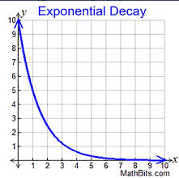
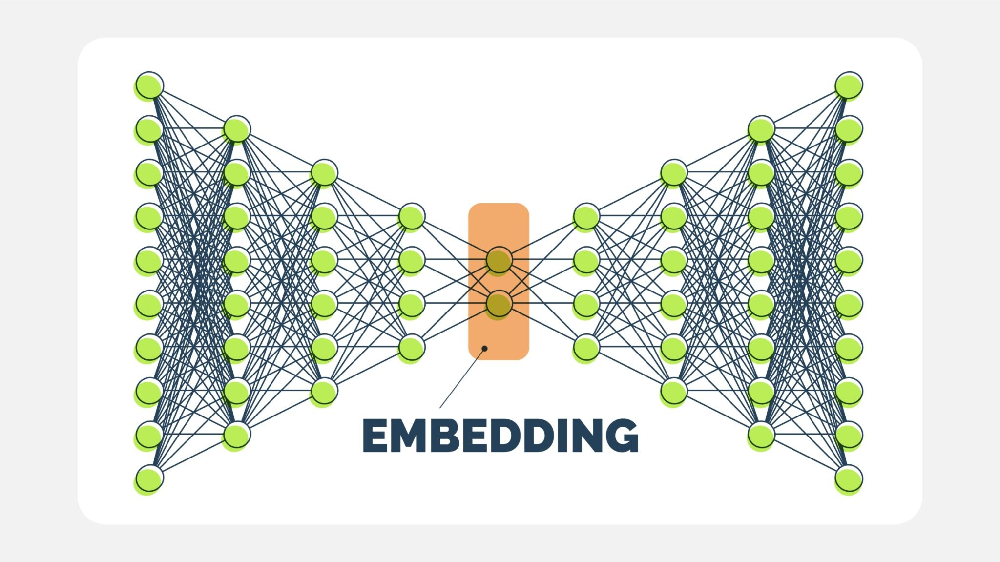
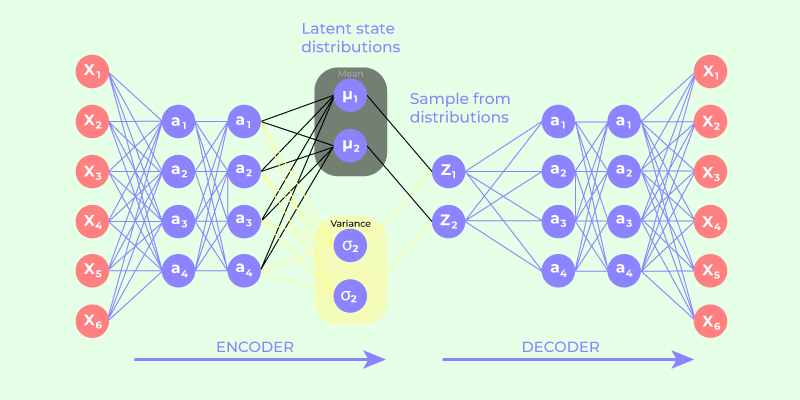

# 3 Deep Learning

# Index for Deep Learning

- [Basics](#basics)
    - [Perceptron](#perceptron)
    - [Feed Forward Neural Networks](#feed-forward-neural-networks)
    - [Hidden Layers](#hidden-layers)
    - [Width of Model](#width-of-model)
    - [Weights and Biases](#weights-and-biases)
    - [Universal Approximation Theorem](#universal-approximation-theorem)
    - [Activation Function](#activation-function)
        - [Need](#need)
        - [Types](#types)
            - [Sigmoid](#Sigmoid-DEPRECATED)
            - [Tanh](#tanh-DEPRECATED)
            - [ReLU (Rectified Linear Unit)](#relu-rectified-linear-unit)
            - [Leaky ReLU](#leaky-relu)
            - [Parametric ReLU](#parametric-relu)
            - [Swish](#swish)
            - [eLU (Exponential Linear Unit)](#elu-exponential-linear-unit)
            - [Softmax](#softmax)
        - [Questions](#questions)
    - [Gradient Descent](#gradient-descent)
        - [Types](#gradient-descent-types)
            - [Stochastic](#stochastic)
            - [Batch](#batch)
            - [Minibatch](#minibatch)
            - [Momentum Based](#momentum-based)
            - [Nesterov Accelerated Gradient Descent](#nesterov-accelerated-gradient-descent)
        - [Common Issues](#common-issues)
            - [Vanishing Gradient](#vanishing-gradient)
            - [Exploding Gradient](#exploding-gradient)
    - [Backpropagation](#backpropagation)
    - [Weight Initialization](#weight-initialization)
        - [Zero Init](#zero-init)
        - [Random Init (Naive)](#random-init-naive)
        - [Xavier Init](#xavier-init)
        - [He Init](#he-init)
    - [Learning Rate Scheduling](#learning-rate-scheduling)
        - [Step Decay](#step-decay)
        - [Exponential Decay](#exponential-decay)
        - [Cosine Annealing](#cosine-annealing)
        - [Polynomial Decay](#polynomial-decay)
        - [LR On Plateau](#lr-on-plateau)
        - [Cyclical](#cyclical)
        - [One Cycle](#one-cycle)
    - [Regularization](#regularization)
        - [L1 LASSO](#l1-lasso)
        - [L2 Ridge](#l2-ridge)
        - [Elastic Net](#elastic-net)
        - [Dropout](#dropout)
        - [Early Stopping](#early-stopping)
        - [Batch Norm](#batch-norm)
        - [Data Augmentation](#data-augmentation)
    - [Optimizer](#optimizer)
        - [SGD](#sgd)
        - [RMSProp](#RMSProp-Root-Mean-Square-Propagation))
        - [Adam](#adam-adaptive-moment-estimation)
        - [AdamW](#adamw)
        - [Ada Grad](#ada-grad)
- [Architectures](#architectures)
    - [Convolutional Neural Networks](#convolutional-neural-networks)
        - [Purpose](#purpose)
        - [Working](#working)
        - [Layer Types](#layer-types)
            - [Convolution](#convolution)
            - [Pooling](#pooling)
            - [Conv Transpose](#conv-transpose)
            - [Unpooling](#unpooling)
            - [Fully Connected](#fully-connected)
        - [Usage](#usage)
        - [Applications](#applications)
    - [Residual Connections / Skip Connections](#residual-connections--skip-connections)
        - [Notable Implementations](#notable-implementations)
    - [Recurrent Neural Networks](#recurrent-neural-networks)
        - [Vanilla RNN](#vanilla-rnn)
        - [LSTM](#lstm)
        - [GRU](#gru)
    - [Encoder Decoder](#encoder-decoder)
        - [Architecture](#architecture)
        - [Shortcomings](#shortcomings)
    - [Attention Mechanism](4_Transformers.md#Attention-Mechanism)
    - [Transformer](4_Transformers.md)
    - [Generative Adversarial Network](#generative-adversarial-network)
    - [Auto Encoder](#auto-encoder)
    - [Variational Auto Encoder](#variational-auto-encoder)
    - [Diffusion Networks](#diffusion-networks)
    - [Transfer Learning](#transfer-learning)
        - [Common Uses](#common-uses-tl)
        - [Usage](#how-to-implement)
    - [Training Strategies](#training-strategies)
        - [Teacher Forcing](#teacher-forcing)
        - [Scheduled Sampling](#scheduled-sampling)
        - [Curriculum Learning](#curriculum-learning)
        - [Professor Forcing](#professor-forcing)
        - [Label Smoothing](#label-smoothing)

## Basics

1. ### Perceptron
   Simplest type of artificial neural network.  
   Predicts using weighted sum and bias followed by an activation function.
    1. **Inputs** (x1,x2,...,xnx_1, x_2, ..., x_nx1,x2,...,xn): Features of the data.
    2. **Weights** (w1,w2,...,wnw_1, w_2, ..., w_nw1,w2,...,wn): Adjustable parameters that stand for importance of
       each feature.
    3. **Bias** (b): A constant term that allows shifting the decision boundary.
    4. **Summation Function:** Computes the weighted sum of inputs
       $$z = \sum_{i=1}^{n} w_i x_i + b$$
    5. **Activation Function**: Applies a step function (threshold function) to determine the output:
       $$y = \begin{cases} 1, & \text{if } z \geq 0 \\ 0, & \text{otherwise} \end{cases}$$
2. ### **Feed Forward Neural Networks**
    - Simplest type of NN
    - Composed of just:
        - Layers process input → hidden → output.
3. ### **Hidden Layers**
    - Layers between the input and output layers
4. ### Width of Model**
    - Number of neurons in a layer
5. ### Weights and Biases**
   (Mentioned above)
   Weights: Defined for each connection. Variable input is multiplied with.  
   Biases: Defined for each node. Variable input shifted by.
6. ### Universal Approximation Theorem
   Pivotal theorem, Any continuous function can be approximated with a sufficiently large neural net with non-linear
   activations (existence, not efficiency). (not a proof of finding it but least knowing that it's possible).
7. ### Activation Function:
   Function applied to the output of a neural network.
    1. #### Need:
       Introduce Non Linearity: Without them NN of any depth would be same as one linear transformation
    2. #### Types:
        1. ##### Sigmoid [DEPRECATED]
           $$f(x) = \frac{1}{1 + e^{-x}}$$
            - 
            - Bounded [0,1]
            - as x→∞ y→ 1
            - as x→-∞ y→ 0
            - at x = 0, y = 0.5  
              Pro Cons:
            - 🔴 Obsolete
            - 🔴 f`(x) maxes out at 0.25 i.e. sure to cause vanishing gradient as you add more
        2. ##### Tanh [DEPRECATED]
           $$\tanh(x) = \frac{e^x - e^{-x}}{e^x + e^{-x}}$$
            - Bounded [-1,1]
            - as x→∞ y→ 1
            - as x→-∞ y→ -1
            - at x = 0, y = 0  
              
            - Pro Cons:
                - 🔴 Obsolete
                - 🔴 f`(x) maxes out at 1 i.e. sure to cause vanishing gradient as you add more
        3. ##### ReLU (Rectified Linear Unit)
           $$f(x) = \begin{cases} x & \text{if } x > 0 \\ 0 & \text{if } x \leq 0 \end{cases}$$
            - 🟢 Only negatively saturates
            - 🟢 Better Sparsity so less computation
            - 🔴 Dying RELU (Can get stuck at 0)
            - 🔴 Not differentiable at 0 (solved using f′(0)=0)
        4. ##### Leaky ReLU
           $$f(x) = \begin{cases} x, & \text{if } x \geq 0 \\ \alpha x, & \text{if } x < 0 \end{cases}$$
            - 🟢 Solves dying relu by letting a small amount of negative gradient through 0< $\alpha$ <<1
            - 🔴 Fixes dying relu but at cost of sparsity
        5. ##### Parametric ReLU
           $$f(x) = \begin{cases} x, & \text{if } x \geq 0 \\ \alpha x, & \text{if } x < 0 \end{cases}$$
            - Same equation as leaky except alpha is a learnable param
            - 🟢 Solves dying relu again
            - 🔴 At cost of sparsity and increased computation
        6. ##### Swish
           $$f(x) = x \cdot \sigma(\beta x) = \frac{x}{1 + e^{-\beta x}}$$
            - $ \beta $ is usually 1
            - Behaves same as relu for x >>0
            - 🟢 provides negative gradient solving dying relu
            - 🔴 Gains are very task dependant, not a universal choice. Used only in deep CNNs
            - 🔴 Increases computation cost
        7. ##### eLU (Exponential Linear Unit)
           $$f(x) = \begin{cases} x & \text{if } x > 0 \\ \alpha \left(e^x - 1\right) & \text{if } x \leq 0 \end{cases}$$
            - 🟢 smooth and allows -ve gradient
            - 🟢 centers at 0 with a smooth negative gradient
            - 🔴 more computation
            - requires $ \alpha $ tuning
        8. ##### Softmax
           $$\text{softmax}(z_i) = \frac{e^{z_i}}{\sum_{j=1}^{n} e^{z_j}}$$
            - Used in multi class classification gives normalized probabilities which sum to 1
            - uses e because summing + and - can cancel some out and e^x is never 0
            - The softmax function takes a vector of raw scores (called logits) and turns them into probabilities.
    3. #### ❓Questions:
        1. **Why is softmax ezi and not zi when both sum to 1?**
            - Zi has certain problems:
                - Negative values break it e.g 1,2,-3
                - It becomes a linear relationship. Exponential highlights larger values
                - Exponential give heightened gradients instead of flatter ones.

8. ### Gradient Descent
   First order iterative algorithm to find local minima of loss function  
   $ \theta_{t+1} \;=\; \theta_t \;-\; \eta \,\nabla_\theta J(\theta_t)$
    - Learning Rate: Determines the size of step taken
    - Epoch: One go through of entire dataset
    - Shuffling: Randomizing order of dataset before every epoch.

    1. ### Gradient Descent Types:
        1. ### Stochastic
            - Uses one training example per update
            - 🔴 Noisy updates can cause zigzagging
            - 🔴 Unstable
            - 🟢 Stochasticity can help escape local minima
        2. ### Batch
            - Uses entire dataset i.e update once every epoch
            - 🟢 Very stable
            - 🔴 Very slow
            - 🔴 Consumes a lot of memory loading entire DS into memory
            - 🟢 Smooth Convergence
        3. ### Minibatch
            - Uses smaller batch sizes usually 32,64,128 and updates per mini batch
            - Good middle ground
            - 🟢 Smoother than stochastic
            - 🟢 Faster convergence than batch
            - 🔴 Requires tuning batch size
        4. ### Momentum Based
            - Not a metric of data set used.
            - Adds a fraction of previous update to accelerate descent
            - $$v_t = \gamma v_{t-1} + \eta \nabla_\theta J(\theta_{t-1})$$
            - $$\theta_t = \theta_{t-1} - v_t$$
            - vt is velocity
            - $ \gamma$ momentum coefficient (i.e how much past gradient matters)
            - $ \eta $ learning rate

        5. ### Nesterov Accelerated Gradient Descent
            - Adds look ahead to momentum i.e. calculates descent from a position which is already at position post this
              update
            - Basically it uses the velocity update on the theta param (calc) itself instead of just on the final params
            - $$v_t = \gamma v_{t-1} + \eta \nabla_\theta J(\theta_{t-1} - \gamma v_{t-1})$$
            - 🟢 faster convergence
            - Optimizer is peeking ahead and adjusting course in direction before overshooting.

    2. ### Common Issues:
        1. ### Vanishing Gradient
            - During backpropagation gradients are calculated using chain rule:
              $\frac{\partial L}{\partial x} = \frac{\partial L}{\partial y} \cdot \frac{\partial y}{\partial x}$
            - if each derivative <1 multiplication causes gradient to earlier layers ~ 0
            - This causes neurons to stop updating
            - Solution?
                - Detection: Manually log gradients or use hooks in pytorch
                - Use better activation functions: ReLU than sigmoid/tanh, leaky relu than relu
                - Proper weight init: Xavier/He
                - Add norm layers
                - Use Skip connections
        2. ### Exploding Gradient
            - During backpropagation gradients are calculated using chain rule:
            - $\frac{\partial L}{\partial x} = \frac{\partial L}{\partial y} \cdot \frac{\partial y}{\partial x}$
            - if each derivative >1 multiplication causes gradient to earlier layers to reach infinity
            - Causes spikes in training loss, signal is lost
            - Solution?
                - Detection: Manually log gradients or use hooks in pytorch
                - Gradient Clipping:
                    - Two Common ways:
                        1. Clipping by Value: each individual gradient is maxed at v threshold
                        2. Clip by Norm: if the L2 norm of entire gradient > τ -> clip it by g = g.τ/||g||
9. ### Backpropagation
10. ### Weight Initialization
    1. #### Zero Init
        - Initialize all weights as 0
        - 🔴⚠️ Terrible idea, any time all weights have same value causes symmetric learning i.e. all neurons in layer
          learn same values
    2. #### Random Init (Naive)
        - Assigns random values to avoid zero init
        - if weights are too small or too large will cause vanishing/exploding gradient
    3. #### Xavier Init
        - designed to keep variance and gradients approx same across all layers to avoid vanish/exploding gradient
        - ideal for **tanh/sigmoid**
        - 2 Types:
            1. Uniform:
                - $$W \sim \mathcal{U}\!\left(-\sqrt{\tfrac{6}{n_{\text{in}} + n_{\text{out}}}}, \; \sqrt{\tfrac{6}{n_{\text{in}} + n_{\text{out}}}}\right)$$
            2. Normal:
                - $$W \sim \mathcal{N}\!\left(0, \; \tfrac{2}{n_{\text{in}} + n_{\text{out}}}\right)$$
        - nin and nout are number of connections in and out respectively
        - symmetric around 0 and squash values, so both the input side (fan-in) and output side (fan-out) matter
    4. #### He Init
        - designed to keep variance and gradients approx same across all layers to avoid vanish/exploding gradient
        - ideal for **Relu**
        - 2 Types:
            1. Uniform:
                - $W \sim \mathcal{U}\!\left(-\sqrt{\tfrac{6}{n_{\text{in}}}}, \; \sqrt{\tfrac{6}{n_{\text{in}}}}\right)$
            2. Normal:
                - $W \sim \mathcal{N}\!\left(0, \; \tfrac{2}{n_{\text{in}}}\right)$
        - nin are number of connections in
        - Relu halves outputs (only +ves), variance of He doubled to compensate (compared to Xavier)
        - But since the key variance-preserving step happens on the input side, He init only uses fan-in
        - (on output side dL/dz gives 1 or 0 only unlike Xavier where it's a complex value)
        - ℹ️ Pytorch uses He Uniform Initialization by Default

    - ℹ️ Uniform distribution implies each value in this range is equally likely while normal implies higher likelihood
      at mean
11. ### Learning Rate Scheduling
    1. #### Step Decay
        - $\eta_t = \eta_0 \cdot \gamma^{\left\lfloor \tfrac{t}{T} \right\rfloor}$
        - Drops LR by a constant factor every few epochs
        - 
    2. #### Exponential Decay
        - $\eta_t = \eta_0 \cdot e^{-\lambda t}$
        - Drops learning rate exponentially per epoch
        - 
    3. #### Cosine Annealing
        - Follows gentler cosine function (convex first then concave)
        - $\eta_t = \eta_{\min} + \tfrac{1}{2}(\eta_0 - \eta_{\min}) \left(1 + \cos\!\left(\frac{\pi t}{T_{\max}}\right)\right)$
        - 
    4. #### Polynomial Decay
        - $\eta_t = \eta_0 \left( 1 - \frac{t}{T_{\max}} \right)^p$
        - Constant polynomial decay
    5. #### LR On Plateau
        - Reduces when a validation metric plateaus (i.e. stops improving)
    6. #### Cyclical
        - Increases and decreases learning rate
        - 🔴 Need max and min and cycle rate careful tuning
        - 🟢 can help get out of minima
        - 
    7. #### One cycle
        - Increases initially then decreases rapidly
        - Gives fast convergence
        - 
12. ### Regularization
    1. #### L1 LASSO
        - Least Absolute Shrinkage and selection operator
        - Applies linear penalty to magnitude of weight
        - 
        - Forms n dimensional diamond constraint region
        - 
        - 🟢 Causes Sparsity which can speed up computation
        - 🟢 Makes model more interpretable
        - 🔴 Sparsity can force useful weights to 0, once set to 0 always vanishes
    2. #### L2 Ridge
        - 
        - Applies quadratic penalty to magnitude of weight
        - Since penalty is quad doesn't force sparsity
        - Since w < 1 would make w^2 even smaller
        - And w>1 would be much larger so minimizes this first
        - 🟢 Prevents overfitting while keeping all the features
        - Forms circular constraint region
        - 
    3. #### Elastic Net
        - 
        - Combines L1 and L2
        - Combines benefit of both
        - 🔴 Requires tuning of relative lambda 1 and 2 for benefits
    4. #### Dropout
        - Temporarily disable output of select randomly chosen neurons while training
        - Chooses based on probablity p (hyperparam)
        - 🟢 Reduces overbalance of model on select neurons
        - 🔴 Slows convergence
        - Requires careful tuning with batch normalization (since batch norm computes mean and variance of all outputs
          while training and uses them while eval and if some are missing while training will skew the numbers)
    5. #### Early Stopping
        - Monitors performance on validation set and stops training once plateaus
        - i.e. some validation stops increasing
        - Params:
            - Patience: number of epochs
            - Monitor: Which metric to monitor
            - Restore Best Weights
            - Min_Delta: What counts as a plateau
        - 🟢 Easy to implement
        - 🟢 Reduces overfitting
        - 🔴 Requires validation set
        - 🔴 May prematurely stop (good training can have plateaus)
    6. #### Batch Norm
        - Applied after linear and convolution layer but before activation function
        - (Linear / Convolution)→BatchNorm→Activation(📌e.g. ReLU)
        - Converts Values to Z score:
        - $\hat{z} = \frac{z - \mu_B}{\sqrt{\sigma_B^2 + \epsilon}}$
            - $\epsilon$ term is a small positive number to prevent divide by 0
        - Then adds trainable $\gamma$ and $\beta$ to shift (since some models perform better when mean =/ 0)
        - $z_{\text{BN}} = \gamma \hat{z} + \beta$
        - 🟢 Faster training on regularized terms
        - 🟢 Reduces exploding and vanishing gradient
        - 🔴 Requires careful usage with dropout
    7. #### Data Augmentation?
13. ### Optimizer
    1. #### SGD
        - Foundational and simple
        - $\theta_{t+1} = \theta_t - \eta \, \nabla_\theta \mathcal{L}(\theta_t)$
        - With momentum :
            - $$v_{t+1} = \mu v_t - \eta \nabla_\theta \mathcal{L}(\theta_t), \quad \theta_{t+1} = \theta_t + v_{t+1}$$
        - [NAG](#Nesterov-Accelerated-Gradient-Descent) is possible to use with this
    2. #### RMSProp (Root Mean Square Propagation)
        - $$E[g^2]_t = \gamma E[g^2]_{t-1} + (1-\gamma)(\nabla_\theta \mathcal{L}(\theta_t))^2$$
        - $$ \quad \theta_{t+1} = \theta_t - \frac{\eta}{\sqrt{E[g^2]_t + \epsilon}} \nabla_\theta \mathcal{L}(\theta_t)$$
        - E[g^2] is a vector, holding one running average per parameter.
        - $\epsilon$ small number, prevents divide by 0
        - Adapts learning rate according to each parameter individually.
        - Keeps a moving squared average of squared gradients (not Expectation)
        - Updates are smaller when gradient is large -> Why? We want to move slower on params which loss function is
          highly
          sensitive to.
        - Used to be useful in RNNs no longer SOTA
    3. #### Adam (Adaptive Moment Estimation)
        - Formulae:
            - $m_t = \beta_1 m_{t-1} + (1-\beta_1)\nabla_\theta \mathcal{L}(\theta_t)$
            - $\quad v_t = \beta_2 v_{t-1} + (1-\beta_2)(\nabla_\theta \mathcal{L}(\theta_t))^2$
            - $\quad \hat{m}_t = \frac{m_t}{1-\beta_1^t}$
            - $\quad \hat{v}_t = \frac{v_t}{1-\beta_2^t}$
            - $\quad \theta_{t+1} = \theta_t - \frac{\eta}{\sqrt{\hat{v}_t}+\epsilon}\hat{m}_t$
        - Uses exponentially decaying moving averages of moments:
            1. First Moment: Mean of gradients (mt) -> Why? Because the raw gradient can be noisy
            2. Second Moment: Mean of squared gradients (vt) -> Why square? Squaring removes the sign, leaving only the
               magnitude
        - Corrects bias introduced by (1-$\beta$) at step 1 (no mt-1)
        - at final step divides momentum by sqrt of velocity
        - This controls rate of descent
        - Example:
            - Suppose a parameter’s gradient sequence looks like this over time:+5,−5,+5,−5
            - The mean gradient (first moment, 𝑚𝑡) will average out close to zero, because positives and negatives
              cancel.
            - The squared gradient (second moment, 𝑣𝑡) will stay large (since 5^2=25, no cancellation).
            - A parameter with gradients that constantly flip sign is a parameter where the optimizer isn’t confident
              about which way to move so slows rate of descent
    4. #### AdamW
        - Difference only matters when using L2 Regularization
        - In vanilla adam lambda penalty is added to gradient
        - This means penalty is scaled and carried forward in next steps moving average too (penalty of current weights
          to be precise)
        - AdamW only applies Lambda penalty at final step seperately
    5. #### Ada grad
        - Ancestor to RMS Prop without the moving average

## Architectures

1. ### Convolutional Neural Networks
   
    - #### Purpose:
        - For processing grid structured data like images
    - #### Working:
        - Apply kernels to input images to extract important features
        - Kernel: Smaller matrix that slides over image
    - #### Layer Types:
        - ##### Convolution:
            - Performs convolution operation with Filter of **size F** and **Stride S**
            - Filter is trainable
            - Specify n to have n different filters to produce n separate feature maps
            - Params:
                - Filter Size F
                - Stride S
                - Padding P → Extra 0 pixels added to edges of image (in case we don't want to downsample)
                    - Valid/No → None Added
                    - Same → Pads to same as input
                    - Full → Actually upsamples, each layer gets it's full conv
                    - Formula Output Size = 1+(N-F)/S where N is input dimension
        - ##### Pooling:
            - Pooling non trainable downsampling operation
            - Applies simple operation on its filter elements:
                - Max → 🟢 Preserves Best detected features
                - Average → 🟢 Preserves overall features
        - ##### Conv Transpose:
            - Opposite of convolution, transpose
            - Upsampling operation, trainable
        - ##### Unpooling:
            - Not as popular
            - Sets middle index and rest 0
        - ##### Fully Connected:
            - Good Ol' Fully Connected Layer
    - #### Usage:
        - Deep CNN themselves no longer SOTA but are used extensively in SOTA models 📌e.g. UMAP in diffusion
        - 🟢 Less resource intensive than ViT
        - 🟢 Easier to train on small datasets, ViT have massive DS requirements
    - #### Applications:
        - Image Classification
        - Object Detection (can do singular and multiple as well)
    - To Explore:
        - Object Detection Loss
        - Notable networks and their architectures
2. ### Residual Connections / Skip Connections
    - NN which has shortcuts from earlier to deeper layers
    - 🟢 Helps Signal and Gradient flow through better (by ensuring signal is not lost across layers)
    - Essentially H(x)=F(x)+x
    - 🟢 Enables training of networks with hundreds of layers
    - ### Notable Implementations:
        - Almost every very deep network (from transformer to deep cnn to Diffusion)
        - Unet (Uses Residual and CNN)
            - Shaped like a U. Walls are downsampling operations and upsampling operations (conv)
            - Left Side: Encoder → Downsamples
            - Right Side: Decoder → Upsamples
            - Bottle Neck: Exists at deeper layers
            - Residual connections exist from each layer left to right to ensure bottleneck doesn't stop data
            - 
3. ### Recurrent Neural Networks
    - Composed of sequential units that use previous output and have hidden states carried forward
    - Each neuron feeds into itself at every timestep, shown below unrolled
    - 
    - Hidden state is a function of last hidden state and input $$h_t = \phi(h_{t-1}, X_t)$$
    - Trained using backpropagation through time (BPTT) i.e. same weights are trained calculating gradient multiple
      times for each sequence.
    - Can have multiple input output configurations
    - 

    1. #### Vanilla RNN
        - Usually rely on these formulas
        - $$h_t = \tanh(Wh_{t-1} + Ux_t)$$
        - $$y_t = \mathrm{softmax}(Vh_t)$$
        - Softmaxxed to give resulting probablities (like in text generation)
    2. #### LSTM
        - 
        - Equations:
            - $$i = \sigma(W_i h_{t-1} + U_i x_t + V_i c_{t-1})$$
            - $$f = \sigma(W_f h_{t-1} + U_f x_t + V_f c_{t-1})$$
            - $$o = \sigma(W_o h_{t-1} + U_o x_t + V_o c_{t-1})$$
            - $$\mathrm{\tilde{C}}_{t} = \tanh(W_g h_{t-1} + U_g x_t)$$
            - $$c_t = (f * c_{t-1}) + (\mathrm{\tilde{C}}_{t} * i)$$
            - $$h_t = \tanh(c_t) * o$$
        - Forget gate (f) controls how much to keep or forget by outputting 0 to 1
        - Input controls how much of input is used in C (long term memory)
        - H is called short term memory because it is calculated and passed at each step
        - C is modified slowly over time
    3. #### GRU
        - GRU only has reset and update gates
4. ### Encoder Decoder
    - #### Architecture:
    - #### Shortcomings:
        1. 🔴 Sequential Execution: Happens across time step with each next step dependent on previous (slows max
           possible rate of training)
        2. 🔴 Bottle Neck at Encoded Vector: Since context vector is fixed length no matter length of input sequence
        3. 🔴 No long range dependencies: Hidden state decays almost instantly, even long term memory decays across
           sequence
5. ### Attention Mechanism [explained in Transformers.md](4_Transformers.md#Attention-Mechanism)
6. ### Transformer [explained in Transformers.md](4_Transformers.md)
7. ### Generative Adversarial Network
    - Use two neural networks:
        1. Generator:
            - Creates new data
            - Takes random noise as input, transforms into something that resembles real data
        2. Discriminator:
            - This neural network acts as a binary classifier.
            - Its job is to examine an input and determine whether it's genuine or fake.
    - The Adversarial Process:
        - The generator and discriminator are trained simultaneously.
        - The generator tries to produce outputs that are so realistic they can fool the discriminator. The
          discriminator, in turn, gets better
          at spotting the fakes.
        - These are trained alternatingly freezing one while other learns
        - This creates a feedback loop: every time the discriminator successfully identifies a fake, the generator
          learns from its mistake and adjusts its parameters to produce more convincing fakes.
        - Over many iterations, this competitive process drives both networks to improve, with the generator becoming so
          skilled that the discriminator can no longer reliably tell the difference between a real and a generated
          sample.
    - Issues:
        - Model Collapse:
            - Model produces limited variety of good examples that fool Discriminator, fails to generalize
            - one of the most common and significant problems
        - Vanishing Gradients:
            - If Discriminator is too strong, Generator gets a 0 for everything
        - Training Instability and non convergence:
            - The generator and discriminator are constantly trying to
              outmaneuver each other, which can lead to oscillations in their performance, making it difficult for the
              models to converge to a stable state.
        - Difficulty in Evaluation:
            - Unlike traditional supervised learning tasks with clear metrics like accuracy,
              evaluating the quality and diversity of generated samples in GANs is complex.
            - Metrics like Inception Score (IS) and Fréchet Inception Distance (FID) have been developed, but they only
              provide a partial understanding of the model's true performance.
8. ### Auto Encoder
    - Unsupervised learning model
    - Primary Goal: Learns a compressed/encoded representation of the input and recreates it to match at output end.
    - 
    - Parts:
        1. ### Encoder:
            - Takes the input data and progressively reduces its dimensionality through a series of layers.
            - The final output of the encoder is the **latent space representation** (also called the bottleneck or
              code)
            - This representation is shown to outperform PCA in lower dimensional information capturing
        2. ### Decoder:
            - Takes the compressed latent space representation and attempts to reconstruct the original input data.
            - The goal of the decoder is to make its output as similar as possible to the original input.
    - Common Types:
        - Denoising Autoencoder:
            - trained on corrupted or noisy data. The goal is to learn to reconstruct the original, clean data from the
              noisy input.
        - Sparse Autoencoder:
            - introduce a sparsity constraint on the latent space representation. This means that only a small number of
              neurons in the bottleneck layer are allowed to be active at any given time. This encourages the network to
              learn a more efficient and distinct representation of the data.
    - Applications:
        - Dimensionality Reduction
        - Anomaly Detection: By learning a representation of "normal" data, an autoencoder can flag data points that
          have a high reconstruction error as anomalies.
        - Image Denoising
        - Image Generation: (VAE)
9. ### Variational Auto Encoder
    - A variational autoencoder (VAE) is a type of generative model that learns a compressed, probabilistic
      representation of data. Unlike a standard autoencoder, which learns a fixed-point representation, a VAE models the
      data's underlying structure by mapping it to a distribution in a latent space.
    - In practice, it maps to fixed points too, but the fixed points are mean and variance. Then these are used as a
      probablity distribution and sampled from (with a lower z score) to recreate input.
    - This probabilistic approach allows VAEs to generate new, realistic data points that are similar to the training
      data.
    - 
    - Components:
        - Encoder: Maps input to the parameters of a probability distribution in the latent space.
        - Latent Space: lower-dimensional space where the compressed representations of the data reside. In a VAE, each
          data point is represented not as a single point, but as a probability distribution
        - Decoder: This network takes a point sampled from the latent space distribution and reconstructs the original
          data.
    - Re parametrization Trick:
        - The VAE's objective function is a combination of two terms, and we need to use backpropagation to train the
          network. However, the process of sampling from the latent space distribution (N(μ,σ 2 )) is not
          differentiable.
        - reparameterization trick solves this by separating the randomness from the network's parameters. Instead of
          sampling directly from N(μ,σ^2), we sample from a standard normal distribution N(0,1)
        - z = μ+σ⋅ϵ
    - Loss Function:
        - VAE's objective function, often called the Evidence Lower Bound (ELBO), is a trade-off between two competing
          goals: accurate reconstruction and a well-behaved latent space.
        - Consists of Two Parts:
            - Reconstruction Loss:
                - This term measures how well the decoder can reconstruct the original input from a
                  sample of its latent distribution.
                - Usually binary cross-entropy for black and white images
                - MSE for colored ones
            - KL Divergence:
                - measures the difference between the distribution learned by the encoder for a given data point and a
                  standard normal distribution N(0,1)
                  Loss=ReconstructionLoss+β⋅KL_Divergence
10. ### Diffusion Networks
11. ### Transfer Learning
    - Machine learning technique where a model trained on one task is reused (partially or fully)
      on a different but related task.
    - Instead of training a model from scratch, you start with a pretrained model that has already learned useful
      features
      from a large dataset, and you fine-tune it for your specific task.
    - ### Common uses (TL):
        - Feature extractor: The initial layers (often convolutional or embedding layers) that learn to identify general
          features such as edges, shapes, textures, or word relationships.
            - Often uses as perceptual loss calculating in image models
    - ### How to implement:
        - Freezing and Fine-Tuning
            - Freezing: The feature extractor’s weights are frozen, meaning they are not updated during training.
                - A new classification head is appended and trained on the target dataset.
                - This approach is useful when the target dataset is small or closely related to the original dataset.
            - Fine-Tuning:
                - After replacing the classification head and training it for a few epochs, some or all of the
                  pretrained layers
                  are unfrozen.
                - The entire model, or select layers, are retrained with a smaller learning rate to refine feature
                  representations.
                - Fine-tuning is beneficial when the target task differs significantly from the source task.
12. ### Training Strategies
    1. #### Teacher Forcing:
        - Feeds the ground truth previous tokens at time t rather than the model's output at time t-1
        - 🟢 Allows training in parallel since model is not required to output t-1
        - 🟢 Allows model to learn accurate output to accurate t-1
        - 🔴 Exposure Bias: Model struggles with its own predictions since it never trained on that
    2. #### Scheduled Sampling
        - Solution to teacher forcing (Solves exposure bias)
        - Gradually reduces amount of teacher forcing
        - 🔴 Causes training instability
        - 🔴 Can cascade errors if models t-1 output is wrong
    3. #### Curriculum Learning
        - Trains on easier sequences first then more difficult one
        - Imitates teaching humans via curriculum
        - 2 styles:
            - In Epoch (ordered Batches):
                - same epoch ordered easy to hard
                - 🟢 Simple
                - 🔴 Doesn't give model enough time
                - 🔴 Can confuse optimizer due to change in gradient
            - Across Epoch (staged):
                - Feed easier DS first
                - 🟢Improved Generalization
                - 🔴Harder to implement
        - 🟢 Faster convergence
        - 🟢 Improved Generalization
        - 🔴Difficult to tell what model actually considers difficult
    4. #### Professor Forcing
        - Similar to GAN
        - Generate both teacher forced and free run output together
        - Aim is to fool discriminator into thinking it was teacher forced when it wasn't
        - 🟢 Eliminates Train Test Mismatch
        - 🟢 Differentiable
        - 🟢 Works well for longer sequences
        - 🔴 Very complex
    5. #### Label Smoothing
13. ### Model Compression and Optimization
    1. ### Knowledge Distillation
        - Used to create smaller models yb scaling down larger ones without signficat loss in accuracy
        - Process:
            - Use teacher(original) and student model
            - Train student model to predict the same outputs as teacher but with one difference
            - Student is trained to predict soft targets (like p for each class in classification) instead of hard
              labels 1|0
            - Much easier to learn with softer targets since richer in info
            - Use combination of: KL Divergence and Standard Loss (📌e.g. Cross entropy for sample)
    2. ### Quantisation
        - Takes a trained model and reduces numerical precision of weights/activations
        - If precision not reduced by a lot, output remains similar
14. ### HyperParameter Tuning
    - hyperparameters are settings that are not learned by the model during training but are set before training starts.
      They control the learning process.
    - 📌Examples of hyperparameters:
        - **Category**    | Examples
        - **Model architecture**:    Number of layers, number of neurons per layer
        - **Learning process:**    Learning rate, batch size, optimizer type
        - **Regularization:**    Dropout rate, L2/L1 weight decay
        - **Training process:**    Number of epochs, early stopping patience
    - ### Need:
        - Hyperparameters strongly affect model performance:
        - Too high a learning rate → model may diverge.
        - Too low → model trains very slowly or gets stuck in a bad minimum.
        - Too many layers → overfitting.
        - Too few layers → underfitting.
    - ### Hyperparameter Tuning Methods:
        1. ### Manual Search
            - Try a few combinations by intuition.
            - Simple but inefficient for large search spaces.
        2. ### Grid Search
            - Define discrete values for each hyperparameter.
            - Train on all combinations.
            - 🟢 Exhaustive, easy to implement
            - 🔴 Very computationally expensive for many parameters
        3. ### Random Search
            - Randomly sample hyperparameters from distributions.
            - Often better than grid search because some parameters matter more than others.
            - Example: sample learning rate from log-uniform(1e-5, 1e-1)
            - 🟢 Can explore more space efficiently
            - 🔴 Still can be slow if model is large
        4. ### Bayesian Optimization
            - Uses past results to choose the next set of hyperparameters intelligently.
            - BO treats the objective function (e.g., validation accuracy as a function of hyperparameters) as unknown
              and expensive to evaluate.
            - model it probabilistically using a surrogate model (usually a Gaussian Process, GP)
            - The model is trained for a few epochs for surrogate model can learn its performance
            - Then it's trying to predict the model's accuracy as a function of hyperparams
            - Uses Acquisition Function
                - Acquisition function tells us where to try next.
                - Common functions:
                    1. **Expected Improvement (EI)**: Choose points likely to improve current best.
                    2. **Upper Confidence Bound (UCB)**: Combines mean and uncertainty to balance exploration/exploitation.
                    3. **Probability of Improvement (PI)**: Probability that the new point improves the best so far.