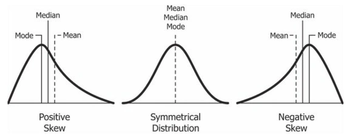
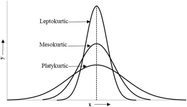
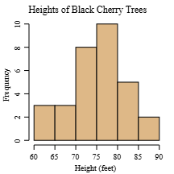
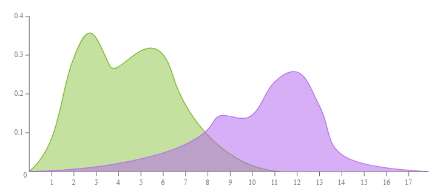
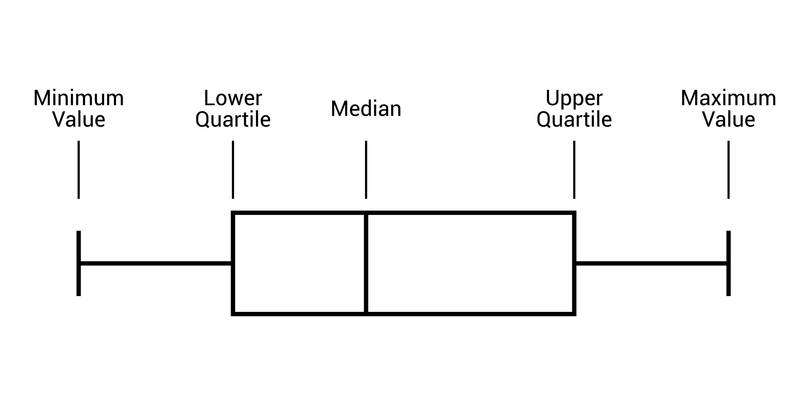
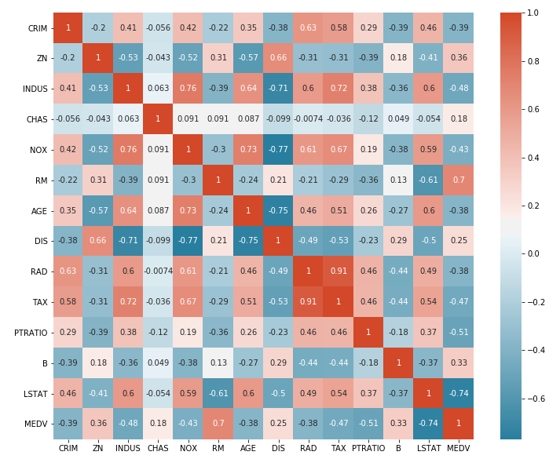

# Exploratory Data Analysis

- set of techniques for understanding a dataset.
- uses list of methods - primarily visual - to explore and summarize main characteristics of dataset
- ## Aim:
    - Summarize Data: Get high level overview
    - identify patterns and relationships
    - Detect outliers and anomalies
    - check assumptions

## Steps/Process

1. Data Cleaning and Preprocessing
    1. Data Cleaning
    2. Handling Missing Data
        1. Imputation Strategies -> Mean, median, mode interpolation
        2. Regression
    3. Handling Duplicates
    4. Handling Outliers
    5. Outlier Detection Methods [#reade here](1_DataPreProcessing.md#Outlier-detection)
    6. ### Outlier Treatment (capping, transformation, removal)
        1. ### Capping:
           - Limiting extreme values to a certain percentile
           - Outliers don’t dominate the data but are not entirely discarded.
           - 📌 e.g. 1st Percentile 500, 99th 5000. if x<500-> x = 500
        2. ### Transformation:
           - Transformation changes the scale of your data to reduce the impact of outliers.
           - Commons Techniques:
             1. ### Log Transformation
                - Applies y=log(x) to compress large values.
                - Best for +ve skewed data
             2. ### Square Root Transformation
                - applies y = sqrt(x)
                - 🟢 Reduces impact of large values without being as strong as log
             3. ### Box-Cox Transformation
                - $y(\lambda) = \begin{cases} \frac{y^\lambda - 1}{\lambda}, & \lambda \neq 0 \\ \ln(y), & \lambda = 0 \end{cases}$
                - Generalized transformation
                - 🔴 Requirse choosing Lmabda
                - 🟢 Keeps All Data
                - 🔴 Hard to interpret
                - 🔴 Not applicable to <=0
             1. ### Log Transformation 
       3. ### Removal:
          - Removing outliers involves deleting the extreme values entirely from your dataset.
          - 🟢 Simple and effective
          - 🔴 Risk losing signal
          - 🟢 Avoid statistical distortion
    7. Encoding
    8. Creating new features
    9. ### Date time decomposition
       - process of breaking down a single date-time value into its individual components to make it easier to analyze, manipulate, or use in calculations
2.

- ## Tools:
    1. ### Summary Statistics:
        1. ### Measures of central tendency
            - Mean: The average value. It's sensitive to outliers.
            - Median: The middle value when the data is sorted. It's robust to outliers.
            - Mode: The most frequently occurring value.
        2. ### Measures of dispersion (Spread):
            - **Range**: The difference between the maximum and minimum values.
            - **Variance and Standard Deviation**: Measures of how much the data deviates from the mean. A higher
              standard deviation indicates greater spread.
            - **Interquartile Range (IQR)**: The range of the middle 50% of the data. It's the difference between the
              first quartile (25th percentile) and the third quartile (75th percentile) and is a robust measure of
              spread.
        3. ### Skewness:
            - Measure of asymmetry of a probablity distribution
            - 
            - Types:
                - Symmetric: No skew left or right
                - Positive Skew:
                    - The tail of the distribution extends to the right.
                    - most of the data is concentrated on the left side
                - Negative Skew:
                    - The tail of the distribution extends to the left.
                    - most of the data is concentrated on the right side
        4. ### Kurtosis:
            - Measure of tailedness of probablity distribution
            - $K = \frac{\frac{1}{n} \sum_{i=1}^{n} (x_i - \bar{x})^4}{\left(\frac{1}{n} \sum_{i=1}^{n} (x_i - \bar{x})^2\right)^2}$
            - 
            - Types:
                1. Leptokurtic (High Kurtosis):
                    - kurtosis > 3
                    - Have fatter tails
                2. Platykurtic (Low Kurtosis):
                    - kurtosis < 3
                    -
                3. Mesokurtic:
    2. ### Data Visualization
        - Arguably the most important component of EDA
        - Humans can much better comprehend visualizations than raw data
        - Types:
            1. Histograms:
                - shows the distribution of a single numerical variable
                - Divides the data into bins and displays frequency of data points in each bin
                - 
            2. Density Plot:
                - Graph that visualizes the distribution of a continuous variable using a smoothed curve
                - Provides a continuous and fluid representation of the data's probability density function
                - Alternative to histogram, using a method called kernel density estimation to smooth out data.
                - 🟢 Ideal for comparing two or more datasets, as overlapping curves provide an easy way to contrast
                  different distributions
                - 
            3. Box Plots:
                - Summarizes the distribution of a numerical variable
                - Useful for comparing distributions across different groups
                - The box represents the IQR, the line inside is the median
                - the "whiskers" extend to the minimum and maximum non-outlier values.
                - 
            4. Scatter Plot:
                - Shows the relationship between two numerical variables.
                - Each point represents an observation, position determined by the values of the two variables.
                - 🟢 Excellent for spotting correlations
            5. Pair Plots:
                - A pair plot, also known as a scatterplot matrix, is a visualization tool that displays pairwise
                  relationships between multiple numerical variables in a dataset.
                - It creates a grid of plots, with scatter plots showing the relationship between two different
                  variables
            6. Pie Chart
            7. Bar Plot
            8. HeatMaps (for correlation):
                - A heatmap correlation is a graphical representation of a correlation matrix, where the strength and
                  direction of the relationship between variables are shown using color
                - 
    3. ### Correlation Analysis
        1. Pearson
        2. Spearman
        3. Kendall
    4. Categorical Analysis:
        1. Frequency Counts
        2. Proportions

## Types:

1. ### Univariate Analysis
    - Focuses on studying one variable to understand its characteristics
    - helps to describe data and find patterns within a single feature.
    - Tools Used:
        1. For Numerical Features:
            1. Summary Statistics: Mean, Mode, Median, Variance, Skew, Kurtosis
            2. Visualization: Histogram, BoxPlots, Density Plot, Violin Plot
        2. Categorical Features:
            1. Frequency Counts and Proportions
            2. Visualizations: Bar Plot, Pie Chart
    -
2. ### Bivariate Analysis
    - Focuses on identifying relationship between two variables to find connections, correlations and dependencies
    - Basically identify how two variables interact with each other
    - Types:
        1. Numerical vs Numerical:
            - Correlation Analysis (Pearson, Spearman, Kendall), Scatter Plots, Pair Plots
        2. Numerical vs Categorical
        3. Categorical vs Categorical:
            - Cross Tabulation
            - Chi square test
            - Stacked bar charts/heatmaps
3. ### Multivariate Analysis
    - Correlation Heatmap
    - Pairwise Plots/Scatter Matrix
    - Dimensionality Reduction
        - PCA
        - T-SNE/UMAP for viz
    - Interactions
        - Feature Combinations
        - Pivot Tables/Aggregations
4. Handling Imbalanced Data
    1. Resampling Techniques:
        1. SMOTE (Oversampling) [#reade here](1_DataPreProcessing.md#SMOTE-Synthetic-Minority-Oversampling-Technique)
        2. ADA SYN (Oversampling) [#reade here](1_DataPreProcessing.md#ADASYN-Adaptive-Synthetic-Sampling)
        3. Undersampling
        4. Class Weight Adjustment