# AWS Lex & Bedrock

# AWS Lex
AWS Chatbot service, allows Voice and Text
Benifits: Simple, seamless deployment and scaling
ℹ️ Seamless Deployment: Deployment without disruption
### Components:
- **Bot**: Chatbot container
- **Intent**: Final Action or Goal User wants. Can be more than 1
 e.g Hotel Booking is the final intent (not rooms, nights questions)
- **fallback Intent**: If lex can't match with a specific one then goes to fallback
e.g Sorry I didn't understand. You can ask me to do A or B.
(It can )
- **Utterance**:  User input or phrases user might say to trigger intent
- **slots**: Variables bots need to complete task
- **Slot types**: Types of values slot can take
- **Prompts**: Questions bot asks to get slot values
- **Confirmation**: Bot confirms once you add slot values to confirm to trigger intent
- **fulfillment**: 
- **Response Cards**: 
- **Contexts**: Contexts are like flags or conversation states to steer conversation to one intent only once active (useful when too many intents), 
  - two types
    - Input: Set to follow a specific intent  
    e.g I want to book a hotel -> triggers hotel booker -> how many rooms? (routes to hotel booking only)
    - Output: triggered once one intent finishes and routes to another  
      e.g you booked a hotel, now books a taxi pickup
  - Expiry: expires after its time-to-live
    - Turns: How many turns it stays active
    - Time - real time seconds
  - Lambda: Can also be deactivated by lambda state update
- **Session**: A session is the lifecycle of a single conversation between a user and your Lex bot.
- **Session State**: Session State holds all the conversation data, intent, slot values, contexts etc.
- **Hooks**: Can be
  - Dialog (DialogCodeHook): Called before prompt provided to user. To modify prompt or load slot values manually
  - Fulfilment (FulfillmentCodeHook): Called at end, when you call intent  
    You check which kind of call to lambda it is by checking '**invocationSource**'
- **Dialog Action**: Steers conversation
  - ElicitSlot → ask the user for a specific slot.
  - ElicitIntent → ask user for intent again.
  - ConfirmIntent → ask if user really meant this intent.
  - Delegate → let Lex continue managing dialog (default).
  - Close → end the conversation.
  

## Creating a Lex Bot
- On lex create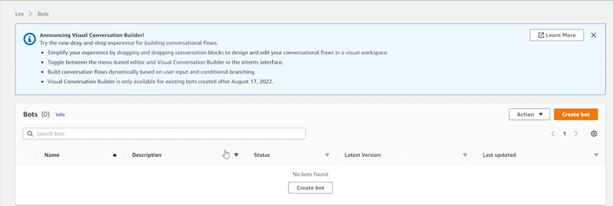
- Have a few options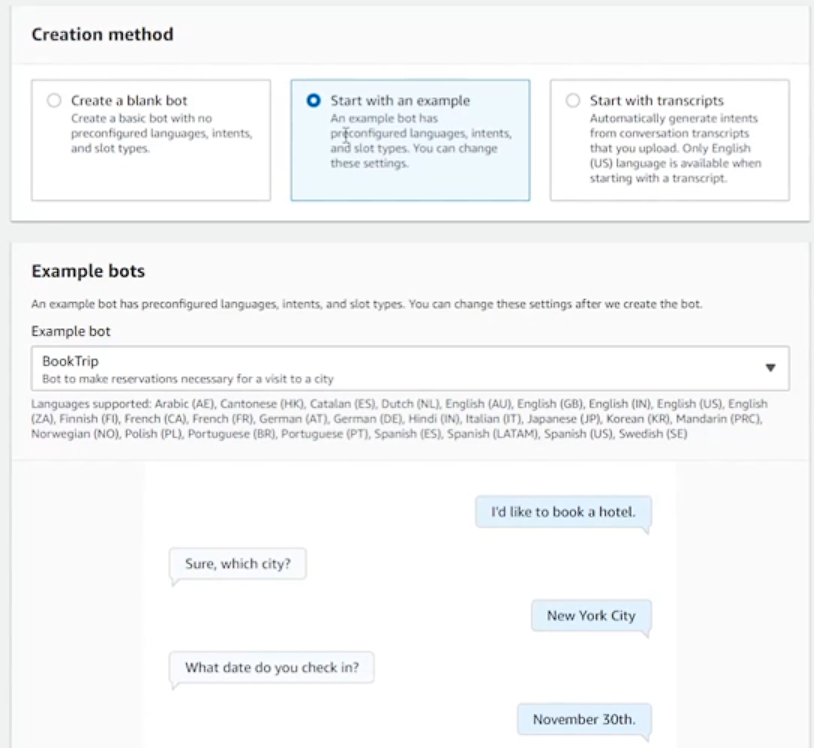
- Can configure timeout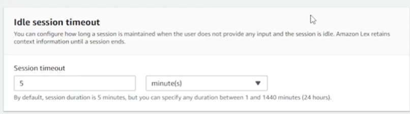
- Can add multiple languages and specify intent confidence score 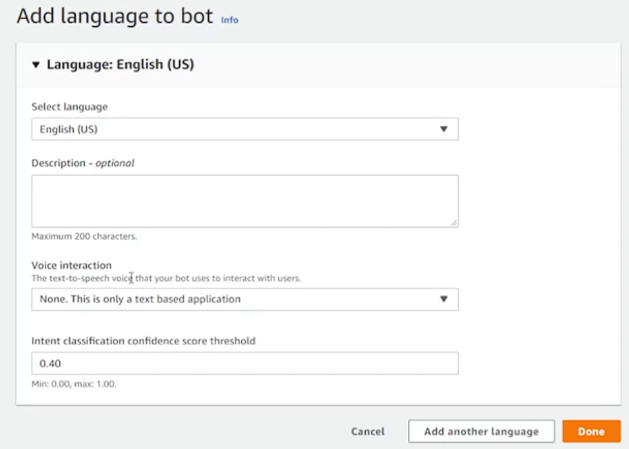
- Creating new intent 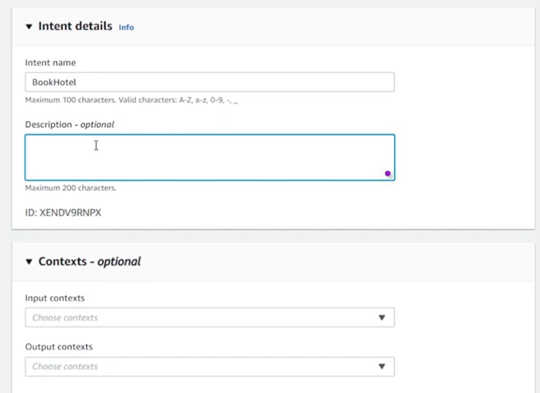
- Add sample utterances to compute similarity and finally confidence from 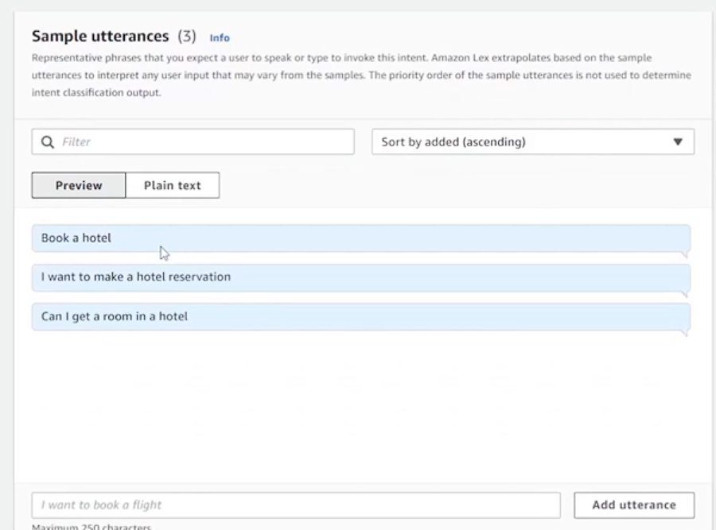
- Select text and select from drop down to convert part of utterance to slot which will be populated at the bottom (name them appropriately) 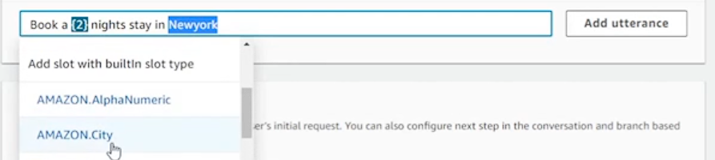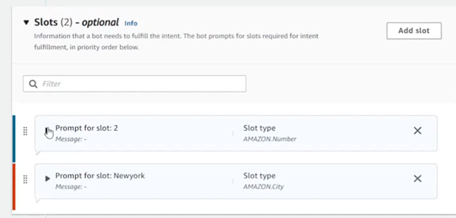
- Give prompts to make sure user populates slot 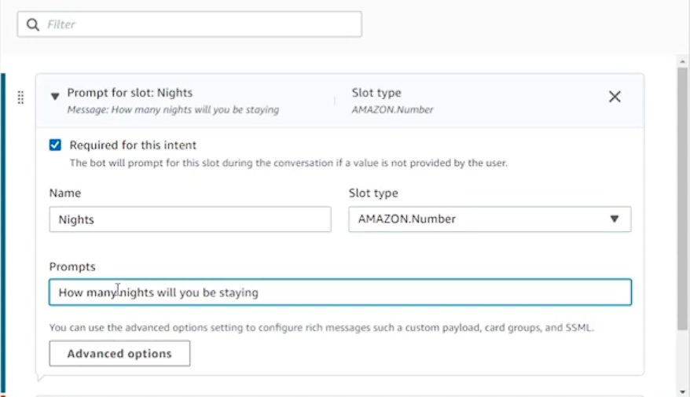
- If Amazon Predefined Slot Types Doesn't fit create a new slot type i.e new data type 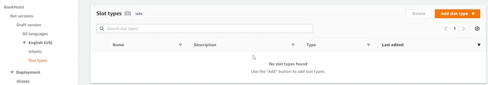 which can expand (capitalization, stemming, spaces) or be very strict 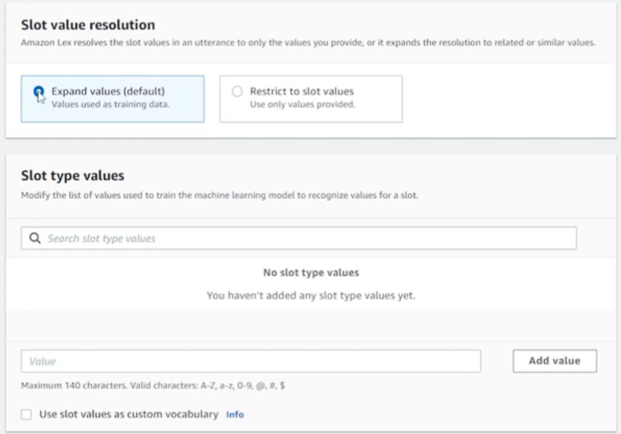
- Add confirmation for the value 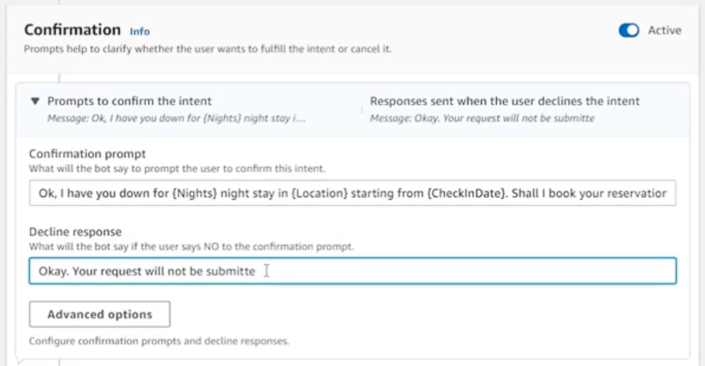
- You can visualize convo using visual builder 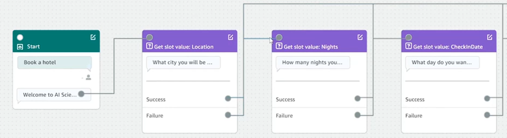
- Define lambda handler to handle
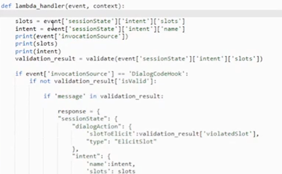
- Can give response cards to make interaction easier by adding Response Cards 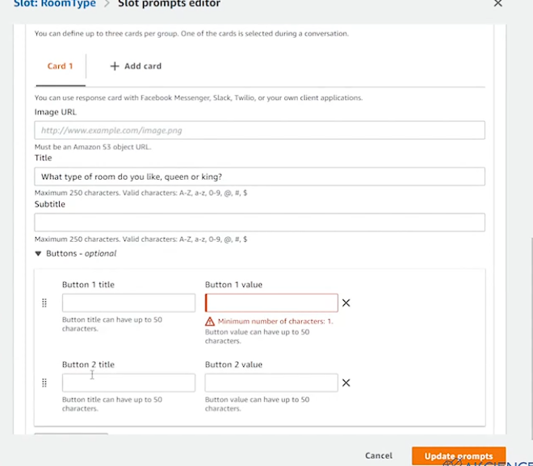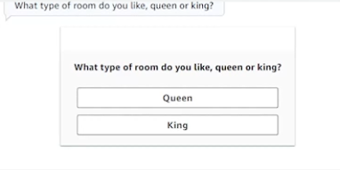
### Connecting Lambda to Lex
 