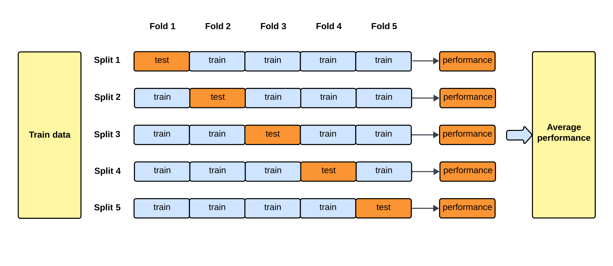
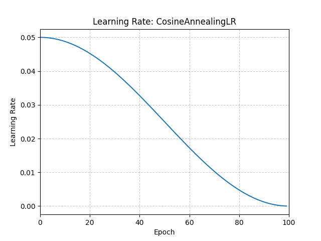

# Deep Learning

## Basics

1. **Perceptron**
   Simplest type of artificial neural network.  
   Makes prediction based on a single input by w*x+b followed an activation function.
    1. **Inputs** (x1,x2,...,xnx_1, x_2, ..., x_nx1,x2,...,xn): Features of the data.
    2. **Weights** (w1,w2,...,wnw_1, w_2, ..., w_nw1,w2,...,wn): Adjustable parameters that determine the importance of
       each feature.
    3. **Bias** (b): A constant term that allows shifting the decision boundary.
    4. **Summation Function:** Computes the weighted sum of inputs
       $$z = \sum_{i=1}^{n} w_i x_i + b$$
    5. **Activation Function**: Applies a step function (threshold function) to determine the output:
       $$y = \begin{cases} 1, & \text{if } z \geq 0 \\ 0, & \text{otherwise} \end{cas
2. **Feed Forward Neural Networks**
3. **Hidden Layers** 
   Layers between the input and output layers
4. ### Width of Model**
5. ### Weights and Biases**
   (Mentioned above)
   Weights: Defined for each connection. Variable input is multiplied with.  
   Biases: Defined for each node. Variable input shifted by.
6. ### Universal Approximation Theorem
   Pivotal theorem, proving that provided a sufficiently deep neural network with non-linear activation can approximate
   any function. (not a proof of finding it but least knowing that it's possible).
7. ### Activation Function:
   Function applied to the output of a neural network.
    1. #### Need:
       Introduce Non Linearity: Without them NN of any depth would be same as one linear transformation
    2. #### Types:
        1. ##### Sigmoid [DEPRECATED]
           $$f(x) = \frac{1}{1 + e^{-x}}$$  
           
            - as x→∞ y-> 1
            - as x->-∞ y-> 0
            - at x = 0, y = 0.5  
              Pro Cons:
            - 🔴 Obsolete
            - 🔴 f`(x) maxes out at 0.25 i.e sure to cause vanishing gradient as you add more
        2. ##### Tanh [DEPRECATED]
           $$\tanh(x) = \frac{e^x - e^{-x}}{e^x + e^{-x}}$$
            - as x→∞ y-> 1
            - as x->-∞ y-> -1
            - at x = 0, y = 0  
              
            - Pro Cons:
                - 🔴 Obsolete
                - 🔴 f`(x) maxes out at 1 i.e sure to cause vanishing gradient as you add more
        3. ##### ReLU (Rectified Linear Unit)
           $$f(x) = \begin{cases} x & \text{if } x > 0 \\ 0 & \text{if } x \leq 0 \end{cases}$$
            - 🟢 Only negatively saturates
            - 🟢 Better Sparsity so less computation
            - 🔴 Dying RELU (Can get stuck at 0)
            - 🔴 Not differentiable at 0 (solved using f′(0)=0)
        4. ##### Leaky ReLU
           $$f(x) = \begin{cases} x, & \text{if } x \geq 0 \\ \alpha x, & \text{if } x < 0 \end{cases}$$
            - 🟢 Solves dying relu by letting a small amount of negative gradient through 0< $\alpha$ <<1
            - 🔴 Fixes dying relu but at cost of sparsity
        5. ##### Parametric ReLU
           $$f(x) = \begin{cases} x, & \text{if } x \geq 0 \\ \alpha x, & \text{if } x < 0 \end{cases}$$
            - Same equation as leaky except alpha is a learnable param
            - 🟢 Solves dying relu again
            - 🔴 At cost of sparsity and increased computation
        6. ##### Swish
           $$f(x) = x \cdot \sigma(\beta x) = \frac{x}{1 + e^{-\beta x}}$$
            - $ \beta $ is usually 1
            - Behaves same as relu for x >>0
            - 🟢 provides negative gradient solving dying relu
            - 🔴 Gains are very task dependant, not a universal choice. Used only in deep CNNs
            - 🔴 Increases computation cost
        7. ##### eLU (Exponential Linear Unit)
           $$f(x) = \begin{cases} x & \text{if } x > 0 \\ \alpha \left(e^x - 1\right) & \text{if } x \leq 0 \end{cases}$$
            - 🟢 smooth and allows -ve gradient
            - 🟢 centers at 0 with a smooth negative gradient
            - 🔴 more computation
            - requires $ \alpha $ tuning
        8. ##### Softmax
           $$\text{softmax}(z_i) = \frac{e^{z_i}}{\sum_{j=1}^{n} e^{z_j}}$$
            - Used in multi class classification gives normalized probabilities which sum to 1
            - uses e because summing + and - can cancel some out and e^x is never 0
            - The softmax function takes a vector of raw scores (called logits) and turns them into probabilities.

8. ### Gradient Descent
   First order iterative algorithm to find local minima of loss function
    - Learning Rate: Determines the size of step taken
    - Epoch: One go through of entire dataset
    - Shuffling: Randomizing order of dataset before every epoch.

    1. Types:
        1. ### Stochastic
            - Uses one training example per update
            - 🔴 Noisy updates can cause zigzagging
            - 🔴 Unstable
            - 🟢 Stochasticity can help escape local minima
        2. ### Batch
            - Uses entire dataset i.e update once every epoch
            - 🟢 Very stable
            - 🔴 Very slow
            - 🔴 Consumes a lot of memory loading entire DS into memory
            - 🟢 Smooth Convergence
        3. ### Minibatch
            - Uses smaller batch sizes usually 32,64,128 and updates per mini batch
            - Good middle ground
            - 🟢 Smoother than stochastic
            - 🟢 Faster convergence than batch
            - 🔴 Requires tuning batch size
        4. ### Momentum Based
            - Not a metric of data set used.
            - Adds a fraction of previous update to accelerate descent
            - $$v_t = \gamma v_{t-1} + \eta \nabla_\theta J(\theta_{t-1})$$
            - $$\theta_t = \theta_{t-1} - v_t$$
            - vt is velocity
            - $ \gamma$ momentum coefficient (i.e how much past gradient matters)
            - $ \eta $ learning rate

        5. ### Nesterov Accelerated Gradient Descent
            - Adds look ahead to momentum i.e. calculates descent from a position which is already at position post this
              update
            - $$v_t = \gamma v_{t-1} + \eta \nabla_\theta J(\theta_{t-1} - \gamma v_{t-1})$$
            - 🟢 faster convergence
            - Optimizer is peeking ahead and adjusting course in direction before overshooting.

    2. ### Common Issues:
        1. ### Vanishing Gradient
        2. ### Exploding Gradient
9. ### Backpropagation
10. ### Weight Initialization
    1. #### Zero Init
       - Initiliaze all weights as 0
       - 🔴⚠️ Terrible idea, any time all weights have same value causes symmetric learning i.e. all neurons in layer learn same values
    2. #### Random Init (Naive)
       - Assigns random values to avoid zero init
       - if weights are too small or too large will cause vanishing/exploding gradient
    3. #### Xavier Init
       - designed to keep variance and gradients approx same across all layers to avoid vanish/exploding gradient
       - ideal for **tanh/sigmoid**
       - 2 types:
         - Uniform: $$W \sim \mathcal{U}\!\left(-\sqrt{\tfrac{6}{n_{\text{in}} + n_{\text{out}}}}, \; \sqrt{\tfrac{6}{n_{\text{in}} + n_{\text{out}}}}\right)$$
         - Normal: $$W \sim \mathcal{N}\!\left(0, \; \tfrac{2}{n_{\text{in}} + n_{\text{out}}}\right)$$
       - nin and nout are number of connections in and out respectively
       - symmetric around 0 and squash values, so both the input side (fan-in) and output side (fan-out) matter
    4. #### He Init
       - designed to keep variance and gradients approx same across all layers to avoid vanish/exploding gradient
       - ideal for **Relu**
       - 2 Types:
         - Uniform: $W \sim \mathcal{U}\!\left(-\sqrt{\tfrac{6}{n_{\text{in}}}}, \; \sqrt{\tfrac{6}{n_{\text{in}}}}\right)$
         - Normal: $W \sim \mathcal{N}\!\left(0, \; \tfrac{2}{n_{\text{in}}}\right)$
       - nin are number of connections in
       - Relu halves outputs (only +ves), variance of he doubled to compensate (compared to Xavier) 
       - But since the key variance-preserving step happens on the input side, He init only uses fan-in
       - (on output side dL/dz gives 1 or 0 only unlike Xavier where it's a complex value)
11. ### Learning Rate Scheduling
    1. #### Step Decay
       - $\eta_t = \eta_0 \cdot \gamma^{\left\lfloor \tfrac{t}{T} \right\rfloor}$
       - Drops LR by a constant factor every few epochs
    2. #### Exponential Decay
       - $\eta_t = \eta_0 \cdot e^{-\lambda t}$
       - Drops learning rate exponentially per epoch
       - 
    3. #### Cosine Annealing
       - Follows gentler cosine function
       - $\eta_t = \eta_{\min} + \tfrac{1}{2}(\eta_0 - \eta_{\min}) \left(1 + \cos\!\left(\frac{\pi t}{T_{\max}}\right)\right)$
       - 
    4. #### Polynomial Decay
       - $\eta_t = \eta_0 \left( 1 - \frac{t}{T_{\max}} \right)^p$
       - Constant polynomial decay
    5. #### LR On Plateau
       - Reduces when a validation metric plateaus (i.e. stops improving)
    6. #### Cyclical
       - Increases and decreases learning rate
       - 🔴 Need max and min and cycle rate careful tuning
       - 🟢 can help get out of minima
       - 
    7. #### One cycle
       - Increases initially then decreases rapidly
       - Gives fast convergence
       - 
12. ### Regularization
    1. #### L1 LASSO : Least Absolute Shrinkage and selection operator
    2. #### L2 Ridge
    3. #### Elastic Net
    4. #### Dropout
    5. #### Early Stopping
    6. #### Batch Norm
    7. #### Data Augmentation?
13. ### Optimizer
    1. #### SGD
    2. #### RMSProp
    3. #### Adam
    4. #### AdamW
    5. #### Ada grad

## Architectures

1. ### Convolutional Neural Networks
   - #### Purpose:
     - For processing grid structured data like images
   - #### Working:
     - Apply kernels to input images to extract important features
     - Kernel: Smaller matrix that slides over image
   - #### Layer Types:
     - ##### Convolution: 
       - Performs convolution operation with Filter of **size F** and **Stride S**
       - Filter is trainable 
       - Specify n to have n different filters to produce n separate feature maps
       - Params:
         - Filter Size F
         - Stride S
         - Padding P -> Extra 0 pixels added to edges of image (in case we don't want to downsample)
           - Valid/No -> None Added
           - Same -> Pads to same as input
           - Full -> Actually upsamples, each layer gets it's full conv
           - Formula Output Size = 1+(N-F)/S where N is input dimension
     - ##### Pooling:
       - Pooling non trainable downsampling operation
       - Applies simple operation on its filter elements:
         - Max -> 🟢 Preserves Best detected features
         - Average -> 🟢 Preserves overall features
     - ##### Conv Transpose:
       - Opposite of convolution, transpose
       - Upsampling operation, trainable
     - ##### Unpooling:
       - Not as popular
       - Sets middle index and rest 0
     - ##### Fully Connected:
       - Good Ol' Fully Connected Layer
   - #### Usage:
     - Deep CNN themselves no longer SOTA but are used extensively in SOTA models e.g. UMAP in diffusion
     - 🟢 Less resource intensive than ViT
     - 🟢 Easier to train on small datasets, ViT have massive DS requirements
   - #### Applications:
     - Image Classification
     - Object Detection (can do singular and multiple as well)
2. ### Recurrent Neural Networks
    1. #### Vanilla RNN
    2. #### LSTM
    3. #### GRU
3. ### Encoder Decoder
4. ### Transformer
5. ### Generative Adversarial Network
6. ### Auto Encoder
7. ### Variational Auto Encoder
8. ### Diffusion Networks