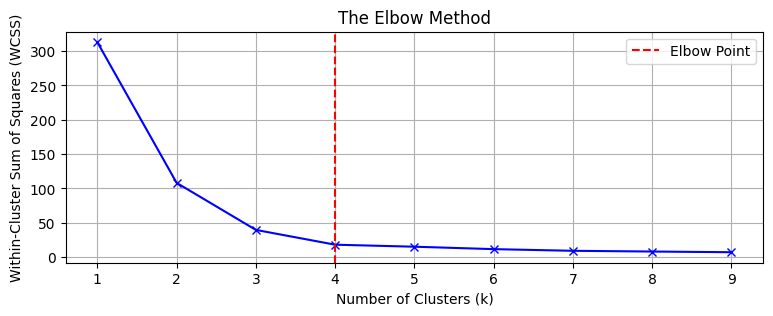
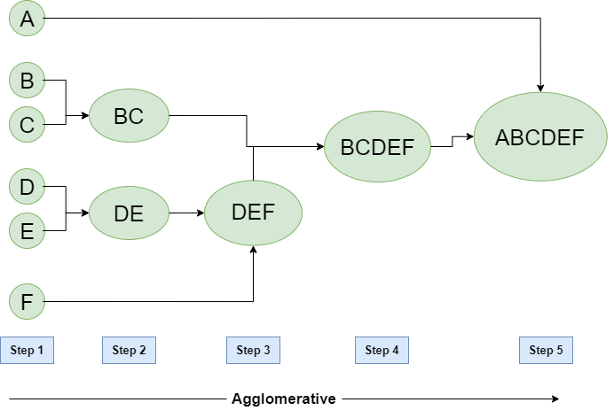

# Machine Learning

1. Fundamentals
    1. **Supervised Learning**
    2. **Unsupervised Learning**
    3. **Semisupervised Learning**
    4. **Reinforcement Learning**
    5. **Self supervised Learning**
2. Concepts
    1. ### **Training**
    2. ### **Testing**
    3. ### Bias Variance Trade-Off
       In ML Trade off between model's ability to make accurate predictions on training data and its ability to
       generalize to unseen data.
        1. **Bias**: Error due to overly simplistic assumptions in the learning algorithm
        2. **Variance**: model's sensitivity to fluctuations in the training data
           The goal is to find a balance between bias and variance
    4. ### Cross Validation
       Used to assess the performance and generalization ability of a model.i.e. It is a model evaluation process to
       compare models/hyperparameters  
       **K Folds:**
        1. Split the dataset into K equal-sized folds (subsets).
        2. For each fold:
            1. Use that fold as the test set.
            2. Use the remaining K-1 folds as the training set.
            3. Train the model on the training set and evaluate on the test set.
        3. Repeat the process K times, each time with a different fold as the test set.
        4. Average the performance metrics (e.g., accuracy, RMSE) across all folds for a final score.
            Pros & Cons:
            ✅ Provides a better estimate of model performance.
            ✅ Helps detect overfitting or underfitting.
            ⚠️ Computationally expensive for large datasets.
3. Algorithms
    1. ### Linear Regression
    2. ### Logistic Regression
        - $$\hat{y} = \sigma(\mathbf{w}^\top \mathbf{x} + b)= \frac{1}{1 + e^{-(\mathbf{w}^\top \mathbf{x} + b)}}$$
    3. ### K Nearest Neighbours
        - Lazy learner, assigns class to samples based on neighbours
        - Supervised Classification algo
        - 🔴 Sensitive to k chosen (incorrect k can split points into incomprehensible mess)
        - K↑ Bias↑ | K↓ Variance ↑
        - Working: Find K points closest to new sample, assign class based on majority of them
        - Ideal to use Odd (if binary classfn). Else choose lowest dist or smallest total dist.
        - How to decide K? Elbow Plot
          
    4. ### Naive Bayes
        - Supervised Classification algo
        - **Naive** - Assumes P(X|C) = P(x1...Xn|C) is equal to ΠP(xi|C)
        - i.e. Assumes independence of feature given class
        - $$P(C \mid X) = \frac{P(C) \, P(X \mid C)}{P(X)}$$
        - $$P(X \mid C) = \prod_{i=1}^n P(x_i \mid C)$$
        - For Example:
            - C-> Covid, x1-> has cold, x2->cough
            - Calculate P(C) = no. of examples of class C/ total number of samples
            - P(xi|C) = no. of examples of xi in C/ total number of samples in C
            - Use this to calc P(C|X)
    5. ### Decision Trees
        - Supervised - Classification and Regression
        - Split data to create leafs with maximal purity
        - Use metric Gini Impurity
        - $$Gini(t) = 1 - \sum_{i=1}^{K} p_i^2$$
        - Steps:
            1. Start from top, divide into two
            2. For each calculate gini impurity of both sides
            3. Calculate weighted impurity $$Gini_{split} = \frac{N_{L}}{N} \, Gini(L) + \frac{N_{R}}{N} \, Gini(R)$$
            4. Select split with the lowest impurity
            5. Stop when:
                1. All examples in a node belong to same class
                2. No more features to split
                3. Max Tree Depth (decide yourself)
                4. Too few samples
        - Weighing is necessary to prevent formation of extremely pure minority classes earlier in tree
    6. ### Ensemble Learning
        - Based on idea: multiple weak learners combined to form one strong learner
        - Types:
            1. #### Bagging
               Improves stability by reducing variance  
               Trains model independently on different random subsets of data with replacement.  
               Combines predictors -
                - Voting for classification
                - Average for regression
                  To give more power to higher performing learner assigns weights
            2. #### Boosting
               Trains model sequentially, each learner sequentially correcting the error of last.  
               Assigns weights to each sample and tune weights for sample so later learners can focus more on samples
               misclassified by earlier learners.
               Steps:
                1. Assign each sample equal weight and train first model i.e wi = 1/N (No. of samples)
                2. Calculate rate of error in first model ε = wi*(1 is misclassified else 0)/N
                3. Calculate α i.e model weight = (1-ε)/ε
                4. Reassign weights wi = e^(-α) if correctly classified else e^α
    7. ### K Means Clustering
       Unsupervised clustering technique, group similar data points together
        - Steps:
            1. Choose k random points call them centroids (each centroid being it's own class)
            2. Calculate distance of each sample from each centroid, assign class based on min distance
            3. Once assigned to each point recalculate centroids (as being mean of the class)
            4. Repeat process multiple times until centroids settle
        - 🔴 Sensitive to K
        - 🟢 Simple and Fast
    8. ### Hierarchical Clustering:
       Instead of setting out with a fixed k can cluster in a tree like manner.   
       Benefit? Cutting at any depth gives us that number of clusters.  
       Two ways:
        - Agglomerative i.e. Bottom up
        - Divisive i.e. Top Down
    9. ### Agglomerative Clustering
        - Bottom up hierarchical clustering
        - Steps:
            1. Start with each point being it's own class
            2. Calculate length from every other points, merge closest ones to form combined class
            3. Now for each class (cluster) calculate distance from every other cluster
                - Actually you calculate distance between every single point in both clusters
                - Choose a measure as cluster distance, called **linkage**
                - Linkage Types:
                    1. Single: Min dist between any 2 points
                    2. Complete: Max dist between any 2 points
                    3. Average: Averages of all dists
                    4. Ward: instead of distance choose clusters which cause least in cluster variance
            4. Combine clusters and repeat until they reach one common cluster
               
        - 🟢 No need to specify K
        - 🔴 Computation requirements limit to small/medium datasets
        - 🟢 Can handle non-spherical clusters by defining custom linkage
    10. ### Random Forest
        Bagging implementation
        Builds n decision trees, each tree being given a bootstrapped dataset.  
        At each split each tree gets a subset of features, split normally using gini impurity
        This ensures reduced variance and more generalization
        Build each tree till either they form or clip at a common length
        Vote for classification
    11. ### Gradient Boosted Machines
        Boosting implementation
        Builds decision trees (not a rule but usually means this in practice), each weak learner aims to correct error
        of
        previous weak learner
    12. ### XGBoost
   13. ### Support Vector Machines
   14. ### DBSCAN
   15. ### PCA