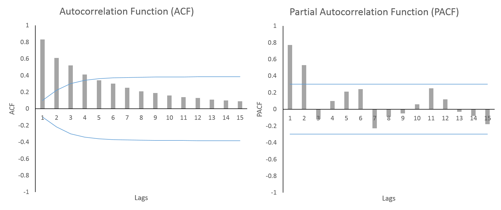

# Time Series

- Sequence of data points, collected and ordered chronologically.
- A time series is simply a set of observations measured sequentially through time.

## Components of a Time Series:

1. ### Trend:
    - This represents the long-term, underlying movement of the data.
    - can be upward (a steady increase in sales over years) or downward (a consistent decrease in product demand)
    - Does not have to be linear.
2. ### Seasonality:
    - These are patterns that repeat at fixed, regular intervals.
    - This pattern is predictable and consistent.
    - 📌For example, retail sales often spike during the holiday season each year.
3. ### Cyclicality:
    - Patterns that also repeat, but with no fixed or regular period.
    - Unlike seasonality, the length of a cycle can vary.
    - Often influenced by economic conditions, such as business cycles that can last for several years.
4. ### Noise/Irregularity:
    - Also known as residuals
    - Random, unpredictable fluctuations in data not explained by trend, seasonality, or cyclical components

## Stationarity

- A stationary time series has statistical properties—like the mean and variance—that remain constant over time.
- Makes the series easier to model and forecast because its behavior is consistent.
- **non-stationary series**, with a changing mean or variance, can lead to unreliable forecasts.
- Methods to Check for Stationarity:
    1. Augmented Dickey-Fuller (ADF) Test:
        - Statistical hypothesis test that determines if a time series is stationary.
        - The null hypothesis (H0) is that the time series has a unit root, meaning it is non-stationary.
        - The alternative hypothesis (Ha) is that the series is stationary
        - If the p-value is less than the significance level (e.g., 0.05), you reject the null hypothesis and conclude
          the series is likely stationary.
    2. Kwiatkowski-Phillips-Schmidt-Shin (KPSS) Test:
        - This test is used to test for stationarity around a deterministic trend.
        - The null hypothesis (H0 ) is that the time series is stationary.
        - The alternative hypothesis (Ha ) is that the series is non-stationary.
        - This test is often used in conjunction with the ADF test to provide a more robust conclusion.
- If a time series is not stationary, you need to transform it to achieve stationarity before modeling.
- Common techniques include:
    1. Differencing:
        - This involves subtracting the previous observation from the current one.
        - This is highly effective at removing trend and seasonality.
        - For example, a first-order difference is Yt′=Yt−Yt−1.
    2. Transformations:
        - Applying mathematical functions like the logarithmic transformation can help stabilize the variance of a time
          series.
        - This is useful when the variance increases as the mean increases.

## Time Series Data Preparation

1. ### Handling Missing Data:
    - Missing data points are common in real-world time series.
    - Methods:
        1. Forward-Fill:
            - Fills a missing value with the most recent previous value.
            - useful when the future value is a better estimate than the past value.
        2. Backward-Fill:
            - Fills a missing value with the next available observation.
        3. Interpolation:
            - Estimates missing values based on surrounding data points
            - Linear interpolation, for example, draws a straight line between two known points and fills the missing
              data point on that line.
            - 🟢 Often more accurate than forward or back fill
2. ### Feature Engineering
    - Process of creating new input features from the existing data to improve the performance of a machine learning
      model.
    - Methods:
        1. ### Lag Features:
            - Using past values of time series as new features
            - 📌e.g. using t-1, t-2
        2. ### Rolling Window
            - Calculated over a sliding window of past observations.
            - Help the model understand the local behavior and trends of the series.
        3. ### Time-based Features
            - Features can be extracted from the timestamp itself
            - 📌E.g. day of the week, month, year, or even whether it is a public holiday
            - Help the model capture seasonality and other time-related patterns that might influence the series
3. ### Data Splitting for Time Series
    - Data splitting for time series must respect the temporal order
    - Randomly splitting the data would lead to data leakage, where the model is trained on future data
    - A proper split involves a chronological split:
        - **Training Set:** Use the earliest portion of the data for training the model.
        - **Validation/Test Set:** Use the latter portion of the data for evaluating the model's performance.

## Forecasting Models

## Classical Time Series Forecasting

- Use statistical models

1. ### Autoregressive (AR) Models
    - Based on idea that a future value is a linear combination of past self
    - $Y_t = c + \phi_1 Y_{t-1} + \phi_2 Y_{t-2} + \dots + \phi_p Y_{t-p} + \epsilon_t$
    - Epsilon: White noise
    - ℹ️White noise is a series of purely random shocks with constant variance and no correlation across time. Assumed
      to be normally distributed
    - Model is a simple linear regression
2. ### Moving Average (MA) Models
    - Use past forecast errors (residuals) to predict future values
    - $Y_t = \mu + \theta_1 \epsilon_{t-1} + \theta_2 \epsilon_{t-2} + \dots + \theta_q \epsilon_{t-q} + \epsilon_t$
    - effective when the variations in the time series are due to random shocks that have a lingering effect on future
      values.
3. ### Autoregressive Moving Average (ARMA) Models
    - Combination of the AR and MA models.
    - $Y_t = c + \phi_1 Y_{t-1} + \dots + \phi_p Y_{t-p} + \theta_1 \epsilon_{t-1} + \dots + \theta_q \epsilon_{t-q} + \epsilon_t$
    - $Y_t = c + \sum_{i=1}^{p} \phi_i Y_{t-i} + \sum_{j=1}^{q} \theta_j \epsilon_{t-j} + \epsilon_t$
    - Used for stationary time series and is denoted as ARMA(p, q), where p is the order of the AR component
    -
4. ### Autoregressive Integrated Moving Average (ARIMA) Models
    - an extension of ARMA models specifically designed to handle non-stationary time series.
    - "I" stands for "Integrated," which refers to the differencing step needed to make the series stationary.
    - ARIMA model is denoted as ARIMA(p, d, q)
        - p: The order of the AR component (number of lag observations).
        - d: The degree of differencing (the number of times the series is differenced to achieve stationarity)
        - q: q: The order of the MA component (the number of lagged forecast errors).
    - ℹ️ Integrated Part Explained:
        - ### 1. Purpose
            - Make a **non-stationary time series stationary** by removing trends (or seasonality in some cases).
            - Stationarity is required for ARMA modeling to work properly.

          ### 2. Differencing
            - **First difference (d = 1):**  
              \[
              Y_t = X_t - X_{t-1}
              \]  
              Removes linear trends.

                - **Second difference (d = 2):**  
                  \[
                  Z_t = Y_t - Y_{t-1} = X_t - 2X_{t-1} + X_{t-2}
                  \]  
                  Used if the series still has a trend after first differencing.

                - Usually, **d ≤ 2** is sufficient.

          ### 3. ARMA Modeling
            - After differencing, we model the **stationary series \(Y_t\)** using AR (autoregressive) and MA (
              moving average) components.
          ### 4. Forecasting Original Series
            - Predictions are made on \(Y_t\) first.
                - To get predictions for the original series \(X_t\):  
                  \[
                  X_{t+1} = X_t + \hat{Y}_{t+1}, \quad X_{t+2} = X_{t+1} + \hat{Y}_{t+2}, \dots
                  \]
                - This “undoes” the differencing, integrating the forecast back to the original scale.
          ### 5. Key Points
            - Differencing = subtract previous values to remove trends.
                - Over-differencing can make the series noisy; under-differencing leaves trends in the data.
                - Always model the **differenced (stationary) series** with ARMA; integrate back to original series for
                  forecasts.

5. ### Seasonal ARIMA (SARIMA)
    - Extension of the ARIMA model that explicitly handles time series with seasonality.
    - introduces seasonal terms to account for repeating patterns.
    - A SARIMA model is denoted as SARIMA(p, d, q)(P, D, Q)m, where:
        - (p, d, q): The non-seasonal components (same as ARIMA).
        - (P, D, Q): The seasonal components.
        - P: The seasonal autoregressive order.
        - D: The seasonal differencing order.
        - Q: The seasonal moving average order.
    - ## Seasonal Components
        1. **Seasonal Autoregressive (SAR) - P**
            - AR on seasonal lags (multiples of s):  
              \[
              X_t = \Phi_1 X_{t-s} + \Phi_2 X_{t-2s} + \dots + \epsilon_t
              \]
            - Φ (capital phi) represents the coefficients of the seasonal autoregressive (SAR) terms
            - Φ1,…,ΦP = seasonal AR coefficients, controlling how much past seasonal values affect the current value
        2. **Seasonal Differencing (D)**
            - Removes seasonal trends:  
              \[
              Y_t = X_t - X_{t-s}
              \]
        3. **Seasonal Moving Average (SMA) - Q**
            - MA on seasonal lags of errors:  
              \[
              X_t = \epsilon_t + \Theta_1 \epsilon_{t-s} + \Theta_2 \epsilon_{t-2s} + \dots
              \]

6. ### Exponential Smoothing (ES) Methods
    - forecasting models that assign exponentially decreasing weights to older observations.
    - more recent data points have a greater influence on the forecast.
    - ### Simple Exponential Smoothing:
        - This is for data with no trend or seasonality.
        - It forecasts a future value based on a weighted average of past observations, with the weights decaying
          exponentially as the observations get older.
    -  ### Holt's Linear Trend Model
    - extension of simple exponential smoothing that handles data with a trend
    - ### Holt-Winters' Seasonal Model:
        - It's used for data with both a trend and seasonality.
        - uses three smoothing equations: one for the level, one for the trend, and one for the seasonal component.

### How To Fit ARIMA/SARIMA etc.?

1. ### Parameter Selection with ACF and PACF
    - 
    - ACF Plot:
        - Shows the correlation between a time series and its lagged values. (Basically Cor(Xt,Xt-k))
        - For an MA(q) model, the ACF will be significant for the first q lags and then drop to zero
    - PACF Plot:
        - Shows the correlation between a time series and its lagged values after the effects of the intermediate
          lags have been removed.
        - basically Cor(Xt and Xt-k) but we ignore values in middle which borrowed from Xt-k
        - For an AR(p) model, the PACF will be significant for the first p lags and then drop to zero.
2. ### Maximum Likelihood Estimation (MLE):
    - For calculating coefficients (ϕ's and θ's)
    - **Likelihood Function:**
        - The likelihood function represents the probability of observing the data given a set of parameters.
    - **Iterative Optimization**:
      - 

## Forecasting using Machine Learning:

1. ## Linear Regression:
    - Linear regression can be used for time series forecasting by creating a "supervised learning" problem.
    - achieved through the use of lag features.
2. ## Tree Based Models:
    - Can capture non-linear relationships and interactions between features without making assumptions about the
      underlying data distribution.
    - makes them well-suited for more complex time series
3. ## Support Vector Regression

## Forecasting using Deep Learning:

1. RNNs
    - handle sequential data by using a feedback loop.
    - allows information from previous steps in the sequence to influence the processing of the current step
2. Convolutional Neural Networks (CNNs) for Time Series
    - A 1D CNN applies a filter (or kernel) to a specific segment of the time series data.
    - This process is repeated across the entire sequence, creating a feature map.
    - effective at identifying local, short-term patterns like trends or cycles.
    - By stacking multiple convolutional layers, CNNs can learn hierarchical features, making them a powerful tool for
      time series feature extraction.
3. Sequence-to-Sequence (Seq2Seq) Models
4. Time Series Transformer
    - Deep learning model that uses the Transformer architecture's self-attention mechanism to capture long-range
      dependencies and complex patterns in sequential data for tasks like forecasting, anomaly detection, and
      classification.