# 7 AWS Lex & Bedrock

# AWS Lex
AWS Chatbot service, allows Voice and Text
Benefits: Simple, seamless deployment and scaling  
ℹ️ Seamless Deployment: Deployment without disruption
### Components:
- **Bot**: Chatbot container
- **Intent**: Final Action or Goal User wants. Can be more than 1
 📌e.g. Hotel Booking is the final intent (not rooms, nights questions)
- **fallback Intent**: If lex can't match with a specific one then goes to fallback
📌e.g. Sorry I didn't understand. You can ask me to do A or B.
(It can call an intent like any other but usually used to reroute)
- **Utterance**:  User input or phrases user might say to trigger intent
- **slots**: Variables bots need to complete task
- **Slot types**: Types of values slot can take
- **Prompts**: Questions bot asks to get slot values
- **Confirmation**: Bot confirms once you add slot values to confirm to trigger intent
- **fulfillment**: 
- **Response Cards**: 
- **Contexts**: Contexts are like flags or conversation states to steer conversation to one intent only once active (useful when too many intents), 
  - two types
    - Input: Set to follow a specific intent  
    e.g I want to book a hotel → triggers hotel booker → how many rooms? (routes to hotel booking only)
    - Output: triggered once one intent finishes and routes to another  
      e.g you booked a hotel, now books a taxi pickup
  - Expiry: expires after its time-to-live
    - Turns: How many turns it stays active
    - Time - real time seconds
  - Lambda: Can also be deactivated by lambda state update
- **Session**: A session is the lifecycle of a single conversation between a user and your Lex bot.
- **Session State**: Session State holds all the conversation data, intent, slot values, contexts etc.
- **Hooks**: Can be
  - Dialog (DialogCodeHook): Called before prompt provided to user. To modify prompt or load slot values manually
  - Fulfilment (FulfillmentCodeHook): Called at end, when you call intent  
    You check which kind of call to lambda it is by checking '**invocationSource**'
- **Dialog Action**: Steers conversation
  - ElicitSlot → ask the user for a specific slot.
  - ElicitIntent → ask user for intent again.
  - ConfirmIntent → ask if user really meant this intent.
  - Delegate → let Lex continue managing dialog (default).
  - Close → end the conversation.
  

## Creating a Lex Bot
- On lex create 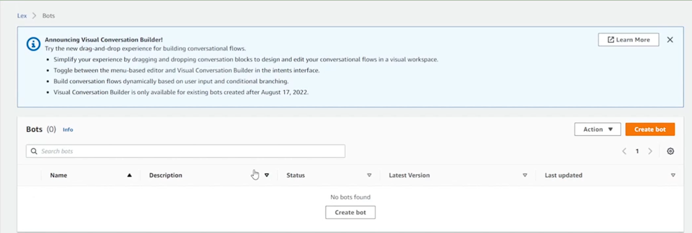
- Have a few options 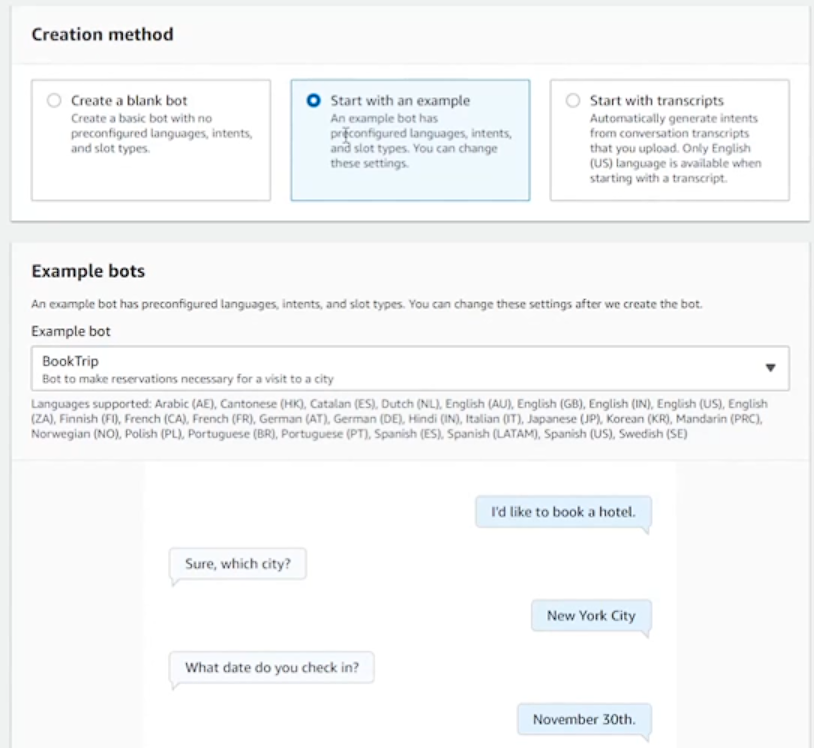
- Can configure timeout 
- Can add multiple languages and specify intent confidence score  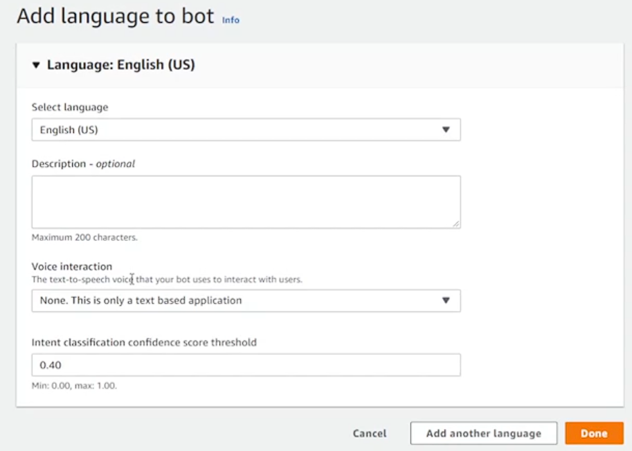
- Creating new intent  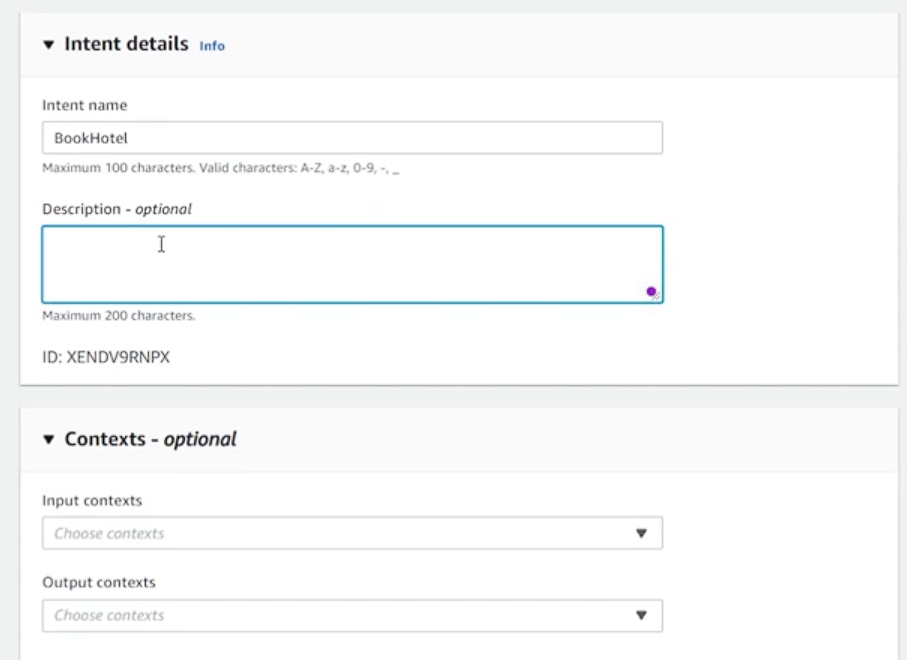
- Add sample utterances to compute similarity and finally confidence from  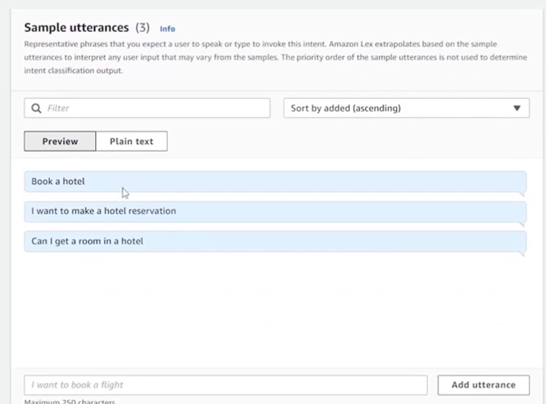
- Select text and select from drop down to convert part of utterance to slot which will be populated at the bottom (name them appropriately)  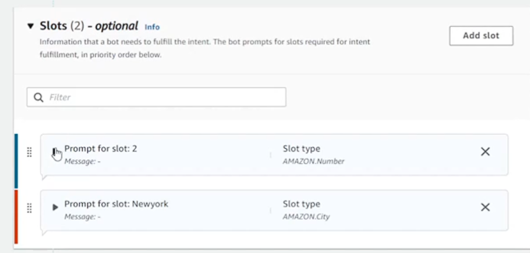
- Give prompts to make sure user populates slot  
- If Amazon Predefined Slot Types Doesn't fit create a new slot type i.e new data type  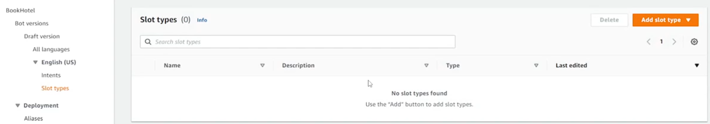 which can expand (capitalization, stemming, spaces) or be very strict 
- Add confirmation for the value 
- You can visualize convo using visual builder  
- Define lambda handler to handle 

- Can give response cards to make interaction easier by adding Response Cards  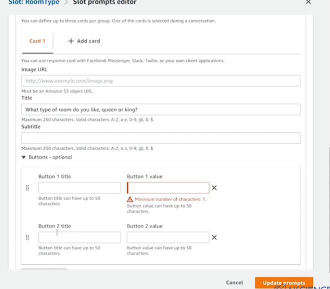
- Can use Amazon AI Intents using AWS Bedrock  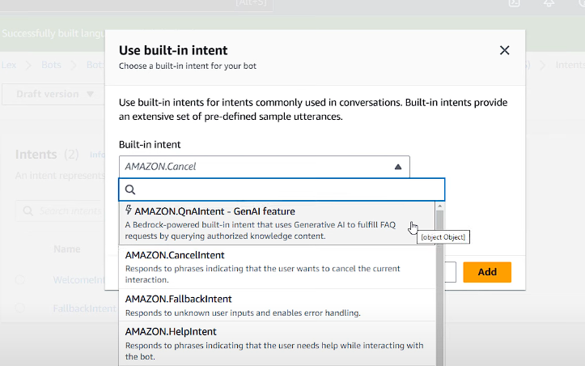

# AWS Bedrock
Fully maaged service for building GenAI Apps both text and images  

Features:  
- Comes with pretrained models.
- Provides Native RAG capablity with Knowledge Base.
- 

Available Models:
1. AI21 - Jamba
2. AWS - Nova, Titan
3. Anthropic - Claude
4. Mistral - Mistral
5. Meta - Llama
6. Stability - Stable Diffusion

## Setup
1. Choose model   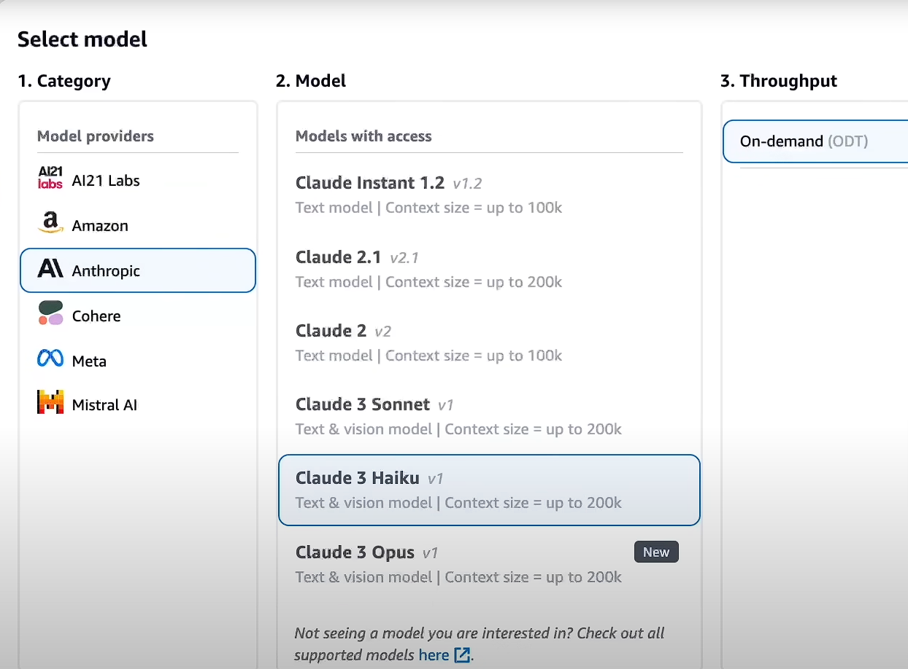
2. Test model on playground   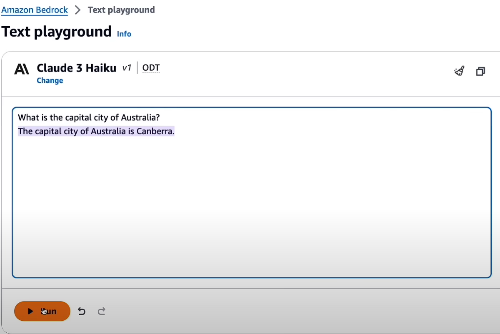
3. You can also compare multiple models in terms of output, speed etc   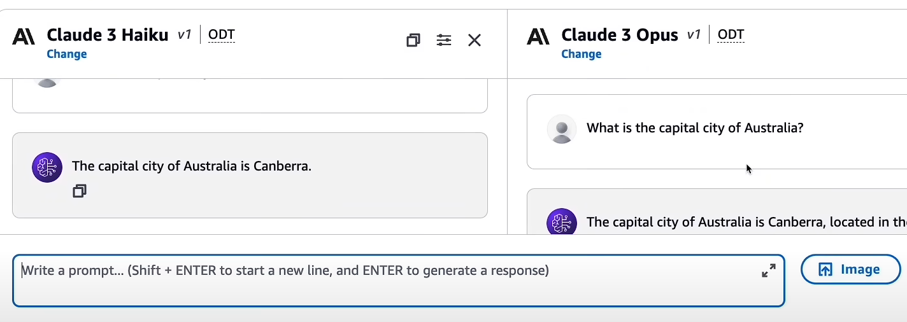
4. Model access isn't available to begin with but can be granted really quickly  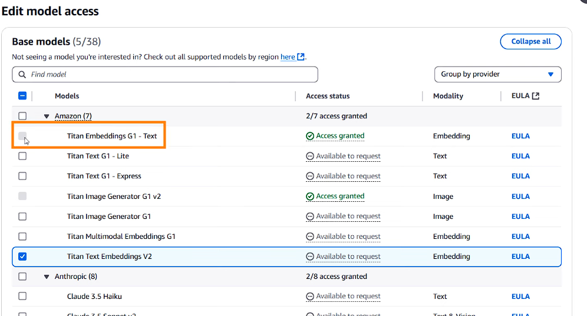
5. To integrate knowledge bases:
   1. Create a knowledge store: Either S3
6. Add your knowledge base   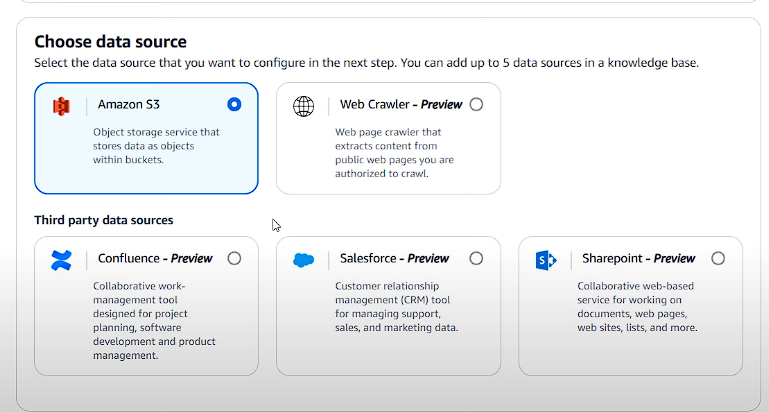   Choose your embedding and vector store 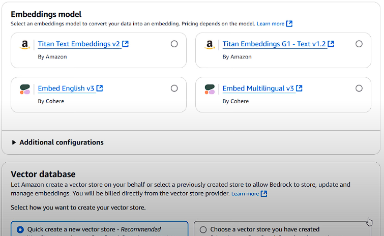

