# AWS Lex & Bedrock

# AWS Lex

AWS Chatbot service, allows Voice and Text
Benefits: Simple, seamless deployment and scaling  
ℹ️ Seamless Deployment: Deployment without disruption

### Components:

- **Bot**: Chatbot container
- **Intent**: Final Action or Goal User wants. Can be more than 1
  📌e.g. Hotel Booking is the final intent (not rooms, nights questions)
- **fallback Intent**: If lex can't match with a specific one then goes to fallback
  📌e.g. Sorry I didn't understand. You can ask me to do A or B.
  (It can call an intent like any other but usually used to reroute)
- **Utterance**:  User input or phrases user might say to trigger intent
- **slots**: Variables bots need to complete task
- **Slot types**: Types of values slot can take
- **Prompts**: Questions bot asks to get slot values
- **Confirmation**: Bot confirms once you add slot values to confirm to trigger intent
- **fulfillment**:
- **Response Cards**:
- **Contexts**: Contexts are like flags or conversation states to steer conversation to one intent only once active (
  useful when too many intents),
    - two types
        - Input: Set to follow a specific intent  
          e.g I want to book a hotel → triggers hotel booker → how many rooms? (routes to hotel booking only)
        - Output: triggered once one intent finishes and routes to another  
          e.g you booked a hotel, now books a taxi pickup
    - Expiry: expires after its time-to-live
        - Turns: How many turns it stays active
        - Time - real time seconds
    - Lambda: Can also be deactivated by lambda state update
- **Session**: A session is the lifecycle of a single conversation between a user and your Lex bot.
- **Session State**: Session State holds all the conversation data, intent, slot values, contexts etc.
- **Hooks**: Can be
    - Dialog (DialogCodeHook): Called before prompt provided to user. To modify prompt or load slot values manually
    - Fulfilment (FulfillmentCodeHook): Called at end, when you call intent  
      You check which kind of call to lambda it is by checking '**invocationSource**'
- **Dialog Action**: Steers conversation
    - ElicitSlot → ask the user for a specific slot.
    - ElicitIntent → ask user for intent again.
    - ConfirmIntent → ask if user really meant this intent.
    - Delegate → let Lex continue managing dialog (default).
    - Close → end the conversation.

## Creating a Lex Bot

- On lex create<br>
- Have a few options<br>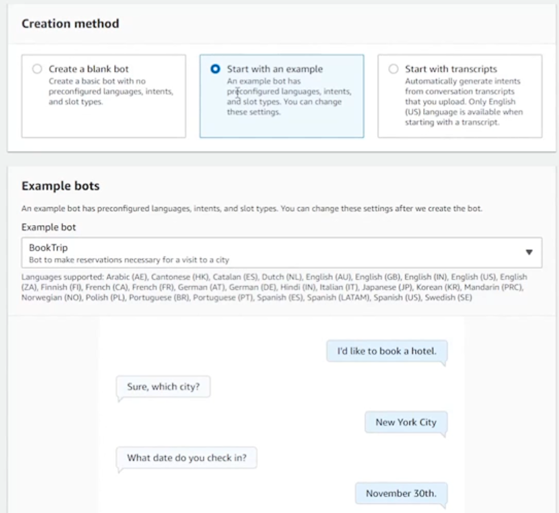
- Can configure timeout<br>
- Can add multiple languages and specify intent confidence score <br>
- Creating new intent <br>
- Add sample utterances to compute similarity and finally confidence from <br>
- Select text and select from drop down to convert part of utterance to slot which will be populated at the bottom (name
  them appropriately) <br>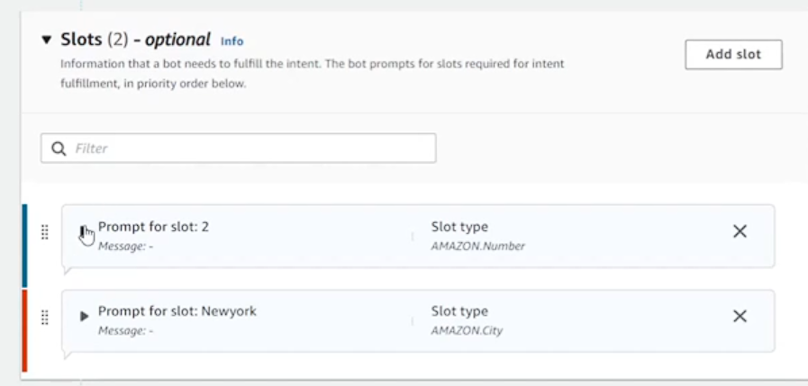
- Give prompts to make sure user populates slot<br> 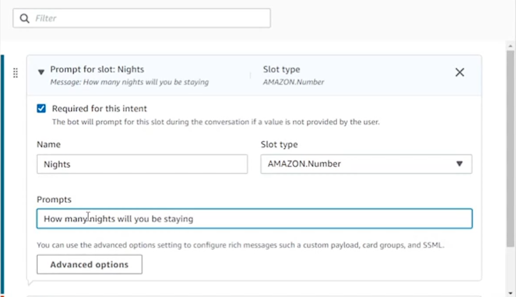
- If Amazon Predefined Slot Types Doesn't fit create a new slot type i.e new data
  type<br>  which can expand (capitalization, stemming, spaces) or be very
  strict 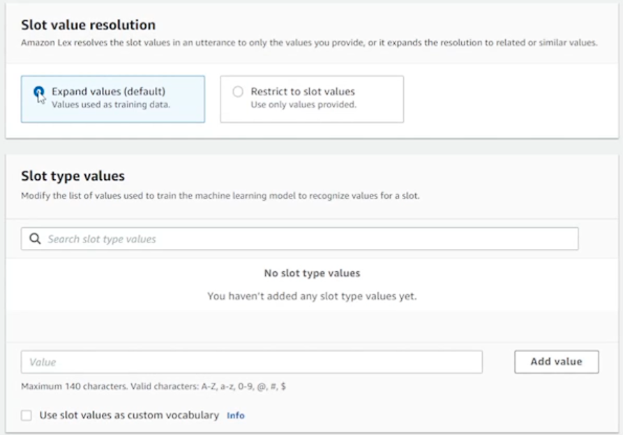
- Add confirmation for the value<br>
- You can visualize convo using visual
  builder <br>
- Define lambda handler to handle<br>
  
- Can give response cards to make interaction easier by adding Response
  Cards <br>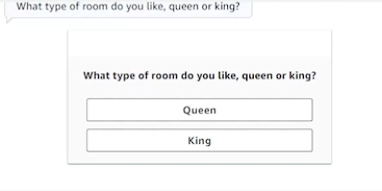
- Can use Amazon AI Intents using AWS Bedrock <br>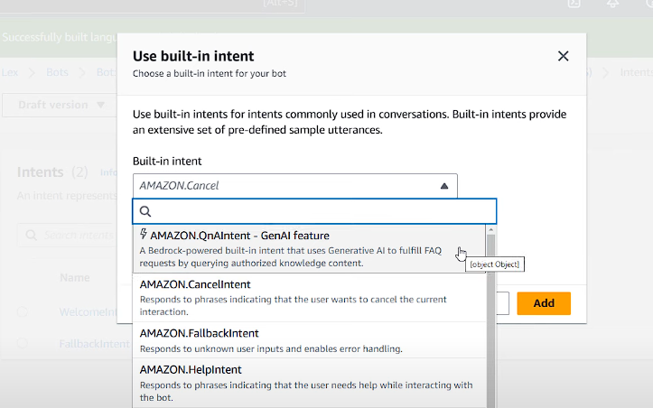

# AWS Bedrock

Fully maaged service for building GenAI Apps both text and images

Features:

- Comes with pretrained models.
- Provides Native RAG capablity with Knowledge Base.
-

Available Models:

1. AI21 - Jamba
2. AWS - Nova, Titan
3. Anthropic - Claude
4. Mistral - Mistral
5. Meta - Llama
6. Stability - Stable Diffusion

## Setup

1. Choose model <br> 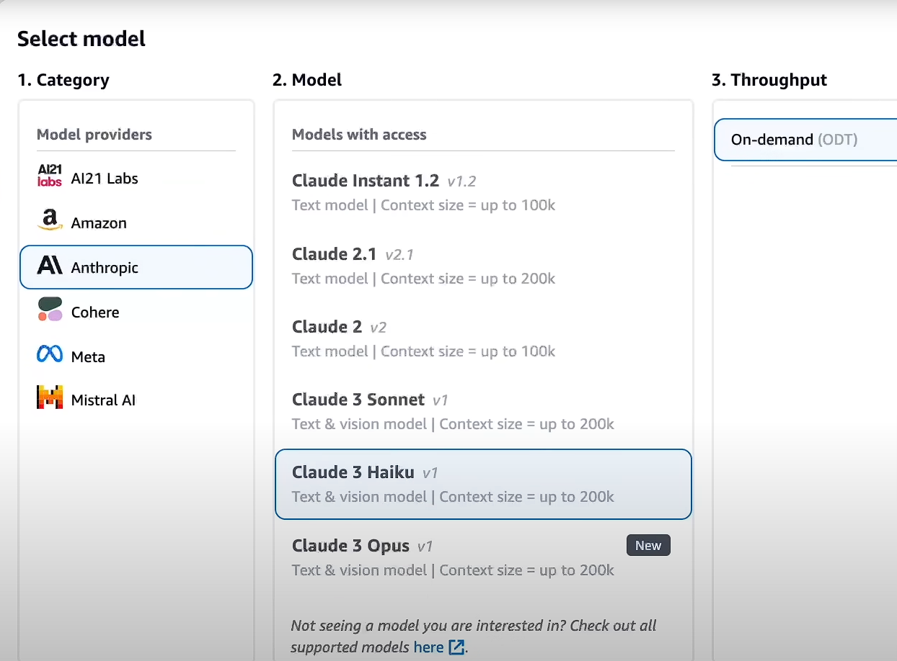
2. Test model on playground <br> 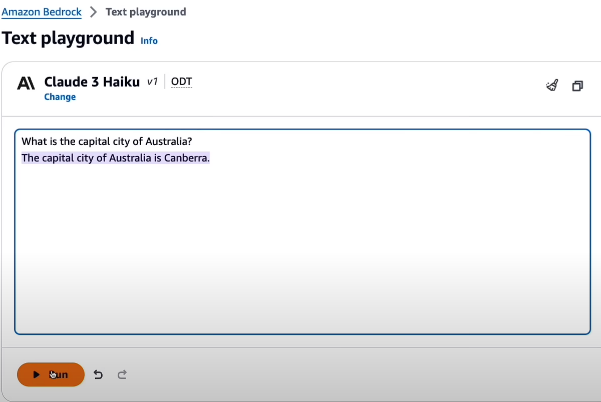
3. You can also compare multiple models in terms of output, speed etc <br> 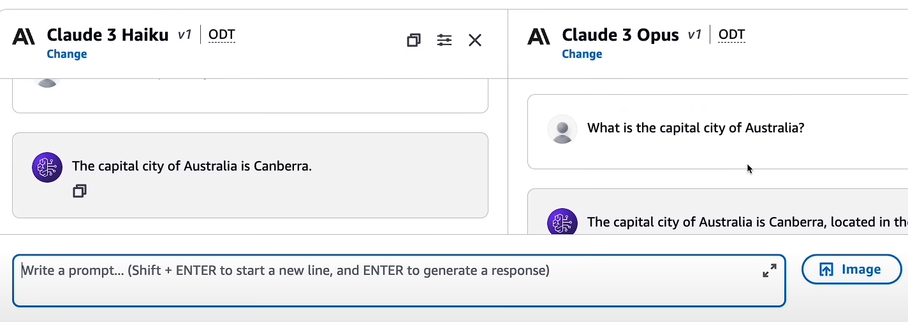
4. Model access isn't available to begin with but can be granted really quickly <br>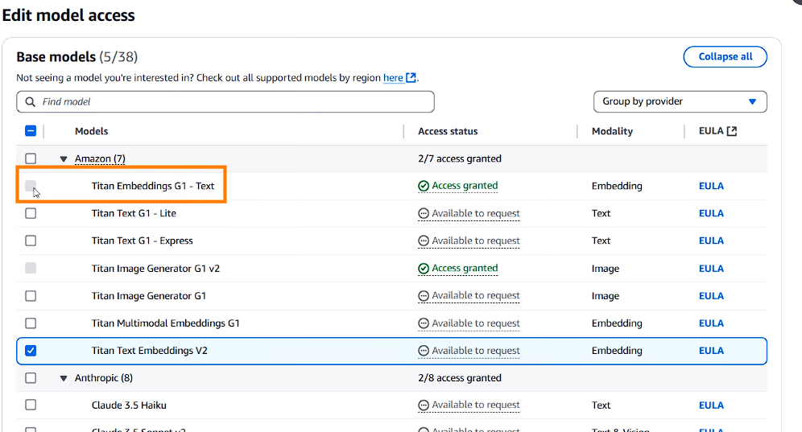
5. To integrate knowledge bases:
    1. Create a knowledge store: Either S3
6. Add your knowledge base <br> 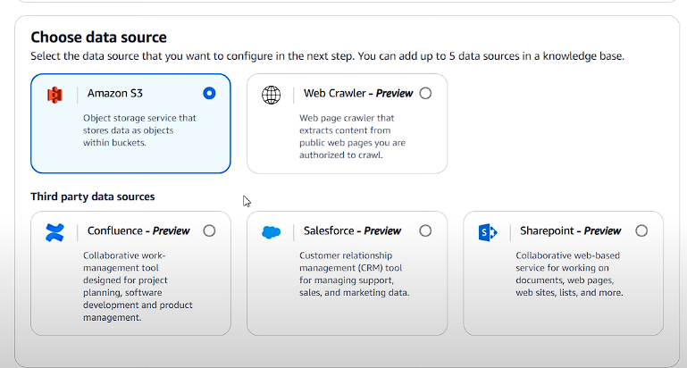 <br> Choose your embedding and vector
   store 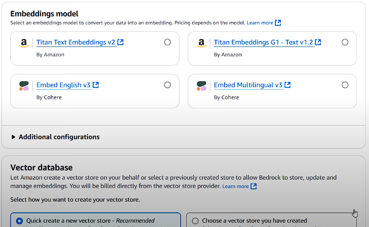

### AWS Bedrock Flows

Flows are a new orchestration tool within Amazon Bedrock that allows developers to create sequences of connected events
and actions.


All the nodes in the flow builder are bucketed into six categories:
Categories of Nodes:

1. Logic : Nodes to control the logic of your flow.
2. Orchestration : Nodes for LLM agents and prompts, helps use a specific prompt or call a particular agent with an
   input.
3. Code : A simple node triggers the Lambda function and gets the output.
4. Data : Everything related to data retrieval, storage, and sending a query to a knowledge base.
5. AI Services : An Amazon Lex node sends the input to an Amazon Lex bot for interpretation.
   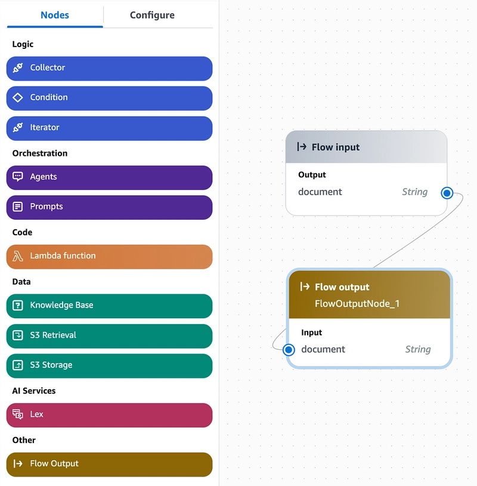

Example from [this link](https://dev.to/aws-builders/understanding-amazon-bedrocks-new-feature-flows-1ohd)

Create prompt node with this connecting to flow output

```commandline
Take the user {{input}} and analyze whether they want to book an 
appointment or have any other query.

Output "APPOINTMENT" if they want to book a new service appointment 
else, output "OTHER"

Only respond with a category.
```

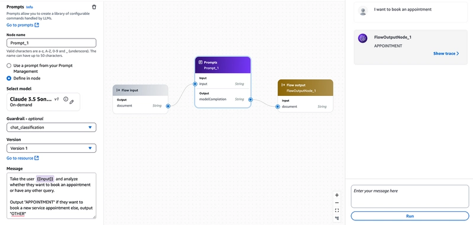
For example, after classifying incoming messages, we'll create two distinct paths: one for appointment requests and
another for general inquiries. Let's test this with the message "Do you guys do plumbing work?" Since this is a general
service inquiry rather than an appointment request, our prompt node classifies it as "OTHER." The Condition node then
routes it to "FlowOutputNode_2"

Add our knowledge base and AI agent to the flow to handle the respective route.
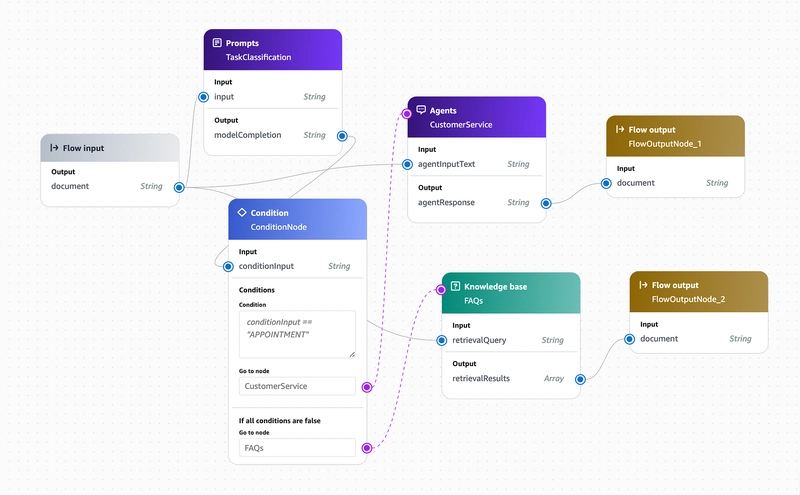