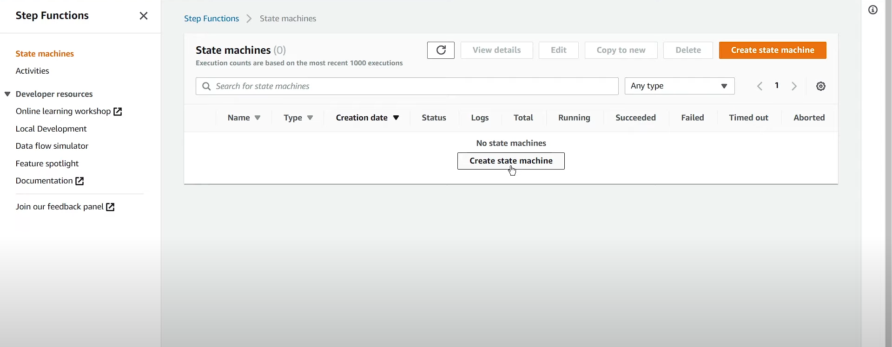
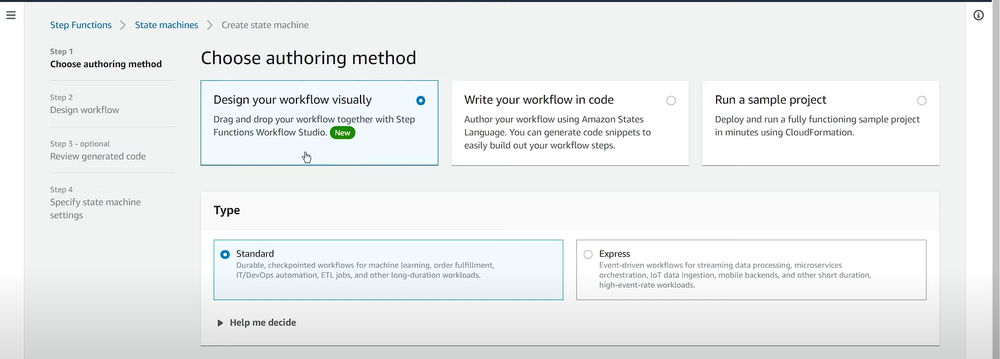

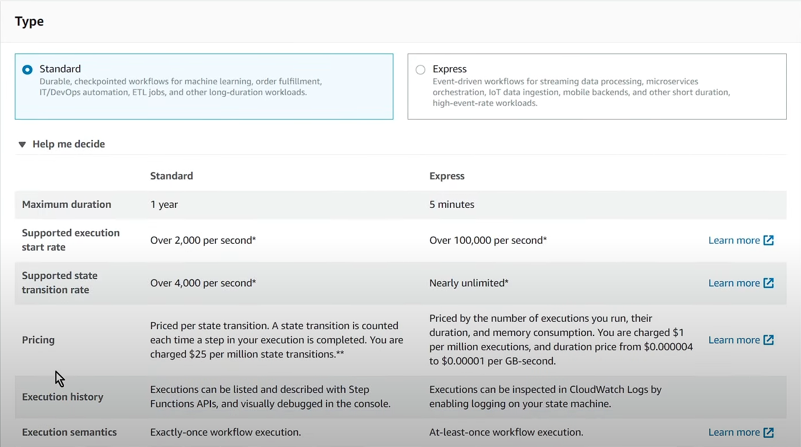
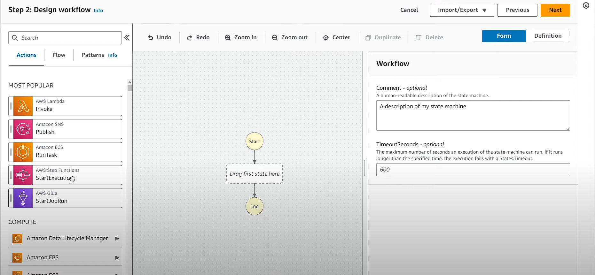
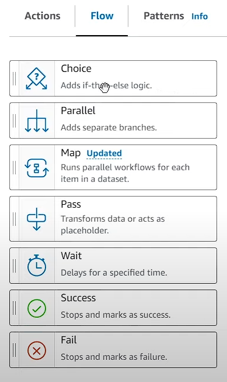
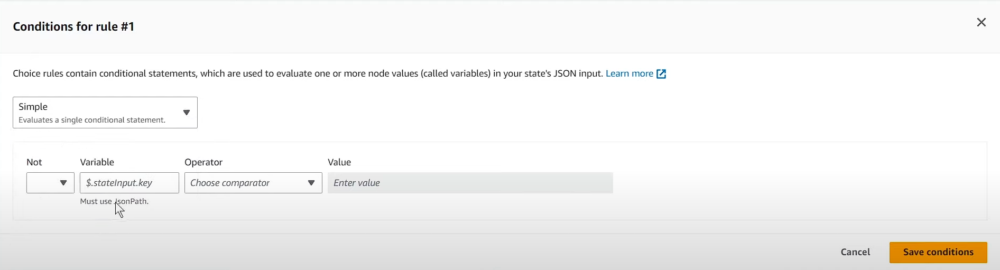
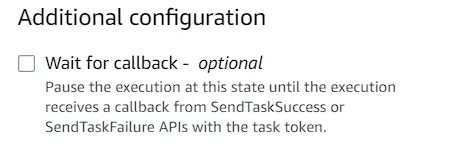
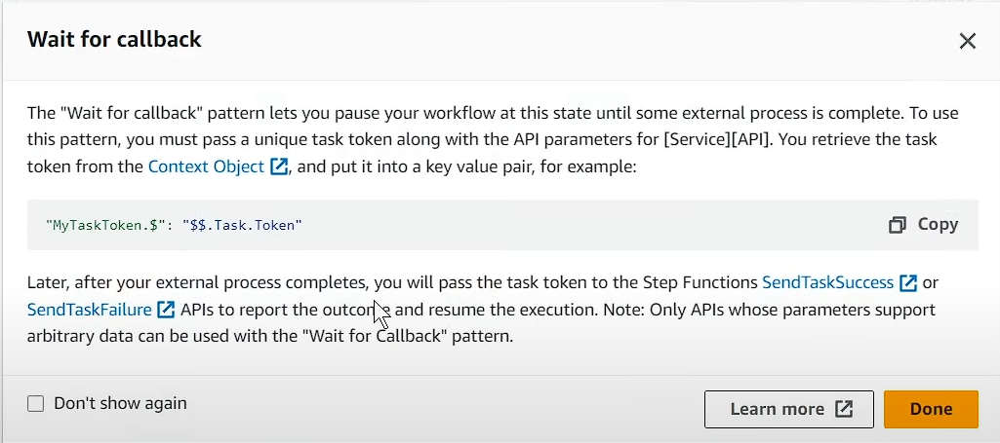
Default: error pauses 
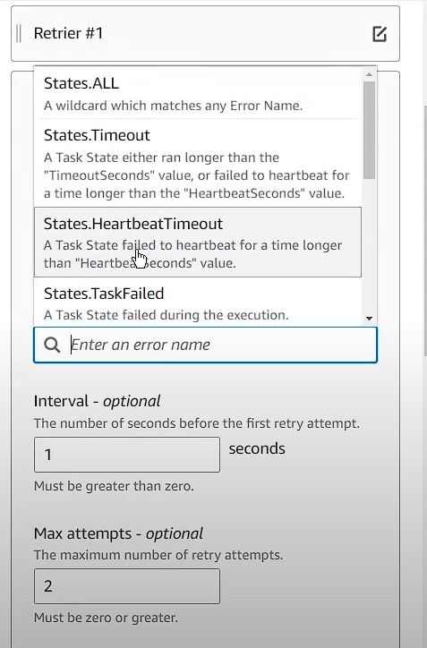
Amazon States Language
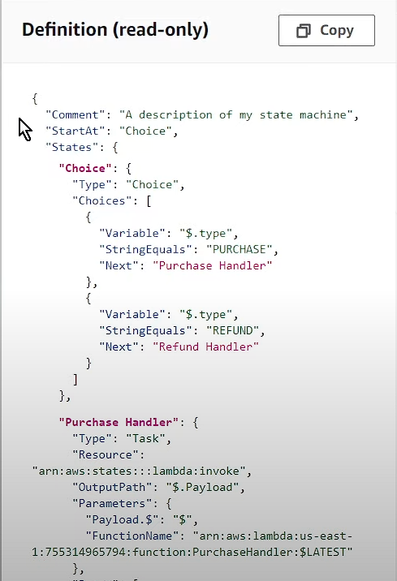
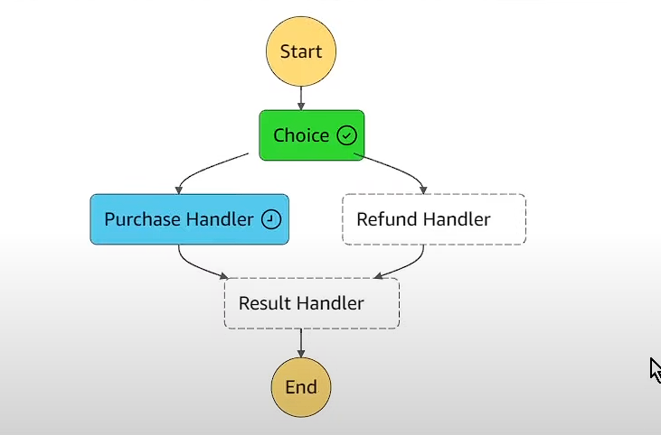
a heartbeat is a way to ensure that a task is still alive and making progress while it runs.
For activities (manual or external worker tasks), your worker needs to periodically call `SendTaskHeartbeat` API to tell Step Functions that it’s still alive.

# AWS Step Functions Textbook: A Comprehensive Guide

## Table of Contents

1. [Introduction to AWS Step Functions](#introduction-to-aws-step-functions)
    - [What is AWS Step Functions?](#what-is-aws-step-functions)
    - [Benefits of Using Step Functions](#benefits-of-using-step-functions)
2. [Key Concepts](#key-concepts)
    - [State Machines](#state-machines)
    - [States](#states)
    - [Transitions](#transitions)
    - [Amazon States Language (ASL)](#amazon-states-language-asl)
3. [Core Components of State Machines](#core-components-of-state-machines)
    - [Task State](#task-state)
    - [Choice State](#choice-state)
    - [Parallel State](#parallel-state)
    - [Map State](#map-state)
    - [Wait State](#wait-state)
    - [Pass State](#pass-state)
    - [Fail and Succeed States](#fail-and-succeed-states)
4. [Advanced Features](#advanced-features)
    - [Error Handling and Retries](#error-handling-and-retries)
    - [Input and Output Processing](#input-and-output-processing)
    - [Callback Patterns](#callback-patterns)
    - [Express vs. Standard Workflows](#express-vs-standard-workflows)
5. [Common Use Cases](#common-use-cases)
    - [Data Processing Pipelines](#data-processing-pipelines)
    - [Microservices Orchestration](#microservices-orchestration)
    - [Serverless Application Workflows](#serverless-application-workflows)
    - [Long-Running Processes](#long-running-processes)
6. [Getting Started with AWS Step Functions](#getting-started-with-aws-step-functions)
    - [Prerequisites](#prerequisites)
    - [Creating a State Machine](#creating-a-state-machine)
    - [Testing and Debugging](#testing-and-debugging)
    - [Monitoring with CloudWatch](#monitoring-with-cloudwatch)
7. [Detailed Examples](#detailed-examples)
    - [Example 1: Order Processing Workflow](#example-1-order-processing-workflow)
    - [Example 2: ETL Pipeline](#example-2-etl-pipeline)
    - [Example 3: Parallel Image Processing](#example-3-parallel-image-processing)
8. [Best Practices](#best-practices)
    - [Design Principles](#design-principles)
    - [Cost Optimization](#cost-optimization)
    - [Security Considerations](#security-considerations)
9. [Integration with Other AWS Services](#integration-with-other-aws-services)
    - [AWS Lambda](#aws-lambda)
    - [Amazon S3](#amazon-s3)
    - [Amazon SNS and SQS](#amazon-sns-and-sqs)
    - [AWS Batch and ECS](#aws-batch-and-ecs)
10. [Advanced Topics](#advanced-topics)
    - [Nested Workflows](#nested-workflows)
    - [Dynamic Parallelism](#dynamic-parallelism)
    - [State Machine Versioning](#state-machine-versioning)
11. [Troubleshooting Common Issues](#troubleshooting-common-issues)
12. [Conclusion](#conclusion)
13. [Additional Resources](#additional-resources)

## Introduction to AWS Step Functions

### What is AWS Step Functions?

AWS Step Functions is a serverless orchestration service that enables developers to coordinate multiple AWS services
into workflows called *state machines*. These workflows are defined using the Amazon States Language (ASL), a JSON-based
language that describes the sequence of steps, decision logic, and error handling. Step Functions abstracts the
complexity of managing distributed systems, allowing you to focus on business logic rather than infrastructure.

Step Functions supports both short-lived (Express Workflows) and long-running (Standard Workflows) processes, making it
suitable for a wide range of applications, from microservices orchestration to data processing pipelines.

### Benefits of Using Step Functions

- **Simplified Orchestration**: Coordinate multiple AWS services without writing complex glue code.
- **Built-in Error Handling**: Automatically handle retries, timeouts, and failures.
- **Visual Workflow Editor**: Design and debug workflows using the AWS Management Console.
- **Scalability**: Run thousands of concurrent workflows without managing servers.
- **Cost-Effective**: Pay only for state transitions, with no upfront costs.
- **Flexibility**: Support for both synchronous and asynchronous workflows.

## Key Concepts

### State Machines

A state machine is the core construct in AWS Step Functions, representing a workflow as a series of states and
transitions. Each state machine has a unique Amazon Resource Name (ARN) and is defined using ASL.

### States

States are individual steps in a state machine. Each state performs a specific action, such as invoking a Lambda
function, waiting for a condition, or branching based on input. Common state types include Task, Choice, Parallel, Map,
Wait, Pass, Fail, and Succeed.

### Transitions

Transitions define the flow between states, specifying the next state to execute based on the current state's outcome or
conditions. Transitions enable dynamic workflow execution, such as branching or looping.

### Amazon States Language (ASL)

ASL is a JSON-based language for defining state machines. It includes fields like `StartAt` (the first state),`States` (
a collection of state definitions), and `Comment` (for documentation). ASL supports visual rendering in the AWS
Management Console, making workflows easier to understand.

## Core Components of State Machines

### Task State

A Task state performs a single unit of work, typically by invoking an AWS service (e.g., Lambda, DynamoDB, SNS) or an
external API via HTTP tasks. Tasks accept input, process it, and produce output for the next state.

Example:

```json
"ProcessData": {
"Type": "Task",
"Resource": "arn:aws:lambda:us-east-1:123456789012:function:ProcessData",
"Next": "NextState"
}
```

### Choice State

A Choice state enables conditional branching based on input data. It evaluates rules (e.g., `StringEquals`,
`NumericGreaterThan`) and directs the workflow to the appropriate next state.

Example:

```json
"CheckStatus": {
"Type": "Choice",
"Choices": [
{
"Variable": "$.status",
"StringEquals": "SUCCESS",
"Next": "SuccessState"
},
{
"Variable": "$.status",
"StringEquals": "FAILED",
"Next": "FailureState"
}
],
"Default": "DefaultState"
}
```

### Parallel State

A Parallel state executes multiple branches concurrently, combining their outputs into a single result. It’s useful for
tasks that can run independently, such as processing multiple files.

Example:

```json
"ParallelTasks": {
"Type": "Parallel",
"Branches": [
{
"StartAt": "Task1",
"States": {
"Task1": {
"Type": "Task",
"Resource": "arn:aws:lambda:us-east-1:123456789012:function:Task1",
"End": true
}
}
},
{
"StartAt": "Task2",
"States": {
"Task2": {
"Type": "Task",
"Resource": "arn:aws:lambda:us-east-1:123456789012:function:Task2",
"End": true
}
}
}
],
"Next": "NextState"
}
```

### Map State

A Map state processes a collection of items iteratively, applying a sub-workflow to each item. It’s ideal for batch
processing, such as transforming a list of records.

Example:

```json
"ProcessItems": {
"Type": "Map",
"ItemsPath": "$.items",
"MaxConcurrency": 10,
"Iterator": {
"StartAt": "ProcessSingleItem",
"States": {
"ProcessSingleItem": {
"Type": "Task",
"Resource": "arn:aws:lambda:us-east-1:123456789012:function:ProcessItem",
"End": true
}
}
},
"Next": "NextState"
}
```

### Wait State

A Wait state pauses the workflow for a specified duration (`Seconds`), until a timestamp (`Timestamp`), or based on a
dynamic input (`SecondsPath`, `TimestampPath`).

Example:

```json
"WaitForApproval": {
"Type": "Wait",
"Seconds": 3600,
"Next": "NextState"
}
```

### Pass State

A Pass state passes its input to its output without performing work. It’s useful for transforming data or maintaining
workflow structure.

Example:

```json
"TransformInput": {
"Type": "Pass",
"Result": {
"transformed": true
},
"Next": "NextState"
}
```

### Fail and Succeed States

- **Fail State**: Terminates the workflow with an error code and message.
- **Succeed State**: Marks successful completion of the workflow.

Example:

```json
"FailState": {
"Type": "Fail",
"Error": "InvalidInput",
"Cause": "Input validation failed"
}
"SucceedState": {
"Type": "Succeed"
}
```

## Advanced Features

### Error Handling and Retries

Step Functions provides robust error handling through `Retry` and `Catch` fields:

- **Retry**: Automatically retries a task on specified errors with exponential backoff.
- **Catch**: Redirects errors to a fallback state for custom handling.

Example:

```json
"ProcessTask": {
"Type": "Task",
"Resource": "arn:aws:lambda:us-east-1:123456789012:function:Process",
"Retry": [
{
"ErrorEquals": ["States.Timeout", "Lambda.TooManyRequestsException"],
"IntervalSeconds": 2,
"MaxAttempts": 3,
"BackoffRate": 2.0
}
],
"Catch": [
{
"ErrorEquals": ["States.ALL"],
"Next": "ErrorHandler"
}
],
"Next": "NextState"
}
```

### Input and Output Processing

Step Functions allows filtering and transforming input/output using `InputPath`, `OutputPath`, `Parameters`, and
`ResultPath`. These fields control which data is passed between states, reducing unnecessary data transfer.

Example:

```json
"FilterInput": {
"Type": "Task",
"Resource": "arn:aws:lambda:us-east-1:123456789012:function:Process",
"InputPath": "$.data",
"ResultPath": "$.result",
"Next": "NextState"
}
```

### Callback Patterns

Step Functions supports callback patterns using the `.waitForTaskToken` suffix in Task states. This allows workflows to
pause and wait for an external process (e.g., human approval) to send a token via API.

Example:

```json
"WaitForCallback": {
"Type": "Task",
"Resource": "arn:aws:states:::lambda:invoke.waitForTaskToken",
"Parameters": {
"FunctionName": "SendApprovalRequest",
"Payload": {
"taskToken.$": "$$.Task.Token"
}
},
"Next": "NextState"
}
```

### Express vs. Standard Workflows

- **Standard Workflows**: Designed for long-running (up to 1 year), durable workflows with exaclty-once execution.
  Suitable for processes like order fulfillment.
- **Express Workflows**: Optimized for high-throughput, short-lived workflows (up to 5 minutes) with at-least-once
  execution. Ideal for event-driven applications.
ℹ️ Note:
  - Unlike Standard workflows, Express workflows do not persist the entire execution history in a durable store.
  - If you use Express Workflows, your tasks must be idempotent. 
    - Example: Writing to a database with “insert if not exists” logic, or using a unique transaction ID to prevent duplicate processing.
  - Express workflows are designed for high-throughput, low-latency execution.
    - If Step Functions sends a task to a Lambda and doesn’t get an acknowledgment quickly (e.g., network timeout), it resends the request.
    - This means duplicate invocations can occur, even if the task itself is stateless or idempotent.
  - Standard Workflows, Step Functions waits for a task to report either success or failure before moving on to the next step. (for synchronous tasks)


## Common Use Cases

### Data Processing Pipelines

Step Functions orchestrates ETL pipelines by coordinating services like AWS Glue, Lambda, and Athena to extract,
transform, and load data.

### Microservices Orchestration

Step Functions coordinates microservices (e.g., Lambda functions, ECS tasks) to ensure reliable execution and handle
dependencies.

### Serverless Application Workflows

Build serverless applications by combining Step Functions with Lambda, SQS, and SNS for event-driven architectures.

### Long-Running Processes

Manage long-running processes, such as user onboarding or batch jobs, with support for pauses, retries, and
human-in-the-loop workflows.

## Getting Started with AWS Step Functions

### Prerequisites

- AWS account with access to Step Functions and related services.
- IAM role with permissions for Step Functions and integrated services (e.g., `AWSLambdaRole`,`AmazonS3ReadOnlyAccess`).
- AWS CLI or SDK (optional for programmatic access).

### Creating a State Machine

1. **Access the AWS Management Console**: Navigate to Step Functions.
2. **Create a State Machine**:
    - Use the visual editor to design the workflow or write ASL directly.
    - Specify the workflow type (Standard or Express).
3. **Define States**: Configure tasks, choices, and other states.
4. **Assign IAM Role**: Attach a role with necessary permissions.
5. **Save and Deploy**: Create the state machine and test it.

### Testing and Debugging

- Use the AWS Management Console to execute the state machine with sample input.
- Inspect execution history to view state transitions, inputs, and outputs.
- Enable CloudWatch logging for detailed logs.

### Monitoring with CloudWatch

- Enable logging in the state machine configuration.
- Monitor metrics like `ExecutionTime`, `StateTransitionCount`, and `FailedExecutions`.
- Set up CloudWatch alarms for critical workflows.

## Detailed Examples

### Example 1: Order Processing Workflow

This state machine validates an order, checks inventory, and sends a notification.

```json
{
  "Comment": "Order processing workflow",
  "StartAt": "ValidateOrder",
  "States": {
    "ValidateOrder": {
      "Type": "Task",
      "Resource": "arn:aws:lambda:us-east-1:123456789012:function:ValidateOrder",
      "Next": "CheckInventory"
    },
    "CheckInventory": {
      "Type": "Task",
      "Resource": "arn:aws:lambda:us-east-1:123456789012:function:CheckInventory",
      "Retry": [
        {
          "ErrorEquals": [
            "States.Timeout"
          ],
          "IntervalSeconds": 2,
          "MaxAttempts": 3,
          "BackoffRate": 2.0
        }
      ],
      "Catch": [
        {
          "ErrorEquals": [
            "States.ALL"
          ],
          "Next": "HandleError"
        }
      ],
      "Next": "SendNotification"
    },
    "SendNotification": {
      "Type": "Task",
      "Resource": "arn:aws:states:::sns:publish",
      "Parameters": {
        "TopicArn": "arn:aws:sns:us-east-1:123456789012:OrderTopic",
        "Message.$": "$.orderDetails"
      },
      "End": true
    },
    "HandleError": {
      "Type": "Fail",
      "Error": "InventoryError",
      "Cause": "Failed to check inventory"
    }
  }
}
```

### Example 2: ETL Pipeline

This state machine extracts data from S3, transforms it using AWS Glue, and loads it into Redshift.

```json
{
  "Comment": "ETL pipeline for data processing",
  "StartAt": "ExtractData",
  "States": {
    "ExtractData": {
      "Type": "Task",
      "Resource": "arn:aws:states:::glue:startJobRun.sync",
      "Parameters": {
        "JobName": "ExtractJob"
      },
      "Next": "TransformData"
    },
    "TransformData": {
      "Type": "Task",
      "Resource": "arn:aws:states:::glue:startJobRun.sync",
      "Parameters": {
        "JobName": "TransformJob"
      },
      "Next": "LoadData"
    },
    "LoadData": {
      "Type": "Task",
      "Resource": "arn:aws:states:::redshift:executeStatement",
      "Parameters": {
        "ClusterIdentifier": "redshift-cluster-1",
        "Database": "mydb",
        "Sql": "INSERT INTO processed_data SELECT * FROM staging_table"
      },
      "End": true
    }
  }
}
```

### Example 3: Parallel Image Processing

This state machine processes multiple images concurrently using Lambda functions.

```json
{
  "Comment": "Parallel image processing workflow",
  "StartAt": "ProcessImages",
  "States": {
    "ProcessImages": {
      "Type": "Parallel",
      "Branches": [
        {
          "StartAt": "ResizeImage",
          "States": {
            "ResizeImage": {
              "Type": "Task",
              "Resource": "arn:aws:lambda:us-east-1:123456789012:function:ResizeImage",
              "End": true
            }
          }
        },
        {
          "StartAt": "CompressImage",
          "States": {
            "CompressImage": {
              "Type": "Task",
              "Resource": "arn:aws:lambda:us-east-1:123456789012:function:CompressImage",
              "End": true
            }
          }
        }
      ],
      "Next": "StoreResults"
    },
    "StoreResults": {
      "Type": "Task",
      "Resource": "arn:aws:states:::s3:putObject",
      "Parameters": {
        "Bucket": "my-image-bucket",
        "Key": "processed/results.json",
        "Body.$": "$"
      },
      "End": true
    }
  }
}
```

## Best Practices

### Design Principles

- **Modularize Workflows**: Break complex workflows into smaller state machines for reusability.
- **Use Descriptive Names**: Name states and state machines clearly to reflect their purpose.
- **Leverage Parameters**: Use `Parameters` to customize task inputs dynamically.

### Cost Optimization

- Minimize state transitions to reduce costs (charged per transition).
- Use Express Workflows for short-lived, high-throughput tasks.
- Avoid unnecessary polling by optimizing wait states.

### Security Considerations

- Use least-privilege IAM roles for state machines.
- Encrypt sensitive data in transit and at rest.
- Restrict access to state machine executions using IAM policies.

## Integration with Other AWS Services

### AWS Lambda

Invoke Lambda functions as tasks to perform compute-intensive operations. Pass input/output between states for seamless
integration.

### Amazon S3

Use S3 for storing input/output data or triggering workflows via S3 events.

### Amazon SNS and SQS

Publish messages to SNS topics or send messages to SQS queues for notifications or queuing tasks.

### AWS Batch and ECS

Orchestrate compute-intensive jobs or containerized applications using AWS Batch or ECS tasks.

## Advanced Topics

### Nested Workflows

Invoke a state machine from another state machine using the `aws:states:::startExecution` resource. This enables
modular, reusable workflows.

### Dynamic Parallelism

Use Map states with dynamic inputs to process variable-sized datasets, controlling concurrency with `MaxConcurrency`.

### State Machine Versioning

Use versioning and aliases to manage updates to state machines without disrupting running executions.

## Troubleshooting Common Issues

- **Execution Timeout**: Check state machine timeout settings and increase if necessary.
- **Permission Errors**: Verify IAM role permissions for all integrated services.
- **Invalid ASL**: Use the AWS Management Console’s visual editor to validate ASL syntax.
- **Task Failures**: Enable CloudWatch logging to inspect error details.

## Conclusion

AWS Step Functions is a versatile service for orchestrating serverless workflows, offering robust features for error
handling, parallelism, and service integration. This textbook provides a detailed guide to understanding and
implementing Step Functions, from basic concepts to advanced use cases. By following best practices and leveraging
examples, you can build scalable, reliable workflows for a variety of applications.

## Additional Resources

- [AWS Step Functions Documentation](https://docs.aws.amazon.com/step-functions)
- [Amazon States Language Specification](https://states-language.net)
- [AWS Step Functions Developer Guide](https://aws.amazon.com/step-functions/getting-started/)
- [AWS Lambda Documentation](https://docs.aws.amazon.com/lambda)
- [AWS re:Invent Talks on Step Functions](https://www.youtube.com/results?search_query=aws+reinvent+step+functions)