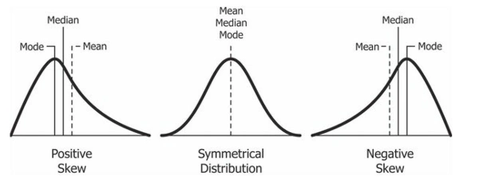
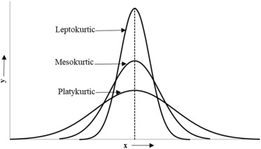
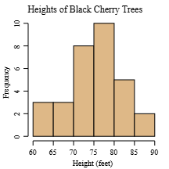
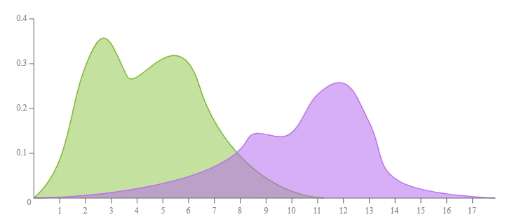
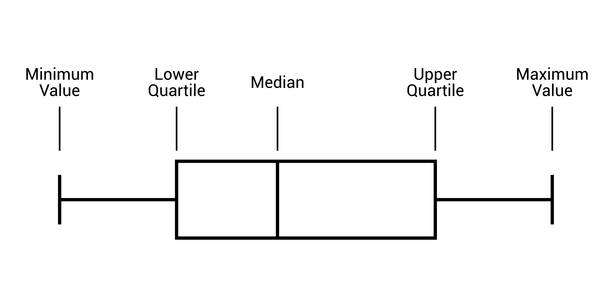
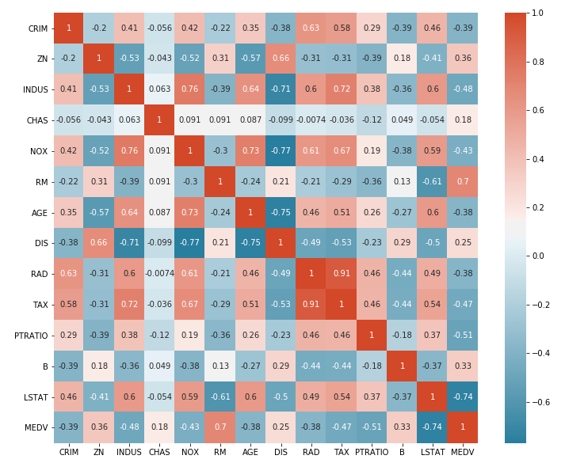

# 2 Exploratory Data Analysis

- Set of techniques for understanding a dataset.
- Uses a list of methods - primarily visual - to explore and summarize main characteristics of dataset
- ## Aim:
    - Summarize Data: Get high level overview
    - Identify patterns and relationships
    - Detect outliers and anomalies
    - Check assumptions

## Steps/Process

1. Data Cleaning and Preprocessing
    1. # Data Cleaning
        - Process of identifying and correcting errors, inconsistencies, or inaccuracies in the dataset.
        - Includes fixing typos, standardizing formats, and resolving inconsistencies in data entries.
        - 🟢 Ensures data quality and reliability for analysis.
        - 🔴 Can be time-consuming and may require domain knowledge to identify errors.
    2. # Handling Missing Data
        - Missing data can arise due to errors in data collection, system failures, or incomplete responses.
        - Strategies for handling missing data ensure the dataset remains usable without introducing significant bias.
        - ### Imputation Strategies
            - **Mean Imputation**: Replace missing values with the mean of the column. Best for numerical data with no extreme outliers.
            - **Median Imputation**: Replace missing values with the median of the column. Robust to outliers, suitable for skewed distributions.
            - **Mode Imputation**: Replace missing values with the most frequent value in the column. Ideal for categorical data.
            - **Interpolation**: Estimate missing values based on surrounding data points, often used in time-series data.
            - 🟢 Simple to implement and preserves dataset size.
            - 🔴 May introduce bias if missing data is not random.
        - ### Regression Imputation
            - Predict missing values using a regression model based on other variables in the dataset.
            - 🟢 Accounts for relationships between variables.
            - 🔴 Computationally intensive and assumes linear relationships.
        - ### Advanced Methods
            - **K-Nearest Neighbors (KNN) Imputation**: Replace missing values with the average of the nearest neighbors based on other features.
            - **Multiple Imputation by Chained Equations (MICE)**: Models each variable with missing data as a function of other variables iteratively.
            - 🟢 More accurate for complex datasets.
            - 🔴 Computationally expensive and requires careful implementation.
    3. ### Handling Duplicates
        - Involves identifying and removing duplicate records to prevent skewed analysis.
        - Common in datasets from merged sources or user input errors.
        - 🟢 Improves data quality and reduces bias in results.
        - 🔴 Risk of accidentally removing valid data if duplicates are not correctly identified.
    4. ### Handling Outliers
        - Outliers are data points that deviate significantly from the rest of the dataset.
        - Can skew analysis and affect model performance if not addressed.
    5. ### Outlier Detection Methods
        - Refer to [Outlier Detection](#reade here)(1_DataPreProcessing.md#Outlier-detection)
    6. ### Outlier Treatment
        - ### Capping
            - Limiting extreme values to a certain percentile.
            - Outliers don’t dominate the data but are not entirely discarded.
            - 📌 📌e.g., 1st Percentile 500, 99th 5000. If x<500 -> x = 500.
        - ### Transformation
            - Transformation changes the scale of your data to reduce the impact of outliers.
            - Common Techniques:
                1. # Log Transformation
                    - Applies y=log(x) to compress large values.
                    - Best for positively skewed data.
                2. # Square Root Transformation
                    - Applies y = sqrt(x).
                    - 🟢 Reduces impact of large values without being as strong as log.
                3. # Box-Cox Transformation
                    - $y(\lambda) = \begin{cases} \frac{y^\lambda - 1}{\lambda}, & \lambda \neq 0 \\ \ln(y), & \lambda = 0 \end{cases}$
                    - Generalized transformation.
                    - 🔴 Requires choosing Lambda.
                    - 🟢 Keeps all data.
                    - 🔴 Hard to interpret.
                    - 🔴 Not applicable to <=0.
        - ### Removal
            - Removing outliers involves deleting the extreme values entirely from your dataset.
            - 🟢 Simple and effective.
            - 🔴 Risk losing signal.
            - 🟢 Avoids statistical distortion.
    7. ### Encoding
        - Converts categorical data into numerical format for analysis or modeling.
        - Common techniques:
            - **One-Hot Encoding**: Creates binary columns for each category.
            - **Label Encoding**: Assigns a unique integer to each category.
            - 🟢 Enables use of categorical data in algorithms.
            - 🔴 One-hot encoding can increase dimensionality significantly.
    8. ### Creating New Features
        - Involves generating new variables from existing data to enhance analysis or model performance.
        - Examples: Creating interaction terms, polynomial features, or aggregating data.
        - 🟢 Can uncover hidden patterns or improve model accuracy.
        - 🔴 May increase complexity or risk overfitting.
    9. ### Date Time Decomposition
        - Process of breaking down a single date-time value into its individual components to make it easier to analyze, manipulate, or use in calculations.
        - Examples: Extracting year, month, day, hour, or weekday from a timestamp.
        - 🟢 Facilitates time-based analysis and feature engineering.
        - 🔴 Requires careful handling of time zones and formats.
2. ## Data Exploration
    - Involves applying statistical and visual methods to understand the dataset's structure, patterns, and relationships.
    - Includes generating summary statistics, visualizations, and correlation analysis to gain insights.

- ## Tools:
    1. ### Summary Statistics
        1. ## Measures of Central Tendency
            - **Mean**: The average value. It's sensitive to outliers.
            - **Median**: The middle value when the data is sorted. It's robust to outliers.
            - **Mode**: The most frequently occurring value.
        2. ## Measures of Dispersion (Spread)
            - **Range**: The difference between the maximum and minimum values.
            - **Variance and Standard Deviation**: Measures of how much the data deviates from the mean. A higher standard deviation indicates greater spread.
            - **Interquartile Range (IQR)**: The range of the middle 50% of the data. It's the difference between the first quartile (25th percentile) and the third quartile (75th percentile) and is a robust measure of spread.
        3. ## Skewness
            - Measure of asymmetry of a probability distribution.
            - 
            - Types:
                - **Symmetric**: No skew left or right.
                - **Positive Skew**:
                    - The tail of the distribution extends to the right.
                    - Most of the data is concentrated on the left side.
                - **Negative Skew**:
                    - The tail of the distribution extends to the left.
                    - Most of the data is concentrated on the right side.
        4. ## Kurtosis
            - Measure of tailedness of probability distribution.
            - $K = \frac{\frac{1}{n} \sum_{i=1}^{n} (x_i - \bar{x})^4}{\left(\frac{1}{n} \sum_{i=1}^{n} (x_i - \bar{x})^2\right)^2}$
            - 
            - Types:
                1. **Leptokurtic (High Kurtosis)**:
                    - Kurtosis > 3.
                    - Have fatter tails.
                2. **Platykurtic (Low Kurtosis)**:
                    - Kurtosis < 3.
                3. **Mesokurtic**:
                    - Kurtosis ≈ 3, similar to a normal distribution.
    2. ### Data Visualization
        - Arguably the most important component of EDA.
        - Humans can much better comprehend visualizations than raw data.
        - Types:
            1. # Histograms
                - Shows the distribution of a single numerical variable.
                - Divides the data into bins and displays frequency of data points in each bin.
                - 
            2. # Density Plot
                - Graph that visualizes the distribution of a continuous variable using a smoothed curve.
                - Provides a continuous and fluid representation of the data's probability density function.
                - Alternative to histogram, using a method called kernel density estimation to smooth out data.
                - 🟢 Ideal for comparing two or more datasets, as overlapping curves provide an easy way to contrast different distributions.
                - 
            3. # Box Plots
                - Summarizes the distribution of a numerical variable.
                - Useful for comparing distributions across different groups.
                - The box represents the IQR, the line inside is the median.
                - The "whiskers" extend to the minimum and maximum non-outlier values.
                - 
            4. # Scatter Plot
                - Shows the relationship between two numerical variables.
                - Each point represents an observation, position determined by the values of the two variables.
                - 🟢 Excellent for spotting correlations.
            5. # Pair Plots
                - A pair plot, also known as a scatterplot matrix, is a visualization tool that displays pairwise relationships between multiple numerical variables in a dataset.
                - It creates a grid of plots, with scatter plots showing the relationship between two different variables.
            6. # Pie Chart
                - Displays the proportion of categories in a categorical variable.
                - 🟢 Useful for showing relative frequencies.
                - 🔴 Can be misleading if too many categories are included.
            7. # Bar Plot
                - Displays the frequency or proportion of categories in a categorical variable.
                - 🟢 Clear and easy to interpret for categorical data.
            8. # HeatMaps (for correlation)
                - A heatmap correlation is a graphical representation of a correlation matrix, where the strength and direction of the relationship between variables are shown using color.
                - 
    3. ### Correlation Analysis
        1. # Pearson
            - Measures the linear relationship between two numerical variables.
            - Values range from -1 to 1, where 1 indicates a perfect positive linear relationship, -1 indicates a perfect negative linear relationship, and 0 indicates no linear relationship.
            - 🟢 Works well for normally distributed data.
            - 🔴 Sensitive to outliers.
        2. # Spearman
            - Measures the monotonic relationship between two variables based on their ranks.
            - 🟢 Robust to outliers and non-linear relationships.
            - 🔴 Less sensitive to linear relationships than Pearson.
        3. # Kendall
            - Measures the ordinal association between two variables.
            - 🟢 Suitable for small datasets or non-parametric data.
            - 🔴 Less commonly used than Pearson or Spearman.
    4. ### Categorical Analysis
        1. # Frequency Counts
            - Counts the occurrences of each category in a categorical variable.
            - 🟢 Simple way to understand category distribution.
        2. # Proportions
            - Calculates the relative frequency of each category.
            - 🟢 Useful for comparing category importance or prevalence.

## Types:

1. ### Univariate Analysis
    - Focuses on studying one variable to understand its characteristics.
    - Helps to describe data and find patterns within a single feature.
    - Tools Used:
        1. # For Numerical Features
            - Summary Statistics: Mean, Mode, Median, Variance, Skew, Kurtosis.
            - Visualization: Histogram, BoxPlots, Density Plot, Violin Plot.
        2. # For Categorical Features
            - Frequency Counts and Proportions.
            - Visualizations: Bar Plot, Pie Chart.
2. ### Bivariate Analysis
    - Focuses on identifying relationships between two variables to find connections, correlations, and dependencies.
    - Basically identifies how two variables interact with each other.
    - Types:
        1. # Numerical vs Numerical
            - Correlation Analysis (Pearson, Spearman, Kendall), Scatter Plots, Pair Plots.
        2. # Numerical vs Categorical
            - Visualizations: Box Plots, Violin Plots, or Bar Plots to compare numerical values across categories.
            - Statistical Tests: T-tests or ANOVA to assess differences.
        3. # Categorical vs Categorical
            - Cross Tabulation.
            - Chi-square test.
            - Stacked bar charts/heatmaps.
3. ### Multivariate Analysis
    - Analyzes relationships among three or more variables simultaneously.
    - Tools Used:
        - # Correlation Heatmap
            - Visualizes the correlation matrix for multiple variables.
        - # Pairwise Plots/Scatter Matrix
            - Extends pair plots to multiple variables for a comprehensive view.
        - # Dimensionality Reduction
            - **PCA (Principal Component Analysis)**: Reduces the dimensionality of the dataset while preserving variance.
            - **T-SNE/UMAP**: Visualization techniques for high-dimensional data.
        - # Interactions
            - Feature Combinations: Creating new features by combining existing ones.
            - Pivot Tables/Aggregations: Summarizing data across multiple variables.
4. # Handling Imbalanced Data
    - Occurs when one class in a dataset is significantly underrepresented compared to others.
    - Common in classification problems (📌e.g., fraud detection).
    - Techniques:
        1. # Resampling Techniques
            - **SMOTE (Synthetic Minority Oversampling Technique)**: Generates synthetic samples for the minority class. [Read here](DataPreProcessing.md#SMOTE-Synthetic-Minority-Oversampling-Technique)
            - **ADASYN (Adaptive Synthetic Sampling)**: Similar to SMOTE but focuses on harder-to-classify minority samples. [Read here](DataPreProcessing.md#ADASYN-Adaptive-Synthetic-Sampling)
            - **Undersampling**: Reduces the majority class to balance the dataset.
            - **Class Weight Adjustment**: Assigns higher weights to minority class samples in model training.
            - 🟢 Improves model performance on imbalanced datasets.
            - 🔴 May lead to overfitting (oversampling) or loss of information (undersampling).