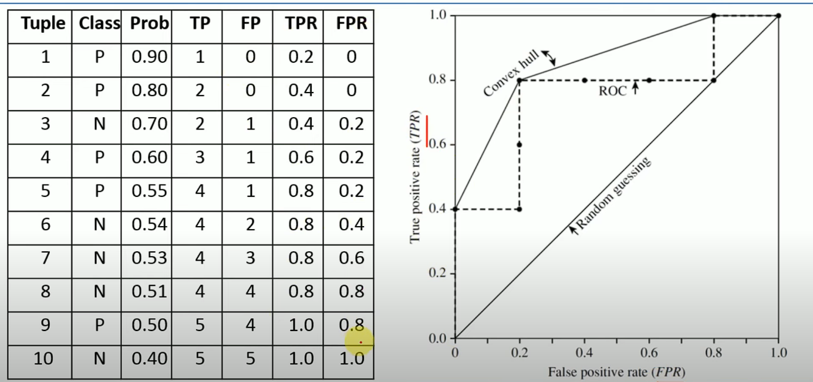

# Machine Learning

## Fundamental Types

| Type                     |                                                                               | Example                                                                                                         |
|--------------------------|-------------------------------------------------------------------------------|-----------------------------------------------------------------------------------------------------------------|
| Supervised Learning      | Learning with labels, target variable                                         | Classification, Regression                                                                                      |
| Unsupervised Learning    | Learning without existing labels, usually to find pattern between data itself | Clustering                                                                                                      |
| Semisupervised Learning  | Combines labelled and unlabelled data.                                        | Self training: Learn from few labels, assign to unlabelled and train                                            |
| Reinforcement Learning   | Models learns by performing or learns results of actions in an environment.   | Q Learning                                                                                                      |
| Self supervised Learning | Model creates its own labels from data.                                       | Contrastive learning where model learns by augmenting, masked word models: mask and predict from same sentence. |

## Concepts

1. ### **Training**
2. ### **Testing**
3. ### Bias Variance Trade-Off
    - In ML Trade off between model's ability to make accurate predictions on training data and its ability to
      generalize to unseen data.
        1. **Bias**: Error due to overly simplistic assumptions in the learning algorithm
        2. **Variance**: Error due to model's sensitivity to fluctuations in the training data
    - The goal is to find a balance between bias and variance

4. ### Cross Validation
   Used to assess the performance and generalization ability of a model.i.e.  
   It is a model evaluation process to compare models/hyperparameters
   

   **K Folds:**
    1. Split the dataset into K equal-sized folds (subsets).
    2. For each fold:
        1. Use that fold as the test set.
        2. Use the remaining K-1 folds as the training set.
        3. Train the model on the training set and evaluate on the test set.
    3. Repeat the process K times, each time with a different fold as the test set.
    4. Average the performance metrics (📌e.g., accuracy, RMSE) across all folds for a final score.
        - Pros & Cons:
        - 🟢 Provides a better estimate of model performance.
        - 🟢 Helps detect overfitting or underfitting.
        - 🔴 Computationally expensive for large datasets.
        - 🔴 Not viable for computationally expensive algorithms like deep learning
5. ### Evaluation Metrics
    TP = True Positives
    TN = True Negatives
    FP = False Positives
    FN = False Negatives

    1. ### Accuracy
       $$\text{Accuracy} = \frac{TP + TN}{TP + TN + FP + FN}$$
    2. ### Precision
       $$\text{Precision} = \frac{TP}{TP + FP}$$
    3. ### Recall
       $$\text{Recall} = \frac{TP}{TP + FN}$$
    4. ### Sensitivity
       $\text{Recall} = \frac{TN}{TN + FP}$
    5. ### ROC Curve
        - Receiver Operating Characteristic Curve
        - Plots: TPR vs FPR where TPR = TP/TP+FN, FPR = FP/FP+TN
          
        - Plotting
          
        - **Using ROC Curve**:
            1. Set Threshold to 1 (for TP) and plot every prediction (will be 0,0)
            2. Slowly lower threshold for classification and watch as TPR and FPR rise
            3. Choose threshold for which plot is closest to (0,1)
        - ⚠️ Not suitable for high class imbalance as it will be close to 0,1 if it predicts majority label each time
        - 💡 Use Precision Recall Curve
    6. ### Precision Recall Curve
        - Better when dataset is highly imbalanced.
        - Plotted using thresholding similarly except plots precision recall. start with threshold = 1 i.e no positives.
        - ℹ️ When Tp = 0 and Fp = 0, we define precision as 1 (otherwise would be 0/0)
        - Here we want both prec and recall to be high, i.e false positive less and false negative less.
        - Aim: Find point closest to (1,1)
          
    7. ### AUC
       Area Under ROC Curve
    8. ### F1 Score
        Harmonic mean of Precision and Recall. Best used when there's class imbalance.
       $$\text{F1Score} = \frac{2 \cdot \text{Precision} \cdot \text{Recall}}{\text{Precision} + \text{Recall}}$$
       $$\text{F1Score} = \frac{2TP}{2TP + FP + FN}$$
    9. Confusion Matrix
        <table>
        <tr> <td>Actual \ Predicted</td><td>Positive</td><td>Negative</td></tr>
        <tr> <td>**Positive**</td><td>TP</td><td>FN</td></tr>
        <tr> <td>**Negative**</td><td>FP</td><td>TN</td></tr>
       </table>
    10. ### R2 Score
        Tells how much variance in target variable is explained by model i.e.   
        doesn't punish model as much for wrong prediction if the zscore of prediction is high (unexpected).
        $$R^2 = 1 - \frac{\sum_{i=1}^{n} (y_i - \hat{y}_i)^2}{\sum_{i=1}^{n} (y_i - \bar{y})^2}$$

# ML Algorithms

1. ### Linear Regression
2. ### Logistic Regression
    - $$\hat{y} = \sigma(\mathbf{w}^\top \mathbf{x} + b)= \frac{1}{1 + e^{-(\mathbf{w}^\top \mathbf{x} + b)}}$$
3. ### K Nearest Neighbours
    - Lazy learner, assigns class to samples based on neighbours
    - Supervised Classification algo
    - 🔴 Sensitive to k chosen (incorrect k can split points into incomprehensible mess)
    - K↑ Bias↑ | K↓ Variance ↑
    - Working: Find K points closest to new sample, assign class based on majority of them
    - Ideal to use Odd (if binary classfn). Else choose lowest dist or smallest total dist.
    - How to decide K? Elbow Plot
4. ### Naive Bayes
    - Supervised Classification algo
    - **Naive** - Assumes P(X𑁇C) = P(x1...Xn𑁇C) is equal to ΠP(xi𑁇C)
    - i.e. Assumes independence of feature given class
    - $$P(C \mid X) = \frac{P(C) \, P(X \mid C)}{P(X)}$$
    - $$P(X \mid C) = \prod_{i=1}^n P(x_i \mid C)$$
    - For Example:
        - C→ Covid, x1→ has cold, x2→cough
        - Calculate P(C) = no. of examples of class C/ total number of samples
        - P(xi𑁇C) = no. of examples of xi in C/ total number of samples in C
        - Use this to calc P(C𑁇X)
5. ### Decision Trees
    - Supervised - Classification and Regression
    - Also called **Classification and Regression Tree (CART)**
    - Split data to create leafs with maximal purity
    - Can be used for classification or regression:

    1. Classification
        - 
        - Use metric Gini Impurity
        - $$Gini(t) = 1 - \sum_{i=1}^{K} p_i^2$$
        - Steps:
            1. Start from top, divide into two
            2. For each calculate gini impurity of both sides
            3. Calculate weighted impurity $$Gini_{split} = \frac{N_{L}}{N} \, Gini(L) + \frac{N_{R}}{N} \, Gini(R)$$
            4. Select split with the lowest impurity
            5. Stop when:
                1. All examples in a node belong to same class
                2. No more features to split
                3. Max Tree Depth (decide yourself)
                4. Too few samples
        - Weighing is necessary to prevent formation of extremely pure minority classes earlier in tree
    2. Regression
        - Use variance within each cluster as measure for impurity
        - Least amount of variance = highest purity
        - Also weighted to prevent formation of extremely high accuracy for minority range
6. ### Ensemble Learning
    - Based on idea: multiple weak learners combined to form one strong learner
    - Types:
        1. ### Bagging
           Improves stability by reducing variance  
           Trains model independently on different random subsets of data with replacement.  
           Combines predictors -
            - Voting for classification
            - Average for regression
              To give more power to higher performing learner assigns weights
        2. ### Boosting
           Trains model sequentially, each learner sequentially correcting the error of last.  
           Assigns weights to each sample and tune weights for sample so later learners can focus more on samples
           misclassified by earlier learners.
           Steps:
            1. Assign each sample equal weight and train first model i.e wi = 1/N (No. of samples)
            2. Calculate rate of error in first model ε = wi*(1 is misclassified else 0)/N
            3. Calculate α i.e model weight = (1-ε)/ε
            4. Reassign weights wi = e^(-α) if correctly classified else e^α
        3. ### Stacking
            - Takes outputs from multiple models
            - Combined output is fed through metamodel which essentially weighs each model's output
            - Steps:
                1. Base models (level-0 models): Train several different models (e.g., decision trees, SVM, logistic
                   regression) on the same dataset.
                2. Metamodel (level-1 model): Train another model on the outputs (predictions) of the base models. This
                   model learns how to best combine their predictions.
                3. Final prediction: The metamodel’s prediction becomes the final output.
            - Base models should be diverse to reduce correlation of errors.
            - Metamodel is often a simple learner (e.g., logistic regression) to avoid overfitting.

7. ### K Means Clustering
   Unsupervised clustering technique, group similar data points together
    - Steps:
        1. Choose k random points call them centroids (each centroid being its own class)
        2. Calculate distance of each sample from each centroid, assign class based on min distance
        3. Once assigned to each point recalculate centroids (as being mean of the class)
        4. Repeat process multiple times until centroids settle
    - 🔴 Sensitive to K
    - 🟢 Simple and Fast

8. ### Bisecting K Means
    - Bisecting k-means is a variant of k-means clustering. It builds clusters using a hierarchical top-down (divisive)
      approach instead of directly partitioning into k.
    - Steps:
        - Start with all points belonging to same cluster
        - Select cluster to split (either largest or max Sum of squared errors)
        - Apply K means with K = 2 with multiple different centroids (Choose one with the lowest SSE overall)
        - Repeat

9. ### Hierarchical Clustering:
   Instead of setting out with a fixed k, we can cluster in a tree like manner.   
   Benefit? Cutting at any depth gives us that number of clusters.  
   Two ways:
    - Agglomerative i.e. Bottom up
    - Divisive i.e. Top Down

10. ### Agglomerative Clustering
     - Bottom up hierarchical clustering
     - Steps:
         1. Start with each point being its own class
         2. Calculate length from every other points, merge the closest ones to form combined class
         3. Now for each class (cluster) calculate distance from every other cluster
             - Actually you calculate distance between every single point in both clusters
             - Choose a measure as cluster distance, called **linkage**
             - Linkage Types:
                 1. Single: Min dist between any 2 points
                 2. Complete: Max dist between any 2 points
                 3. Average: Averages of all dists
                 4. Ward: instead of distance choose clusters which cause least in cluster variance
         4. Combine clusters and repeat until they reach one common cluster
            
     - 🟢 No need to specify K
     - 🔴 Computation requirements limit to small/medium datasets
     - 🟢 Can handle non-spherical clusters by defining custom linkage
11. ### Random Forest
    Bagging implementation
    Builds n decision trees, each tree being given a bootstrapped dataset.  
    At each split each tree gets a subset of features, split normally using gini impurity
    This ensures reduced variance and more generalization
    Build each tree till either they form or clip at a common length
    Vote for classification
12. ### Gradient Boosted Machines
    Boosting implementation (usually for regression)  
    Builds decision trees (not a rule but usually means this in practice), each weak learner aims to correct error (
    residual) of previous weak learner.  
    1. Model starts with γ (gamma) which is usually the mean of the target variable
    2. Use y or log odds of y (classification) for residual calculation
    3. Calculate pseudo-residual i.e. y-ŷ for MSE, can be complex for other loss functions
    4. Train weak learner to predict the pseudo residual (usually a shallow tree)
    5. Each weak learner is assigned a learning rate $ \eta $ (0<$ \eta $<1) which controls how much one tree
       contributes to prevent overfitting
       $$F_m(x) = F_{m-1}(x) + \nu \gamma_m h_m(x)$$
       Fm-1(x) = model's prediction after m-1 iterations.
       hm(x) = next weak learner
       $ \eta $ = learning rate

13. ### XGBoost
    - Extreme Gradient Boost - Extreme version of GBM
    - Doesn't just use decision trees and residuals but also gradient and hessian (Newtonian Method)
    - Uses a regularized objective function
    - Start with base_score i.e. mean or log odds similar to GBM
    - Start with first tree
      $$\mathcal{L}(\phi) = \sum_{i=1}^{n} l(y_i, \hat{y}_i) + \sum_{k=1}^{K} \Omega(f_k)$$
    - here $ \Omega $ is the regularization term to penalize complex trees
    - $$\Omega(f) = \gamma T + \frac{1}{2} \lambda \sum_{j=1}^{T} w_j^2$$ where T = number of leaves in tree  
      wj = leaf weight   $ \lambda $ = L2 reg (penalizes large weights)   $ \gamma $ = complexity cost per
      leaf (penalizes long trees)
    - This is approximated using taylor expansion to
    - $$\mathcal{L}^{(t)} \approx \sum_{i=1}^{n} \left[ l(y_i, \hat{y}_i^{(t-1)}) + g_i f_t(x_i) + \frac{1}{2} h_i f_t^2(x_i) \right] + \Omega(f_t)$$
    - Assuming loss to 0 we get $ w_j^* = - \frac{G_j}{H_j + \lambda} $
    - And gain formula is calculated
      as $\text{Gain} = \frac{1}{2} \left( \frac{G_L^2}{H_L + \lambda} + \frac{G_R^2}{H_R + \lambda} - \frac{(G_L + G_R)^2}{H_L + H_R + \lambda} \right) - \gamma$
    - We split tree using gain till we get to desired leaf node which give
      us $ w_j^* = - \frac{G_j}{H_j + \lambda} $
    - This wj is the output of the tree. Aim of XGBoost is to perform multiple such trees which are usually shallow.
    - Add multiple such trees to base score to fit (with learning rate $ \eta $)
    - $\hat{y}_i^{(t)} = \hat{y}_i^{(t-1)} + \eta\, f_t(x_i)$

14. ### Support Vector Machines
    - Classification Algo
      
    - Separates points out by finding support vector that best separates points with the largest margin.
    - Margin ⬆️ confidence ⬆️
    - ℹ️ Note: To find if two points lie on the same point of line plug them into the equation
        - if wx1+b > 0 and wx2+b > 0 same side
        - if wx1+b > 0 and wx2+b < 0 different side
        - if either equals 0 → On the line
    - To solve: maximize margins i.e. we need to maximize 1/(2❙❙w❙❙2) with constraint
        - $$ \begin{equation}\min_{\mathbf{w}, b, {\xi}} \; \frac{1}{2} \|\mathbf{w}\|^2\end{equation}$$
        - $$\begin{equation} \text{subject to: } y_i (\mathbf{w} \cdot \mathbf{x}_i + b) \geq 1, \quad i = 1, \dots, n\end{equation}$$
    - **Soft Margin Classifier**:
      
        - Instead of using hard margin, allow slack using slack variable $ \epsilon $
            - $$ \begin{equation}\min_{\mathbf{w}, b, {\xi}} \; \frac{1}{2} \|\mathbf{w}\|^2 + C \sum_{i=1}^{n} \xi_i\end{equation}$$
            - $$\begin{equation} \text{subject to: } y_i (\mathbf{w} \cdot \mathbf{x}_i + b) \geq 1 - \xi_i, \quad \xi_i \geq 0, \quad i = 1, \dots, n\end{equation}$$
    - **Kernel Trick**:
15. ### DBSCAN
    
    - Density based spatial clustering with noise
    - 🟢 Allows non-circular clusters and noise
    - 🔴 Sensitive to hyperparams
    - 🔴 Struggles with density variation in same dataset
    - Uses params:
        - ε : Cluster Radius
        - Min Points
    - Defines 3 types of points:
        - Core Point
        - Border Point
        - Noise Point i.e outlier
    - Steps:
        1. Pick any unvisited point (all unvisited at start)
        2. Start with cluster 1 →
        3. if point has > minpoints in its radius ε → Mark it as core point, else border
        4. Recursively go to each point in its radius marking each to same cluster
        5. If a core point continue recursive process, add borders to cluster but don't follow through on them
        6. Once all points in cluster 1 visited, move to unvisited point and cluster 2, repeat.
    - Variants:
        - HDBSCAN
16. ### PCA
    - Principal Component Analysis - Doesn't use target variable
    - Breaks down all features into n PCA vectors (which are weighted linear combinations of other features) using
      eigen vectors
    - Note: Essentially creates linear combinations of features with the highest amount of variability starting from PC1, PC2...
    - We usually consider only first 2 PCA components as they contain most of the variance of data
    - 🔴 Bad for interpretability
    - 🟢 Finds compact uncorrelated representations
    - 🔴 Doesn't optimize for predicting y
17. ### T-SNE
    - T stochastic neighbour embedding
    - Used exclusively for visualization
    - Embeds higher dimension to lower preserving spatial locality
    - Doesn't use y
    - Steps:
        1. Compute Probablity each point j chooses i as neighbour
            - divided by variance → This makes sure clusters of different variance represented with same closeness
            - uses - because we want to reward the smallest distance
              $$p_{j \mid i} = \frac{\exp\!\left(-\frac{\lVert x_i - x_j \rVert^2}{2\sigma_i^2}\right)} {\sum_{k \ne i} \exp\!\left(-\frac{\lVert x_i - x_k \rVert^2}{2\sigma_i^2}\right)}$$
            - ℹ️Note: The K here in question is a parameter we choose called perplexity
                - We adjust variance to match to have <= perplexity decided by us.
                - if perplexity low → Very local spatial locality, preserves local structure well but no global
                  stability
                - if perplexity high → Very global, preserves global structures well but low local stability
        2. Recreates same on a Student t distribution by random assignment
           $q_{ij} = \frac{ \left( 1 + \lVert y_i - y_j \rVert^2 \right)^{-1} } {\sum_{k \ne l} \left( 1 + \lVert y_k - y_l \rVert^2 \right)^{-1}}$
        3. Use KL Divergence between the two as loss
           function $\mathrm{KL}(P \,\|\, Q) = \sum_{i \ne j} p_{ij} \log \frac{p_{ij}}{q_{ij}}$
        4. Perform gradient descent, one trained q should match spatial locality like p
    - Why T dist used? T dist has flatter mean and heavier tails, points do not crowd at center and are more spread
      about
    - 🔴 Very sensitive to perplexity param

18. ### UMAP
    - Uniform Manifold Approximation and Projection
    - A dimensionality reduction technique used for visualizing high-dimensional data in a lower-dimensional space,
    - Process:
        1. Constructs a Graph: UMAP builds a weighted graph where data points are nodes, and edges represent
           similarities (distances) between points in the high-dimensional space.
        2. Preserves Local Structure: UMAP focuses on preserving the local neighborhood of each point, ensuring that
           points close in the original space remain close in the reduced space.
        3. Unlike some other methods (e.g., t-SNE), UMAP also considers the global structure, maintaining the
           overall shape of the data manifold.
        4. It optimizes the low-dimensional representation by minimizing a cost function that balances local and
           global relationships, using a process similar to stochastic gradient descent.
    - Speed: UMAP is faster than t-SNE
    - Flexibility: It can handle various types of data
    - UMAP is faster and scales better with large datasets than T-sne
    - It preserves more of the global structure compared to t-SNE, which focuses heavily on local structure.
    - UMAP has `n_neighbors` (controls local vs global emphasis) and `min_dist` (controls tightness of clusters), which are more interpretable.
19. ### Gaussian Mixture Models
20. ### SHAP
    - SHAP (SHapley Additive exPlanations) is a powerful and widely used technique in machine learning that helps
      you understand the output of your models.
    - ells you why a model made a particular prediction by quantifying the contribution of each feature to that
      prediction
    - crucial aspect of explainable AI (XAI)
    - Based on Gametheory where Players cooperate to win a payout, and the Shapley value fairly distributes the
      payout among them based on their marginal contributions.
    - Working Process:
        1. Baseline (reference prediction):
            - Start with the model’s expected prediction if no features were known (e.g., the mean prediction across
              the dataset).
        2. Marginal Contribution of Each Feature:
            - To compute a feature’s contribution, we calculate difference in models prediction with or without.
        3. For Feature Interaction:
            - we evaluate a feature’s contribution across all possible subsets of features (called coalition)
        4. Calculate Shapely Value
            - Final Contribution of each feature = avg of its marginal contributions across all subsets
    - ℹ️ How do we do missing features?
        1. Can substitute with average for that feature
        2. Can substitute it with random values in that feature and average across those
        3. Tree based methods provide missing value paths
    - Implementations:
        - KernelSHAP → model-agnostic, approximates Shapley values via sampling.
        - TreeSHAP → fast, exact method for tree-based models (XGBoost, LightGBM, CatBoost).
        - DeepSHAP → approximates Shapley values for deep learning models.

21. ### LIME
    - Local Interpretable Model-Agnostic Explanations
    - Technique to explain individual predictions of any machine learning model.
    - works by locally approximating the complex (black-box) model with a simpler, interpretable model (usually
      linear regression).
    - Process:
        1. Pick the sample to explain
        2. Generate Perturbations (neighbours)
        3. Get model predictions for neighbors
        4. Weight samples by proximity, closer get higher
        5. Train a surrogate model like sparse linear regression
        6. Interpret the surrogate model
            - The coefficients of the surrogate model tell you which features were most important for this specific
              prediction