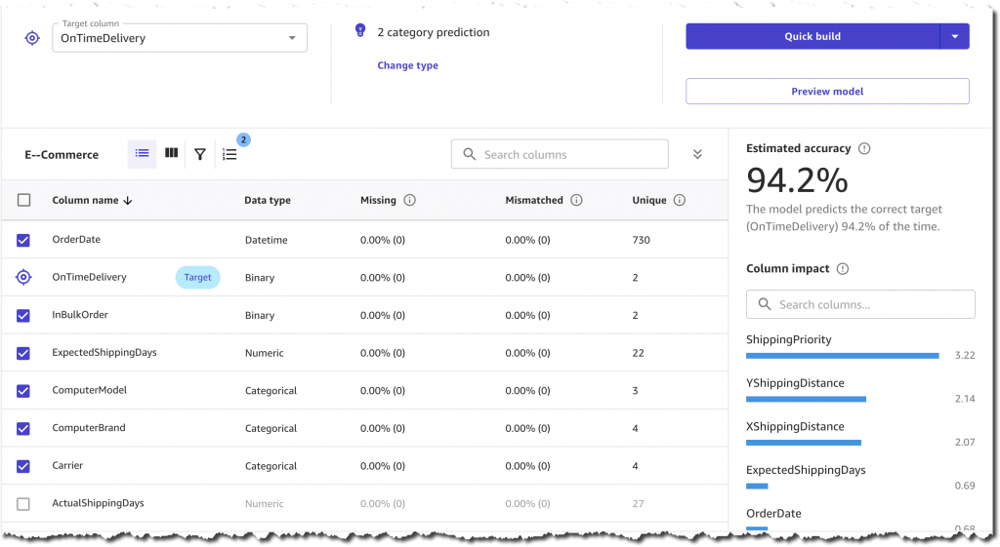

# SageMaker

Amazon SageMaker is a fully managed service from AWS that helps developers and data scientists build, train, and deploy
machine learning (ML) models quickly and easily.
covers the entire ML lifecycle, from data labeling to model deployment and monitoring.

## Key Components

SageMaker is not a single tool but a collection of services that work together. Some of the key components are:

1. **Sagemaker Studio**:
    - Integrated development environment (IDE) for ML
    - Provides a single web-based interface where you can perform all the steps of the ML workflow
2. **SageMaker Notebook Instances**:
    - These are managed Jupyter notebooks that come pre-configured with popular ML frameworks like TensorFlow, PyTorch,
      and scikit-learn.
    - Similar to colab but can launch powerful machine with deep AWS integration
    - 🟢 Great for exploratory data analysis and developing your model code
3. **SageMaker Training**:
    - Allows you to train your models at scale.
    - SageMaker handles the heavy lifting of managing the compute instances,distributing the training workload, and
      saving the final model artifact.
    - Can easily train a model on massive datasets without needing to manage a single server.
4. **SageMaker Inference (Deployment)**:
    - To deploy it to a production environment.
    - Creates an endpoint where your application can send data to get predictions.
    - ℹ️ AWS Endpoint is not a public API but an endpoint you call using AWS SDK
    - SageMaker inference can actually be done in multiple ways:
        - Real time inference: Using an always "on" endpoint
        - Batch Transform: Run on dataset on s3 and write to s3
        - Serverless Endpoints: On demand
5. **SageMaker Data Wrangler**:
    - Tool for data preparation and feature engineering.
    - Helps you aggregate and prepare data from various sources and transform it for training.
6. **SageMaker Pipelines**:
    - Allows you to automate and manage the steps of your ML workflow

### Example Calling sagemaker endpoint

```python
import boto3
import json

runtime = boto3.client('sagemaker-runtime')

data = {"features": [5.1, 3.5, 1.4, 0.2]}  # Example for Iris dataset
payload = json.dumps(data)

response = runtime.invoke_endpoint(
    EndpointName='my-endpoint',
    ContentType='application/json',
    Body=payload
)

result = json.loads(response['Body'].read())
print(result)
```

<hr>

## The Machine Learning Lifecycle

Systematic, iterative process that guides the development and deployment of ML models.
The ML lifecycle can be broken down into several key stages:

1. Data Preparation:
    - Often the most time-consuming part of the process.
    - Involves collecting, cleaning, and transforming raw data into a format suitable for training
    - Tasks include handling missing values, removing duplicates, feature engineering, and splitting the data into
      training, validation, and test sets.
    - 💡Sagemaker Data Wrangler
2. Model Building:
    - Choose a suitable algorithm or model architecture for your problem.
    - You define the model structure, including the number of layers (for a neural network) or the type of algorithm (
      like a decision tree or a linear regression model).
    - 💡 Sagemaker Studio Notebooks
3. Training:
    - Feed the training data to the model to minimize the error or loss.
    - This process is computationally intensive and often requires powerful hardware.
    - 💡 Sagemaker Training
4. Deployment:
    - After the model is trained and validated, needs to be made available for use.
    - Involves packaging the model and deploying it to a production environment where it can receive new data and
      provide predictions.
    - This is also known as inference.
    - 💡 SageMaker Inference
5. Monitoring:
    - Crucial to monitor its performance over time.
    - Involves tracking metrics like prediction accuracy, latency, and resource usage.
    - Models can degrade over time due to changes in data distribution, a phenomenon known as model drift. Monitoring
      helps you detect and address these issues.
    - 💡SageMaker Model Monitor

## Other Sagemaker Tools and how to use them

1. Sagemaker Wrangler
2. Sagemaker Canvas
    - no-code machine learning (ML) platform designed for business analysts and other non-technical users.
    - allows you to build, test, and deploy machine learning models for predictive analytics without writing any code.
    - Steps:
        1. Access the platform: You can access AWS Canvas from within Amazon SageMaker Studio.
        2. Prepare your data:
            - Use the no-code interface to import data from various sources like Amazon S3, Redshift, and Snowflake.
            - You can also upload your own data
            - The platform provides pre-built analyses and transformations to help you prepare your data for modeling.
        3. Go to new Model
            - Select data set
            - For multiple datas you can also use join using a node based ui
        4. Build a model:
            - Choose a machine learning problem type, such as regression or classification, and let Canvas's AutoML (
              Automated Machine Learning) capabilities handle the rest.
            - Select the target column
            - AutoML automatically selects the best algorithm and tunes the model to deliver accurate predictions.
        5. Choose build type:
            - Gives you a quick view of expected error (runs a tiny model on a small sample)
            - 
              
            - Standard Build: Accuracy Over Speed (Takes hours)
            - Quick Build : Speed over accuracy (takes minutes)
        6. Analyse:
           
            - Gives you expected error metric
            - Also Provides you contribution of each
            - Gives you advanced metrics here too
            - 
        7. Predict:
            - Upload dataset to test prediction on
        8. Deploy
            - Canvas allows you to share/export your model to SageMaker Studio or the main SageMaker service.
            - From SageMaker Studio (or the SageMaker console/SDK), you can take the trained model and create a
              real-time inference endpoint.
3. SageMaker Notebook Instances:
    - Means AWS Sagemaker studio Notebooks (Notebook instances are older isolated Jupyter EC2, not as popular anymore)
    - Can select instance type at every run (without losing data) as well images (which have preinstalled libs)
    - **Space:** Space is essentially a dedicated, persistent development environment for each user, designed to give
      them an isolated workspace for building, training, and testing machine learning models.
        - Persistent storage (EFS volume attached to the domain) → keeps your notebooks, data, and settings even if you
          shut down to compute.
        - Ephemeral compute (the instance you choose when you start the space) → only runs while you’re working.
        - Cost: While stopped, you only pay for the underlying storage (EFS), not the compute.
        - Note:
            - ✅ Running code → you pay.
            - ⚠️ Space sitting idle with a notebook open → you still pay.
            - SageMaker Studio has idle timeout policies that an admin can configure.
        - Temp file uploads in colab are not temp here
    - Importing data can be done in multiple ways:
        - Using Boto3
            - ```python
      import boto3
      s3 = boto3.client('s3')
      s3.download_file('my-bucket', 'data/myfile.csv', 'myfile.csv')
         ```
        - Using SageMaker built-in methods
            - ```python
         from sagemaker import Session
         sess = Session()
         s3_path = 's3://my-bucket/data/myfile.csv'
         local_path = sess.download_data(path='.', bucket='my-bucket', key_prefix='data')
         ```
4. Sagemaker CodeEditor
    - Code Editor in SageMaker Studio is persistent, just like the JupyterLab notebooks and files in your space.
    - But unlike notebooks which store state, File edits are saved to disk (persistent), but execution state is lost.
    - Since the VS Code session is connected to a running Studio space, you are billed for the compute instance while
      the space is running.
    - Idle VS Code (no code executing) still charges you because the underlying instance is running.
    - Development on low-cost compute
        - When you open a Studio space, it launches with a kernel running on a specific instance type (compute).
        - For light development, you can pick a small instance like ml.t3.medium or ml.t3.large.
        - This keeps costs low while you write and test code.
    - Switching to high-performance compute
        - If you want to run heavy code (e.g., training locally in the space, not via a training job), you can change
          the kernel’s instance type:
            - Click the kernel name in the top-right of the notebook or Code Editor.
            - Select “Change compute”.
            - Pick a larger instance (ml.p3.2xlarge, ml.p4d, etc.).
        - SageMaker will provision a new instance with your selected size and attach it to your space.
        - ⚠️ This approach only affects the space runtime.
5.

## Getting Started with SageMaker

### Setting up an AWS Account and IAM Roles:

- Create an IAM User, Attach IAM policies: `AmazonSageMakerFullAccess` needed for broad acess
- Create an Execution Role: SageMaker needs an IAM execution role to perform actions on your behalf (like S3 access)

## AWS Sagemaker Studio

integrated development environment (IDE) for machine learning. It provides a single, unified interface for all ML
development steps, from data preparation to model deployment.

- It simplifies collaboration with features like shared notebooks and a unified file system for a team.
- SageMaker Studio provides a single-pane-of-glass experience, so you don't need to switch between different tools. All
  SageMaker services like Data Wrangler, Pipelines, and Experiments are integrated directly into the Studio UI.
- Studio notebooks launch significantly faster (5-10 times faster) than traditional notebook instances.

## Steps to train on sagemaker

1. Prepare Your Training Script
    - The core of your training job is a Python script that contains your model definition, training loop, and data
      loading logic.
    - This script runs on the SageMaker-managed training instance.
    - designed to handle inputs and outputs in a specific way, particularly by using environment variables that
      SageMaker provides.
    - ```python
      import argparse
      import os
      import torch
      import torch.nn as nn
      import torch.optim as optim
      from torchvision import datasets, transforms
      # Define the simple neural network architecture
      class Net(nn.Module):
      def __init__(self):
      super(Net, self).__init__()
      self.fc1 = nn.Linear(28 * 28, 512)
      self.relu = nn.ReLU()
      self.fc2 = nn.Linear(512, 10)

        def forward(self, x):
            x = x.view(-1, 28 * 28)
            x = self.fc1(x)
            x = self.relu(x)
            x = self.fc2(x)
            return x

       def train(model, device, train_loader, optimizer, epoch):
           model.train()
           for batch_idx, (data, target) in enumerate(train_loader):
               data, target = data.to(device), target.to(device)
               optimizer.zero_grad()
               output = model(data)
               loss = torch.nn.functional.cross_entropy(output, target)
               loss.backward()
               optimizer.step()
               if batch_idx % 100 == 0:
                   print(f'Train Epoch: {epoch} [{batch_idx * len(data)}/{len(train_loader.dataset)}] Loss: {loss.item():.6f}')
      def main():
       st = "Use argparse to get hyperparameters passed from the SageMaker estimator"

      parser = argparse.ArgumentParser(description='PyTorch MNIST Example')
      parser.add_argument('--epochs', type=int, default=10, help='number of epochs to train')
      parser.add_argument('--batch-size', type=int, default=64, help='input batch size for training')
      parser.add_argument('--lr', type=float, default=0.01, help='learning rate')
      # SageMaker passes the training data path as an argument
      parser.add_argument('--sm-data-dir', type=str, default='/opt/ml/input/data/training',
                            help='Sagemaker data directory')
      args = parser.parse_args()
    
           # Determine if a GPU is available
           device = torch.device("cuda" if torch.cuda.is_available() else "cpu")
    
           # Data loaders
           transform = transforms.Compose([
               transforms.ToTensor(),
               transforms.Normalize((0.1307,), (0.3081,))
           ])
           train_dataset = datasets.MNIST(root=args.sm_data_dir, train=True, download=False, transform=transform)
           train_loader = torch.utils.data.DataLoader(train_dataset, batch_size=args.batch_size, shuffle=True)
    
           # Initialize model, optimizer
           model = Net().to(device)
           optimizer = optim.SGD(model.parameters(), lr=args.lr)
    
           # Train the model
           for epoch in range(1, args.epochs + 1):
               train(model, device, train_loader, optimizer, epoch)
    
           # Save the model to the output directory provided by SageMaker
           model_dir = os.environ.get('SM_MODEL_DIR')
           if model_dir:
               torch.save(model.state_dict(), os.path.join(model_dir, 'model.pth'))
      if __name__ == '__main__':
        main()
      ```

2. Create a SageMaker Estimator

- The Estimator is a key class in the SageMaker Python SDK that simplifies the training process. It encapsulates the
  logic for creating a training job and provides a high-level interface to configure the training environment.
- ```python
   import sagemaker
   from sagemaker.pytorch import PyTorch
   from sagemaker import get_execution_role

   # Get the SageMaker session and role
   sagemaker_session = sagemaker.Session()
   role = get_execution_role()

   # Define the S3 path for the MNIST data
   # You need to upload the MNIST dataset to an S3 bucket first
   s3_data_path = 's3://your-s3-bucket/path-to-mnist-data/'

   # Create the PyTorch Estimator
   # This defines the training job configuration
   estimator = PyTorch(
   entry_point='train.py', # Your training script
   source_dir='./', # Directory containing your training script
   role=role, # The IAM role
   framework_version='1.13', # PyTorch version
   py_version='py39', # Python version
   instance_count=1, # Number of instances
   instance_type='ml.c5.xlarge', # Instance type (use 'ml.p3.2xlarge' for GPU)
   hyperparameters={
   'epochs': 5,
   'batch-size': 128,
   'lr': 0.001
   }
   )

   # Launch the training job
   # The training data from S3 is passed here
   estimator.fit({'training': s3_data_path})

   # The trained model is saved to S3 and can be used for deployment
   print('Training job complete! Model artifacts are in S3.')
   ```

- Calling Estimator.fit directly initiates and manages the entire training process on a dedicated,
  SageMaker-provisioned infrastructure.
- The training happens on a different, remote AWS instance that SageMaker provisions for you, not on the VS Code
  instance or notebook where you're calling the .fit() method.
- The easiest way to check the status is directly in SageMaker Studio. On the left-hand navigation pane, you'll find a "
  Training jobs" section. Here you can see a list of all your training jobs, their current status (InProgress,
  Completed, Failed),
- **Monitoring:**
    - Clicking on a specific job provides a more detailed view, including:
        - Metrics: A live chart of key metrics like training loss, validation accuracy, and other custom metrics you
          define.
        - Logs: The full stream of logs from your training script, just as if you were running it on your own machine.
        - Artifacts: Information on where the model and other output artifacts are saved in your S3 bucket.
    - SageMaker automatically streams all logs from your training job to Amazon CloudWatch Logs.
    - ℹ️ if you forget to include the code to save your model in the train.py script, the trained model and its weights
      will be lost. SageMaker's training instance is ephemeral; it is automatically terminated and its storage is wiped
      clean after the training job is complete.

## Data Ingestion: Best Practices for Moving Data to S3 📦

Amazon S3 (Simple Storage Service) is the foundational data store for Amazon SageMaker. It's a scalable and secure
object storage service used to store datasets, model artifacts, and other files. Best practices for ingesting data into
S3 include:

- Organize Data with a Logical Structure: Use a clear folder hierarchy to manage your data.
- ℹ️Note: bucket names are unique and have unique urls across the world s3://your-bucket-name/project-name/data/raw/
- Secure Your Data: Use IAM policies to control who can access your S3 buckets. Enable S3 encryption at rest to protect
  sensitive data.
- Use the Right Tools: For large datasets, use tools like the AWS CLI (aws s3 sync), AWS DataSync, or the S3 Transfer
  Acceleration feature to speed up data transfers

## SageMaker Data Wrangler 🧹

Integrated in AWS Canvas Studio  
SageMaker Data Wrangler is a powerful tool within SageMaker Studio that simplifies the process of data preparation and
feature engineering. It allows data scientists to aggregate, prepare, and transform data from various sources with a
visual interface.

### Data Flow:

A data flow is essentially a visual and logical representation of the steps you use to process and transform data. It
lets you move data from raw sources to a form suitable for machine learning
- ### Viewing:
    - In SageMaker Data Wrangler, you can preview and process your data in-memory without explicitly writing it
      anywhere.
      The visual data flow lets you explore and manipulate the dataset interactively, which is especially useful during
      feature engineering or cleaning.

- ### Consuming:
    - If you want to use the transformed data in a training job, you usually export it — commonly to S3, the SageMaker
      Feature Store, or directly to a processing/training job

On creating new data flow:


1. You can get data insights
2. 
3. Select target column and analysis name
4. Wrangler will generate you your report
    - 
    - 
6.

- Interactive Data Preparation: You can connect to data sources like S3, Amazon Redshift, and Snowflake. Data Wrangler
  automatically profiles your dataset, providing insights into data quality and potential issues.
- Visualizations and Transformations: Data Wrangler offers built-in visualizations
- Exporting Data Flows: Once you've created a data preparation "flow," you can export it as a repeatable job. This flow
  can be used as a step in a SageMaker Pipeline, allowing you to automate the entire data preparation process and ensure
  consistency.

## SageMaker Ground Truth

data labeling service that helps you build high-quality training datasets for machine learning.
particularly useful for supervised learning tasks where models require labeled data (e.g., image classification, object
detection).

- Creating Data Labeling Jobs: Ground Truth allows you to create labeling jobs for various data types, including images,
  videos, and text. You can use your own team of labelers, leverage a public workforce through Amazon Mechanical Turk
- Human-in-the-Loop Workflows: Ground Truth is designed for human-in-the-loop workflows. It can use an ML model to
  automatically label a portion of your data. The model’s labels are then sent to human reviewers for verification,
  which helps improve efficiency and quality. This process is called active learning.

