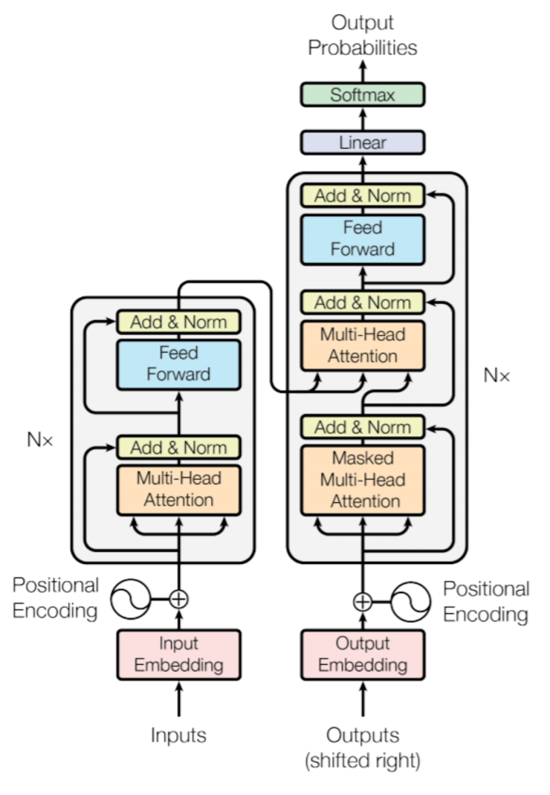
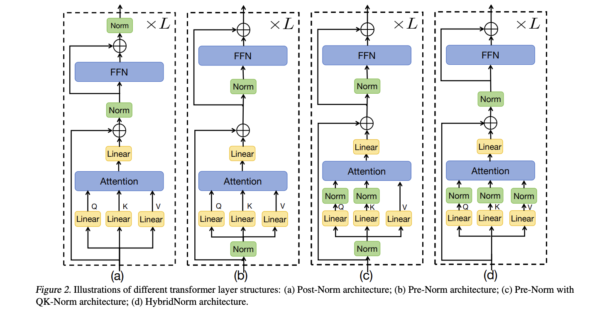
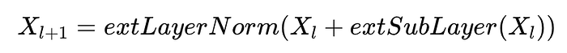

# Transformer

- Key component: Attention Mechanism

## Attention Mechanism

Improvements over Encoder Decoder:

- Provides a way for each part of decoder to focus on each part of input
    - 🟢 Allows selective focus on what part that decoder finds useful (Gives long range dependencies)
    - 🟢 No bottlenecks as there is no common context vector
    - 🟢 Allows parallel execution of each segment of decoder (while training)

- Adds a path so at computation of each token, the model can access every part of the input and selectively focus on
  parts it deems important.
- ℹ️ In encoder/decoder arch info would fade due to context vector encoding only limited length + model would lose long
  range relationships.
- At its core, the attention mechanism computes a set of attention scores that determine how much focus each input
  element (e.g., a word in a sentence) should receive when processing another element.
- Composed of:
    1. Query, Key and Value Vectors:
        - Query (Q): Represents the question model is asking -> what am I looking for?
        - Key (K): Represents what info or the label for each token -> I have information on this
        - Value (V): Actual information that will be passed on choosing this token
        - Calculated using learned weight matrices WQ,WK & WV.
        - Q = XWQ, K = XWK, V = XWV
        - X ∈ Rnxdmodel where dmodel is the embedding dimension
        - WQ ∈ Rdmodel×dk
        - ℹ️ These matrices play no part in encoding decoding outside of attention score calc
        - ℹ️ The definitions might seem vague, that's because this is their expected role not their literal working
    2. Attention Scores:
        - Model calculates how relevant each input token is to every other token by computing dot product
        - Score = QKT
        - To prevent large values scaled using dk
        - $Scaled Score = \frac{QK^{\top}}{\sqrt{d_k}} $
    3. Attention Weights
        - Passed through softmax function to convert them to probabilities
        - $\mathrm{Attention Weights}=\mathrm{softmax}\!\left(\frac{QK^{\top}}{\sqrt{d_k}}\right) $
    4. Weighted Sum:
        - Attention weights are used to compute weighted sum of the value vectors
        - $\mathrm{Attention}(Q,K,V)=\mathrm{softmax}\!\left(\frac{QK^{\top}}{\sqrt{d_k}}\right) V $

    - ℹ️Note: dk is a key dimensionality vector, usually multiple attention heads are used instead of one large dk
        - dk is chosen by dmodel/h where h is the number of attention heads
        - larger dk makes training extremely slow, smaller dks often used. dk=64 common in many models due to comp
          efficiency

- 
- Usually Made up of encoder decoder (or one of these)
- Improvement over traditional RNN
    - 🟢 Trained in parallel since each token can look at all others instead of relying on last output (with teacher
      forcing)
    - 🟢 No bottleneck: Since no central encoded vector, each token fetches its context from attending to all others
    - 🟢 Can freely have long range dependencies. Each token can attend to all others.

## Layers

## 1. **Embedding** [(explained in DataPreProcessing.md)](./DataPreProcessing.md#Word-Embedding)

## 2. **Positional** Encoding [(explained in LLM.md)](./LLM.md#positional-encoding)

## 3. **MultiHead** Attention layer

## 4. **Residual Connections**:

Each layer's output is added to it's input (through skip connections) (prevents vanishing gradient)

## 5. **Layer Normalization**

In Transformers, two major strategies exist for applying LayerNorm

- 

1. ### **Post-Normalization** (Post-LN):
    - LayerNorm is applied after the residual connection.
    - This strategy was used in orignal papers
    - 
        - i.e Input $ x $ goes through sub-layer (e.g., attention $ A(x) $ or feed-forward $ F(x) $).
        - Residual: $ x + \text{sub-layer}(x) $.
        - Then apply LayerNorm: $ \text{LN}(x + \text{sub-layer}(x)) $.
        - This is repeated across $ L $ layers.
    - 🔴 This can affect the signal from skip connection since it's normalized (across N encoders distorts greatly)
    - 🔴 Causes gradient instability: Why? At init outputs of sublayer (attention with linear) are small (due to He init)
      so residual path
      dominates forcing both to same range and multiply over deepstacks.(Thus attention output dilutes)
    - 🔴 Requires learning rate warm up
2. **Pre-Normalization** (Pre-LN):
    - LayerNorm is applied inside the residual connection, before each sub-layer.
        - i.e. Apply LayerNorm first: $ \text{LN}(x) $
        - Sub-layer on normalized input: $ \text{sub-layer}(\text{LN}(x)) $.
        - Residual: $ x + \text{sub-layer}(\text{LN}(x)) $.
        - No additional norm after the residual in the basic pre-norm variant.
    - 🟢 Does not distort residual connection
    - 🟢 No need for learning rate warmup
    -
    - Used in most modern models (GPT, BERT)
3. Hybrid: Both pre and post do exist (called Sandwich Normalization)

## 6. Position Wise Feedforward Neural Network:

After attention block, usually a two layer fully connected neural network applied independently to each token
embedding.  
FFN(x)=W2​f(W1​x+b1​)+b2​

- W1 usually expands to a much larger representation (4x in BERT) before w2 squeezes it back down
- 🟢 Transform the output of attention, basically processing it (basically now i have all the needed info, what should i
  do with it)
- 🟢 Add non-linearity to the output of attention blocks

## 7. Softmax

At the end of decoder to transform into probabilities to choose words (in LMs) to output.

## Questions

1. **What is masking and why is it used in transformer?**
   Masking is used to restrict which tokens are allowed to attend to others in the attention mechanism.
   - Ensures proper training behavior (e.g., no peeking into future words).
   - Simulates test-time left-to-right generation during training.
   Types:
   - Padding Mask: Ignores [PAD] tokens during attention.
   - Look-Ahead (Causal) Mask: Prevents a token from attending to future tokens — essential for autoregressive
   tasks like text generation.
   - Encoder-Decoder Mask: (Less common) Restricts attention from the decoder to specific encoder positions.
2. **Why not just use indices instead of positional encoding?**
   - A raw index (like just "0", "1", "2") isn’t differentiable and can't capture patterns like “this word is 3
   tokens ahead”.
   - Using sinusoidal positional encoding allows the model to generalize to longer sequences and recognize
   relative as well as absolute positions.